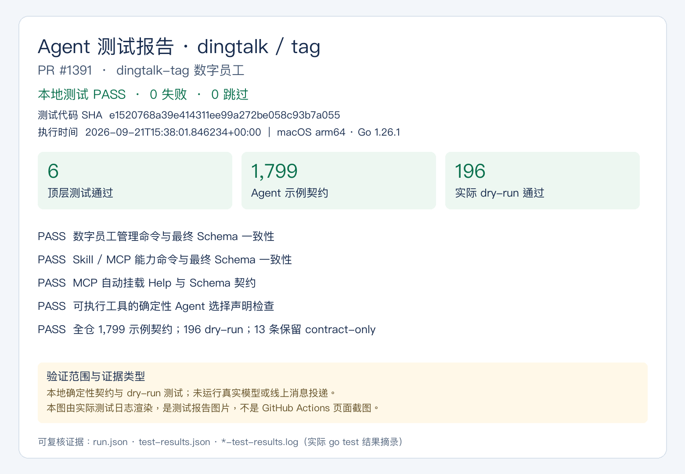
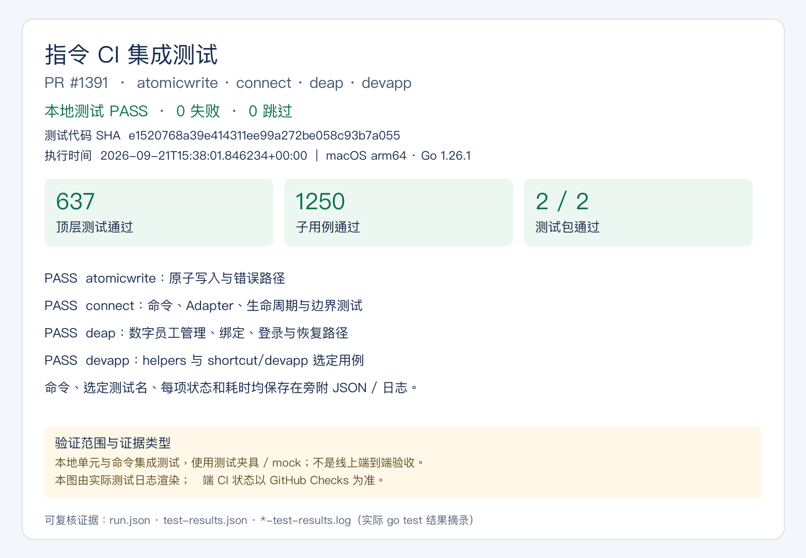

# PR #1391 测试证据

测试代码 SHA：`e1520768a39e414311ee99a272be058c93b7a055`。本目录仅增加测试证据，不修改被测生产代码或测试代码。
执行时间：`2026-09-21T15:38:01.846234+00:00`；环境：`go1.26.1 darwin/arm64`。

## Agent 测试报告：dingtalk、tag

6 个顶层测试、196 个子用例全部通过；1,799 个 Agent 示例契约检查，196 个实际 dry-run。
13 个 reviewed manual 示例保留 contract-only，不计为真实执行。
包括数字员工管理、Skill/MCP、自动挂载最终 Schema 契约及全仓确定性选择声明检查。

## 指令 CI 集成测试：atomicwrite、connect、deap、devapp

637 个顶层测试、1250 个子用例全部通过，0 失败、0 跳过。
测试包：`internal/helpers`、`internal/shortcut/devapp`。选定相关文件中的测试并执行命令层、mock 服务与边界回归。

## 复核与范围

- `run.json` 保存实际命令 argv、选定测试正则、代码 SHA、时间、退出码与原始 JSONL 的 SHA256。
- `test-results.json` 是实际 `go test -json` 的完成事件；两个 `*-test-results.log` 为公开测试结果摘录。
- 图片由这些真实结果渲染，是本地测试报告图片，不是 GitHub Actions 页面截图。
- 未执行真实模型、线上消息投递或全部 Adapter 实机验收；真实 Agent opt-in 测试未纳入选定命令。
- 本地报告不替代远端 CI，也不声称本 PR 已获自动 CR 或人工评审通过。

复现时在仓库根目录读取 `run.json` 的 `commands`，配合其中 `env` 逐一执行。测试自身使用隔离配置和 mock；Agent dry-run 测试主动阻断外部代理。

CR 历史意见、修复与回归验证见 [CR 核对记录](cr-resolution.md)。
