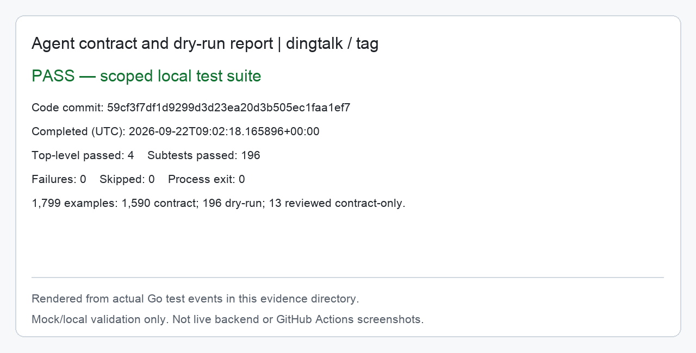
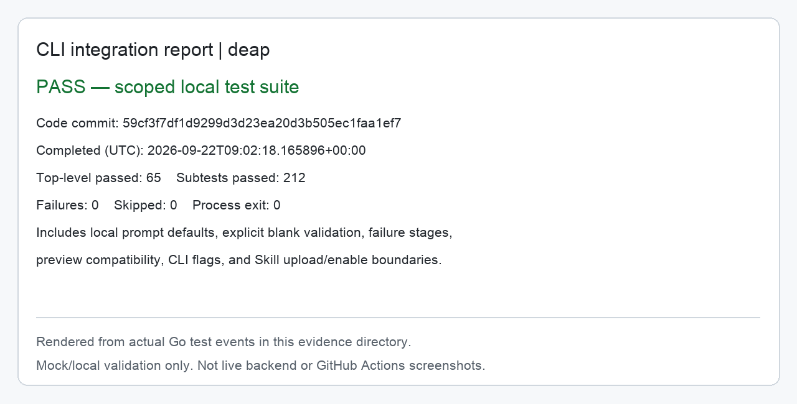

# PR #1434 更新测试证据

被测代码：`59cf3f7df1d9299d3d23ea20d3b505ec1faa1ef7`。运行命令、时间和原始 JSONL 哈希见 `run.json`。

## Agent 测试报告：dingtalk、tag

4 个顶层测试、196 个子用例通过，0 失败、0 跳过。1,799 个示例中 1590 项契约校验、196 项实际 dry-run、13 项 reviewed contract-only。

## 指令 CI 集成测试：deap

65 个顶层测试、212 个子用例通过，0 失败、0 跳过。覆盖数字员工参数、默认人设发布、空值校验、阶段失败、预览契约与 Skill 更新边界。

图片由真实本地测试事件渲染，原始完成事件与摘要在同目录。它们不是 GitHub Actions 页面截图、真实模型或线上端到端验收。服务端尚未部署；完整远端 CI 以 PR 最新 Checks 为准。独立 CLI 进程在本机退出 137 的问题未查明，不能把测试进程内验证等同于独立进程验收。
