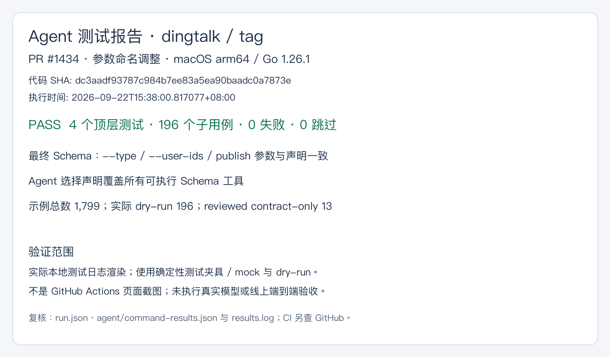
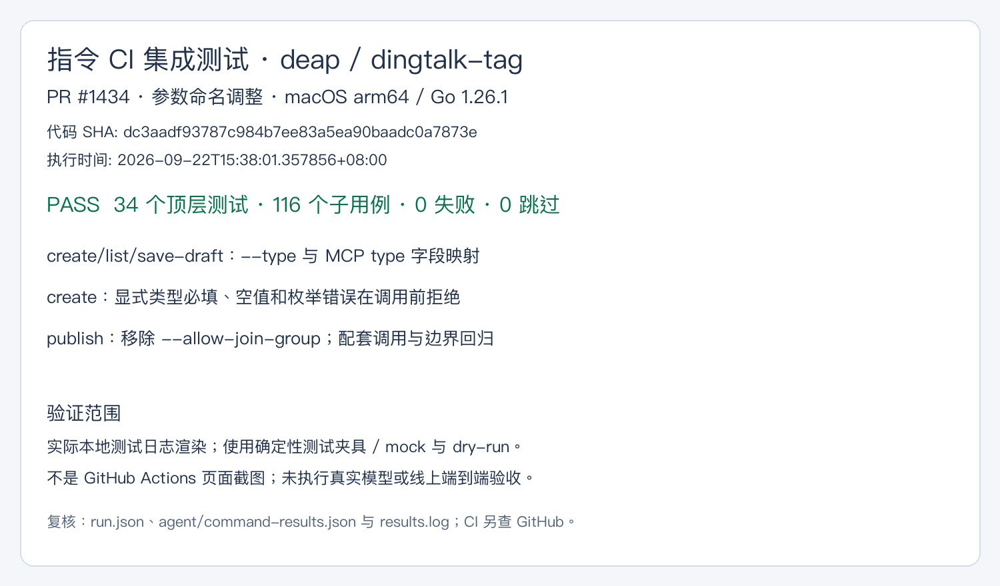

# PR #1434 测试证据

被测代码：`dc3aadf93787c984b7ee83a5ea90baadc0a7873e`；本目录仅增加报告。
环境：macOS arm64 / Go 1.26.1。时间、实际命令、原始 JSONL 摘要哈希见 `run.json`。

## Agent 测试报告：dingtalk、tag

4 个顶层测试与 196 个子用例通过，0 失败、0 跳过。覆盖最终 Schema、确定性 Agent 选择声明和示例校验。
1,799 个示例中，1590 项普通契约校验、196 项实际 dry-run、13 项 reviewed contract-only。

## 指令 CI 集成测试：deap

34 个顶层测试与 116 个子用例通过，0 失败、0 跳过。执行本次修改的三个 helpers 测试文件中的全部测试。

## 边界

图片由本次实际测试结果渲染，不是 GitHub Actions 页面截图，也不是线上或真实模型测试。
两个 `*-results.json` 记录完成事件，两个 `*-results.log` 记录结果摘要。远端 CI 以当前 PR Checks 为准。
本地全量 `go test ./...` 另有 app/installer 失败，未包含在上述限定测试集内，不能由本报告推断全量通过。
