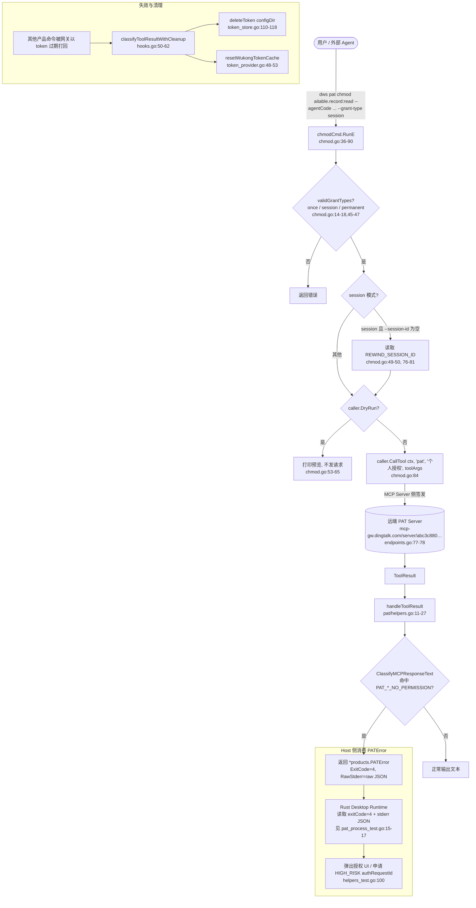
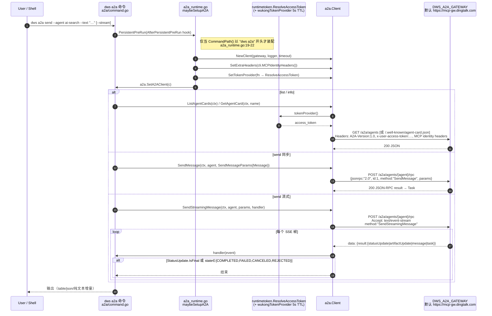
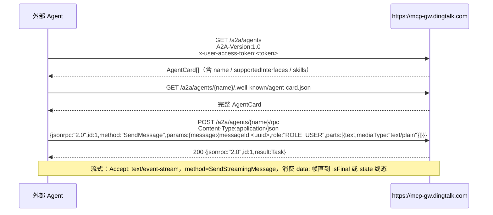

# 悟空侧 PAT + A2A 集成方案报告（W1 Lane1）

> 作者：obsessed-researcher（研究团队 TL，Lane #1）
> 来源仓：`/Users/xuan/dws-wukong`（单向依赖开源核心 `dingtalk-workspace-cli`）
> 研究范围：严格限定在用户给定目录；未跨出 `wukong/**` + `integration/**`；未读取 `.venv`/二进制。
>
> **scope 修正**：原任务单指向的 `wukong/pat/pat_process_test.go` 不存在；该文件实际位于 `wukong/pat_process_test.go`（wukong 包顶层，非 `pat` 子包）。另 `wukong/pat/` 下实际有 `chmod_test.go` 与 `helpers_test.go` 两份测试，本报告一并覆盖。

---

## 1. 文件清单与职责矩阵

| 路径 | 角色 | 关键符号 / 证据行 |
|---|---|---|
| `wukong/hooks.go` | Edition 钩子组装器，real/dev 双模 | `NewHooks(buildMode string)` [1-44]；`classifyToolResultWithCleanup` [50-62] |
| `wukong/hooks_test.go` | 钩子合约测试 | `TestWukongHooksContract` [10-12]；`TestWukongHooksRealMode` [14-28]；`TestWukongHooksDevMode` [30-44]；`TestWukongStaticServersNonEmpty` [46-55] |
| `wukong/register.go` | 四层命令注册入口 | `registerAll` [25-44]；`applyLegacyDefaults` [46-54]；`makeSkillTokenLoader` [60-64] |
| `wukong/a2a_runtime.go` | A2A 运行时按需装配 | `maybeSetupA2A` [19-54]，仅当 `cmd.CommandPath()` 以 `dws a2a` 开头时执行 |
| `wukong/config.go` | 配置目录策略 | `configDir` [24-29]（`DWS_CONFIG_DIR` 或 exe 旁 `.dws`）；`exeRelativeConfigDir` [10-20] |
| `wukong/auth.go` | 认证错误语义化 | `onAuthError` [16-42]，区分 missing_exchange / missing_identity / token_expired |
| `wukong/headers.go` | MCP 请求头注入 | `mergeHeaders` [37-77]；常量 [10-34]（`x-dingtalk-source`、`x-dingtalk-scenario-code`、`x-dingtalk-wk-traceid` 等） |
| `wukong/endpoints.go` | 静态 MCP 服务端注册 | `staticServers` [6-88]；`pat` 服务端点在 [77-78]；`commandAliases` [91-93]；`visibleProducts` [98-108] |
| `wukong/token_store.go` | Token 持久化（AES-256-GCM + PBKDF2/MAC） | `saveToken/loadToken/deleteToken` [41-118]；`encrypt/decrypt` [145-193]；`getMACAddress` [236-266] |
| `wukong/token_provider.go` | 运行时 Token Provider（5 秒 TTL 缓存 + 清理） | `wukongTokenProvider` [26-44]；`resetWukongTokenCache` [48-53] |
| `wukong/pat_process_test.go` | PAT→ExitCode/RawStderr 契约（跨 Rust 主机依赖） | `TestPATErrorExitCodeIs4` [17-64]；`TestPATErrorAllRiskLevels` [68-98]；`TestNonPATBusinessErrorNotIntercepted` [102-115]；`TestClassifyToolResultViaErrorCodeField` [119-136] |
| `wukong/pat/pat.go` | PAT 命令组根节点（`dws pat`） | `RegisterCommands` [13-27]；`caller` 包级变量 [10] |
| `wukong/pat/chmod.go` | 授权命令 `dws pat chmod` 实现 | `chmodCmd` [20-91]；`validGrantTypes` [14-18]；flags 初始化 [93-98] |
| `wukong/pat/helpers.go` | PAT 工具返回值统一处理 | `handleToolResult` [11-27]，调用 `products.ClassifyMCPResponseText` [20] |
| `wukong/pat/chmod_test.go` | chmod 命令行参数校验测试 | 5 个子用例 [8-86]，覆盖 `agentCode` 必填、`grant-type` 合法、`session-id` / `REWIND_SESSION_ID` 回退 |
| `wukong/pat/helpers_test.go` | `handleToolResult` 对 PAT 错误的分类 | LOW/MEDIUM/HIGH 三档风险用例 [12-108] |
| `wukong/a2a/client.go` | A2A HTTP + SSE 客户端（带重试） | `Client` [26-33]；`ListAgentCards` [55-96]；`GetAgentCard` [98-141]；`SendMessage` [173-187]；`SendStreamingMessage` [189-193]；`callA2A` JSON-RPC [205-253]；`callSSE` [255-339]；`injectHeaders` [341-356]；`doWithRetry` [358-388]；`isRetryable` [390-420] |
| `wukong/a2a/command.go` | Cobra 命令树 `dws a2a …` | `RegisterCommands` [25-27]；`newA2ACommand` [29-169]；`runA2ASendSync` [171-177]；`runA2ASendStream` [179-244]；`outputAgentList/outputA2ATask` [268-329] |
| `wukong/a2a/types.go` | A2A v1.0 协议类型定义 | `TaskState` 枚举 [7-19]；`Part/Message/Artifact/Task` [36-81]；`AgentCard` 家族 [83-117]；`SendMessageParams` [125-129]；`SSEEvent/SSEHandler` [148-155]；`jsonRPCRequest/Response/Error` [157-174] |
| `integration/README.md` | 回归脚本用法 | PAT 策略「方案 A」[53-59]（`go test ./wukong -run TestPATError`） |
| `integration/regression.sh` | 一次性构建 + legacy paths `--help` + PAT 测试 | `go build` [50-51]；`--help` 循环 [53-64]；PAT 测试 [71-72] |
| `integration/fixtures/legacy_paths.txt` | 离线 CLI 路径基线 | `pat`, `pat chmod`, `a2a`, `a2a agents`, `a2a agents list`, `a2a agents info`, `a2a send` 均在其中 |
| `Makefile` | `integration-regression` 目标 | 第 46-49 行：`./integration/regression.sh` |
| `README.md` | 架构总览、注册四层、A2A/PAT 用法 | 四层注册图 [59-68]；A2A 用法 [101-110]；PAT 用法 [112-116] |

---

## 2. PAT 生命周期流程图

> 核心论点（先交代）：**`dws pat chmod` 本身不在本地产生/存储 PAT**，它只是把「授权申请」封装成对 **远端 MCP 服务 `pat`（端点见 endpoints.go:77-78）** 的工具调用，`agentCode + scope + grantType [+ sessionId]` 作为参数下发给网关。PAT 的实际签发、校验、吊销都发生在服务端；CLI 端只观察到两件事：①`chmod` 的调用成功/失败；②后续其他产品命令被服务端以 `PAT_*_NO_PERMISSION` 错误码打回（见 `pat_process_test.go:72-77` 枚举）。



补充事实（逐条附证据）：
- **grant-type 三种** — `once | session | permanent`，定义在 `pat/chmod.go:14-18`；`session` 模式必须提供 `--session-id` 或 `REWIND_SESSION_ID` 环境变量，验证逻辑在 `pat/chmod.go:49-50, 76-81`，测试 `pat/chmod_test.go:38-77` 双路径覆盖。
- **agentCode 强校验** — `chmod.go:37-40`，flag 定义 `chmod.go:94-95`，`MarkFlagRequired`。
- **四档 PAT 风险码** — `PAT_NO_PERMISSION / PAT_LOW_RISK_NO_PERMISSION / PAT_MEDIUM_RISK_NO_PERMISSION / PAT_HIGH_RISK_NO_PERMISSION`（`pat_process_test.go:72-77`）；`HIGH_RISK` 返回体携带 `authRequestId`（`pat/helpers_test.go:100`）。
- **ClassifyToolResult 字段** — 同时识别顶层 `code` 与 `errorCode` 两种字段（`pat_process_test.go:119-136`）。
- **Token 与 PAT 解耦** — PAT 错误不会触发 token 清理；**只有** `products.CodeAuthTokenExpired` 才会触发 `deleteToken + resetWukongTokenCache`（`hooks.go:53-59`）。非 PAT 的普通业务错误**不被**hook 拦截（`pat_process_test.go:102-115`）。

---

## 3. A2A 协议字段与调用时序

### 3.1 协议要点（来自 `wukong/a2a/types.go` + `client.go`）

- **协议自称**：「A2A v1.0」— 包头 `A2A-Version: 1.0`（`client.go:342`），`types.go:1` 包注释明示。
- **发现端点（REST + JSON）**：
  - `GET  <gw>/a2a/agents`  → 列表，响应可为裸数组或 `{agents:[…], total}`（`client.go:143-171`）。
  - `GET  <gw>/a2a/agents/{agent}/.well-known/agent-card.json` → 单个 `AgentCard`（`client.go:98-141`）。
- **调用端点（JSON-RPC 2.0 over HTTP POST）**：
  - `POST <gw>/a2a/agents/{agent}/rpc` — method 为 `SendMessage` 或 `SendStreamingMessage`（`client.go:173-193, 205-253`）。
  - 请求体 schema：`jsonRPCRequest{jsonrpc:"2.0", id:1, method, params}`（`types.go:157-162`）。
- **流式 SSE**：`Accept: text/event-stream`；每帧 `data: <json>`；循环内对 `StatusUpdate.IsFinal || state.IsTerminal()` 退出（`client.go:287-339`）。
- **Task 终态定义**：`COMPLETED / FAILED / CANCELED / REJECTED` 为终态；`INPUT_REQUIRED / AUTH_REQUIRED` 为中断态（`types.go:21-27`）。
- **重试策略**：最多 3 次、指数退避 1s→2s→4s→8s（`client.go:21-24, 358-388`）；retryable 判据为 timeout/EOF/连接错/HTTP 5xx/429/rate limit（`client.go:390-420`）。
- **超时**：默认 HTTP 60 秒；SSE 60 分钟（`client.go:17-18`）。

### 3.2 调用时序图



### 3.3 关键字段速查（`types.go`）

| 结构 | 字段 | 备注 |
|---|---|---|
| `Message` | `messageId`(必), `contextId`, `taskId`, `role`, `parts[]`, `metadata`, `extensions[]`, `referenceTaskIds[]` | `types.go:46-55`；`role` 为 `ROLE_USER`/`ROLE_AGENT` [31-34] |
| `Part` | `text / raw / url / data / filename / mediaType / metadata` | `types.go:36-44`；command 把 `--text` 构造成 `mediaType:"text/plain"`，`--data` 走 `data:any`（`command.go:134-143`） |
| `Task` | `id, contextId, status{state,timestamp,message}, artifacts[], history[], metadata, createdAt, lastModified` | `types.go:66-81` |
| `Artifact` | `artifactId, name, description, parts[], metadata, extensions[]` | `types.go:57-64` |
| `AgentCard` | `name, description, supportedInterfaces[{url,protocolBinding,protocolVersion}], version, skills[], capabilities{streaming,extendedAgentCard}` | `types.go:83-107` |
| `SendMessageParams` | `message, configuration{acceptedOutputModes,historyLength,returnImmediately}, metadata` | `types.go:119-129` |
| `SSEEvent` | `statusUpdate? artifactUpdate? message? task?` 四选一 | `types.go:148-153` |
| `jsonRPCError` | `code:int, message:string` | `types.go:171-174`；SSE 帧里若带 error 直接 `return fmt.Errorf("SSE JSON-RPC error %d: %s", …)`（`client.go:312-314`） |

---

## 4. Token Provider / Store 接口摘录

### 4.1 Provider（5 秒 TTL 缓存 + 过期自毁）

```26:44:/Users/xuan/dws-wukong/wukong/token_provider.go
func wukongTokenProvider(ctx context.Context, fallback func() (string, error)) (string, error) {
	wkTokenMu.Lock()
	defer wkTokenMu.Unlock()

	if wkTokenCache != "" && time.Since(wkTokenTime) < wkTokenTTL {
		return wkTokenCache, nil
	}

	token, err := fallback()
	if err == nil && token != "" {
		wkTokenCache = token
		wkTokenTime = time.Now()
		return token, nil
	}

	wkTokenCache = ""
	_ = deleteToken(configDir())
	return "", fmt.Errorf("认证信息已失效，请重新执行上一条命令（最多重试两次）")
}
```

关键事实：
- `wkTokenTTL = 5 * time.Second`（`token_provider.go:16`）——**只是**进程内的短缓存，**每次** fallback 都会完整走「解密 → 校验 → 自动刷新」全链（注释 `token_provider.go:22-25`）。
- 只在 real 模式装配：`hooks.go:37-43` 里 `if isReal { h.TokenProvider = wukongTokenProvider }`。
- `a2a` 的 token 来源另走一条路：`runtimetoken.ResolveAccessToken(ctx, configDir(), explicitToken)`（`a2a_runtime.go:49-51`，`register.go:60-64` 的 skill token 也同一路径）。两条路径通过 `hooks.SaveToken/LoadToken/DeleteToken` 共享**同一个加密文件**。

### 4.2 Store（AES-256-GCM + PBKDF2，MAC 地址做口令）

```41:89:/Users/xuan/dws-wukong/wukong/token_store.go
func saveToken(configDir string, data []byte) error {
	password, err := resolvePassword()
	…
	ciphertext, err := encrypt(data, password)
	…
	finalPath := filepath.Join(configDir, dataFile)     // ".data"
	tmpPath := finalPath + ".tmp"
	tmpFile, err := os.OpenFile(tmpPath, os.O_WRONLY|os.O_CREATE|os.O_TRUNC, filePerm) // 0o600
	…
	if err := os.Rename(tmpPath, finalPath); err != nil { … } // 原子替换
	_ = writeTokenMarker(configDir)  // 生成 token.json 供宿主应用探测
	return nil
}
```

```145:193:/Users/xuan/dws-wukong/wukong/token_store.go
func encrypt(plaintext, password []byte) ([]byte, error) {
	salt := make([]byte, saltSize)       // 32
	…
	key := pbkdf2.Key(password, salt, iterations, keySize, sha256.New) // iters=600_000
	block, _ := aes.NewCipher(key)       // AES-256
	gcm, _ := cipher.NewGCMWithNonceSize(block, nonceSize) // nonce=12
	nonce := …
	ciphertext := gcm.Seal(nil, nonce, plaintext, nil)
	return salt ‖ nonce ‖ ciphertext, nil
}
```

```205:213:/Users/xuan/dws-wukong/wukong/token_store.go
func resolvePassword() ([]byte, error) {
	cachedMACOnce.Do(func() {
		cachedMAC, cachedMACErr = getMACAddress()
	})
	…
	return []byte(cachedMAC), nil
}
```

要点：
- 常量：`saltSize=32, nonceSize=12, keySize=32, iterations=600_000`（`token_store.go:24-28`）。
- 文件：`<configDir>/.data`（密文，`0o600`），`<configDir>/token.json`（明文时间戳 marker，供宿主检测 CLI 登录状态；`token_store.go:124-139`）。
- **口令 = 机器物理 MAC 地址**：`getMACAddress` 排除虚拟网卡（`virtualMACPrefixes` 列表 `token_store.go:215-225`）并按字典序取第一块；虚拟机/容器取不到物理 MAC 会直接失败（`token_store.go:236-266`）。
- **无 Keychain**：未见调用 OS Keychain/Keyring；仅加密文件。注释 `token_store.go:22-23` 明示与开源版 `internal/security` 保持同一算法，**完全用加密文件代替 Keychain**。
- `deleteToken` 幂等：同时删 `.data` / `.data.tmp` / `token.json`（`token_store.go:110-118`）。

### 4.3 接口分层（基于钩子装配）

```15:44:/Users/xuan/dws-wukong/wukong/hooks.go
func NewHooks(buildMode string) *edition.Hooks {
	isReal := buildMode == "real"
	h := &edition.Hooks{
		…
		ConfigDir:    configDir,
		…
		ClassifyToolResult: classifyToolResultWithCleanup(isReal),
	}
	if isReal {
		h.SaveToken     = saveToken
		h.LoadToken     = loadToken
		h.DeleteToken   = deleteToken
		h.TokenProvider = wukongTokenProvider
	}
	return h
}
```

- **Provider/Store 是 `pkg/edition.Hooks` 的扩展点**（字段名 `SaveToken/LoadToken/DeleteToken/TokenProvider`，由开源核心通过 `edition.Override` 消费；仓内未实现，仅注入）。
- **dev 模式不装**：dev 模式 fallthrough 到开源默认（开源默认可能是 Keychain，不在当前扫描范围，未断言）。

---

## 5. Hook / Register / Endpoint 对接点

### 5.1 Hook 全景

| Hooks 字段 | 悟空实现 | 位置 |
|---|---|---|
| `Name / ScenarioCode` | `"wukong" / "com.dingtalk.scenario.wukong"` | `hooks.go:18-19` |
| `IsEmbedded / HideAuthLogin / AutoPurgeToken` | 与 `isReal` 同值 | `hooks.go:20-22` |
| `AuthClientID / AuthClientFromMCP` | `"dingi8foprfi3jynjjlu"` / `true` | `hooks.go:24-25` |
| `ConfigDir` | `configDir`（env 覆盖 → exe 旁 `.dws`） | `hooks.go:27` + `config.go:24-29` |
| `MergeHeaders` | `mergeHeaders`（x-dingtalk-* 注入 + `WUKONG_*` 环境变量透传成 `x-wukong-*` 头） | `hooks.go:28` + `headers.go:37-77` |
| `OnAuthError` | `onAuthError`（分类 missing_exchange/missing_identity/token_expired） | `hooks.go:29` + `auth.go:16-42` |
| `StaticServers` | `staticServers`（43 条硬编码端点） | `hooks.go:31` + `endpoints.go:6-88` |
| `VisibleProducts` | `visibleProducts` | `hooks.go:32` + `endpoints.go:98-108` |
| `RegisterExtraCommands` | `registerAll` | `hooks.go:33` + `register.go:25-44` |
| `AfterPersistentPreRun` | `maybeSetupA2A` | `hooks.go:34` + `a2a_runtime.go:19-54` |
| `ClassifyToolResult` | `classifyToolResultWithCleanup(isReal)` | `hooks.go:35, 50-62` |
| `SaveToken / LoadToken / DeleteToken / TokenProvider` | real 模式才装配 | `hooks.go:37-43` |

### 5.2 四层 `registerAll`（`register.go:25-44`）

```25:44:/Users/xuan/dws-wukong/wukong/register.go
func registerAll(root *cobra.Command, caller edition.ToolCaller) {
	applyLegacyDefaults(root)
	products.InitDeps(caller)

	products.RegisterProducts(root)
	extensions.RegisterExtensions(root)
	pat.RegisterCommands(root, caller)
	a2a.RegisterCommands(root)

	root.AddCommand(
		redirectCmd("bot", "chat bot search", "robot"),
		redirectCmd("approval", "oa approval ..."),
		redirectCmd("message", "chat message ..."),
	)

	skill.RegisterSkillOverrides(root, caller, makeSkillTokenLoader())
	products.RegisterHintSubCmds(root)
	products.RegisterCamelCaseAliases(root)
}
```

- `pat.RegisterCommands` 接收 `caller edition.ToolCaller` 并把它**保存到包级变量**（`pat/pat.go:10, 14`）。`chmodCmd.RunE` 通过它调 `caller.CallTool(ctx, "pat", "个人授权", toolArgs)`（`pat/chmod.go:84`）——**PAT 授权是一次普通的 MCP 工具调用**。
- `a2a.RegisterCommands` 不接收 caller，改由 `AfterPersistentPreRun` 在实际调用前按需装配 `a2a.Client`（`a2a/command.go:20-22` + `a2a_runtime.go:19-54`）。

### 5.3 端点与请求头协议

| 维度 | 值 | 来源 |
|---|---|---|
| MCP 网关（通用产品） | `https://mcp-gw.dingtalk.com/server/<sha>` | `endpoints.go:6-88`，43 条（`pat` 专用 server `abc3c880…` 在 [77-78]） |
| A2A 网关 | `DWS_A2A_GATEWAY` 或 `https://mcp-gw.dingtalk.com` | `a2a_runtime.go:31-34` |
| `pat` 作为 MCP 产品 ID | `{ID:"pat", Name:"行为授权", Prefixes:["pat"]}` | `endpoints.go:77-78` |
| 核心请求头 | `x-dingtalk-source: dws`<br>`x-dingtalk-scenario-code: com.dingtalk.scenario.wukong`（有 `REWIND_REQUEST_ID` 时才写）<br>`x-dingtalk-wk-traceid: $REWIND_REQUEST_ID`<br>`x-dingtalk-wk-session-id: $REWIND_SESSION_ID`<br>`x-dingtalk-wk-message-id: $REWIND_MESSAGE_ID`<br>`claw-type: wukong\|default`（real/非 real）<br>`x-device-name: $DEVICE_NAME`<br>`x-robot-uid: $ROBOT_UID`<br>`x-wukong-<lower-kebab>: $WUKONG_<UPPER_SNAKE>`（自动透传） | `headers.go:10-75` |
| A2A 专属头 | `A2A-Version: 1.0`<br>`x-user-access-token: <access_token>`<br>`+ cli.MCPIdentityHeaders()` 全量 | `a2a/client.go:341-356` + `a2a_runtime.go:46-48` |
| Authorization header | **未使用 `Authorization:`**，统一走自定义 `x-user-access-token` | `client.go:349` |

---

## 6. 权限 / Scope / 高风险命令模型

结合 `pat/chmod.go`、`pat_process_test.go`、`pat/helpers_test.go` 得到的事实模型：

| 维度 | 取值 | 证据 |
|---|---|---|
| 粒度 | **Scope 粒度，不是全权 Token** | `chmod.go:24-27` 注释 `<product>.<entity>:<permission>`，示例 `aitable.record:read`；`Args: cobra.MinimumNArgs(1)` 允许一次授多个 |
| 有效期策略 | `once` / `session` / `permanent` | `chmod.go:14-18`；`session` 必须带 `session-id` 或 `REWIND_SESSION_ID`（`chmod.go:49-50,76-81`） |
| 风险等级（服务端判定） | `PAT_NO_PERMISSION` / `PAT_LOW_RISK_NO_PERMISSION` / `PAT_MEDIUM_RISK_NO_PERMISSION` / `PAT_HIGH_RISK_NO_PERMISSION` | `pat_process_test.go:72-77` |
| 结构化错误字段 | `{success:false, code|errorCode:"PAT_…", data:{requiredScopes?:[{scope}], authRequestId?:string}}` | 低风险样例 `pat_process_test.go:25-33`；高风险 `authRequestId` 样例 `pat/helpers_test.go:97-108` |
| CLI 侧契约 | `*products.PATError`：`ExitCode()==4` + `RawStderr()` 是原始 JSON | `pat_process_test.go:45-63`；主机（Rust 桌面）读 stderr 做交互 |
| 只拦截 PAT 错误 | 非 PAT 错误不经 hook 转换；如 `{success:false, errorCode:"INVALID_SCOPE"}` 原样返回 | `pat_process_test.go:102-115` |
| 本地无高风险白名单 | **未见**任何客户端侧硬编码的「高风险命令清单」；风险判定完全在 `pat` MCP Server 侧 | 本扫描范围内 grep 无该列表；`chmod.go` / `helpers.go` / `endpoints.go` 均未出现 |
| 授权流 | CLI 端只负责 ①透传 `chmod` 申请 ②捕获 `PAT_*_NO_PERMISSION` ③把 `authRequestId` 冒泡给宿主；**不**持有 PAT 本身 | 组合证据：`pat/chmod.go:71-89` + `pat/helpers.go:11-27` + `pat_process_test.go:49-63` |

**推论**：PAT 实质是「服务端下发的 scope 集合 + 授权策略」；客户端的「撤销」体现在 `once` 用完自动失效、`session` 随 session 结束失效、`permanent` 需调用下一层（当前未见对应 revoke 命令）。若要补齐 `dws pat revoke`，目前源码里没有占位符。

---

## 7. 外部 Agent 最小对接序列

面向「外部 Agent 想通过 A2A 协议调用悟空侧能力」的最短路径。要区分两种身份：

### 7.1 场景 A：外部 Agent 作为 A2A Client，直接打悟空网关（不走本地 CLI）



预备条件（逐条对应源码）：
1. **拿到 access token**（`x-user-access-token`）。在悟空场景，外部 Agent 必须先用自己账户完成钉钉鉴权；CLI 做法是 `runtimetoken.ResolveAccessToken(ctx, configDir, explicitToken)`（`a2a_runtime.go:49-51`）。第三方自研时可等价于「与 MCP 网关先完成 OAuth/token exchange」——具体交换协议不在本仓扫描范围，不做断言。
2. **必备头**：`A2A-Version: 1.0`（`client.go:342`）、`x-user-access-token`（`client.go:349`）、`MCPIdentityHeaders()` 的全部条目（身份头 `register.go`→`cli.MCPIdentityHeaders`，本仓只见调用）、`x-dingtalk-source: dws` 等（如果希望用 `dws` 通道，见 `headers.go:42`）。
3. **messageId 使用 UUID**（`command.go:146`：`uuid.New().String()`）。
4. **重试/超时**：自建时建议复用 `client.go:21-24, 390-420` 的判据；网关对 429/5xx 重试是安全的。

### 7.2 场景 B：外部 Agent 包在本地 `dws` 进程外，调 `dws a2a send …` 打通

```bash
# 1. 进入嵌入模式二进制（real 模式，隐藏 auth login）
DWS_CONFIG_DIR=/var/app/.dws \
REWIND_SESSION_ID=sess-abc \
REWIND_REQUEST_ID=req-001 \
DWS_A2A_GATEWAY=https://mcp-gw.dingtalk.com \
dws a2a agents list --format json

# 2. 取单个 Agent 能力卡
dws a2a agents info --agent ai-search --format json

# 3. 同步发送文本消息
dws a2a send --agent ai-search --text "搜索钉钉开放平台文档" --context-id ctx-001

# 4. 流式 SSE
dws a2a send --agent ai-search --text "长任务" --stream --format json
```

行为说明（附行号证据）：
- `a2a` 根命令存在时才装配 A2A 客户端（`a2a_runtime.go:19-22`，避免给所有命令都消耗 token 解析）。
- `--text` 与 `--data` 互斥，二选一；`--data` 必须是合法 JSON，会进入 `Part.Data`；`--text` 会组装成 `mediaType:text/plain`（`a2a/command.go:126-143`）。
- `--context-id` 做多轮续接，对应 `Message.contextId`（`a2a/command.go:150-152` + `types.go:48`）。
- 需要先完成登录（dev：`dws auth login`；real：由宿主应用写入 `.data`）。
- JSON 输出模式下，`--stream` 每帧一行 `json.Marshal(event)`（`a2a/command.go:184-191`），方便下游按行解析。

### 7.3 PAT 授权配套（外部 Agent 想先给自己发 scope）

```bash
dws pat chmod aitable.record:read aitable.record:write \
    --agentCode agt-xxxx \
    --grant-type session \
    --session-id sess-abc     # 或设置 REWIND_SESSION_ID
```

证据：`pat/chmod.go:33-35` 的 Example、`pat/chmod.go:71-84` 的 `toolArgs` 构造、`pat/chmod_test.go:58-77` 的 env 回退测试。

---

## 8. 复用到开源仓的建议

### 8.1 必须照搬（低改动价值高）

| 文件 / 模块 | 复用理由 |
|---|---|
| `wukong/a2a/**` 三件套 | 协议完全 schema 中立；只需移除 `products.GetFormatter()` / `GroupRunE` 之类悟空私有工具类依赖（`command.go:13` 对 `products` 包的 import），把输出抽象成接口即可。JSON-RPC + SSE 的重试/退避/错误分类值得进入开源核心 `pkg/a2a`。 |
| `wukong/token_store.go` 的 crypto scheme | AES-256-GCM + PBKDF2(600k 轮) + salt/nonce 布局 + 原子 rename + 0o600 marker，已对齐开源 `internal/security`（注释 `token_store.go:22-23`），可直接提取为 `pkg/securestore`。MAC 地址做口令的部分**要做平台豁免**（见 8.3）。 |
| `wukong/token_provider.go` 的 TTL + 过期自毁 | 5 秒 TTL 适合做「每命令近似不变」的短生命周期缓存；过期时 `deleteToken` 幂等清理，非常保守。可泛化成 `pkg/runtimetoken.CachingProvider`。 |
| `pat/chmod.go` 的 CLI 骨架（flags/校验/dry-run） | `grant-type = once/session/permanent` 三态模型是通用的「最小授权粒度」；`Args + MarkFlagRequired + DryRun 预览` 的模式可做成开源参考实现。 |
| `hooks.go` 里 `ClassifyToolResult → TokenExpired 自清理` 的耦合 | 这是「服务端 401 → 本地 token 失效」的最小闭环，值得开源核心模板化（当前只在 wukong 实现，代码量极小，8 行）。 |
| `a2a_runtime.go` 的**按命令路径懒装配**模式 | `strings.HasPrefix(cmd.CommandPath(), "dws a2a")` 避免为非 a2a 命令白装 HTTP client + token，这一设计值得作为 `edition.AfterPersistentPreRun` 的官方范例。 |

### 8.2 需要改写（悟空强耦合，开源前必清洗）

| 问题点 | 建议改写方向 |
|---|---|
| `endpoints.go` 43 条硬编码 MCP 端点（`endpoints.go:6-88`） | 开源仓应改为「配置驱动 + 默认空」，由下游 edition 注入。当前每个 endpoint 都是 `mcp-gw.dingtalk.com/server/<sha>` 形态，域名/sha 全是悟空内部资产。 |
| `headers.go` 所有 `x-dingtalk-*` / `x-wukong-*` 常量 | 开源仓改成「header prefix 可配置」；把「`REWIND_*` → 请求头」的拷贝逻辑封成 `pkg/cli/EnvHeaderBridge`。`REWIND_*` 是悟空宿主的进程契约，不应进开源。 |
| `auth.go:16-42` 的 `missing_exchange / missing_identity` 文案 | 开源仓改成错误**分类**返回（如 `AuthReadiness{Kind, Hint}`），让各 edition 自行本地化文案。 |
| `a2a/client.go:349` 的 `x-user-access-token` | 可开源化为 `client.Option` 注入「token header name」，默认 `Authorization: Bearer <token>`；保留悟空 edition 注入私有头名称的能力。 |
| `register.go:35-37` 的 redirect 命令（`bot/approval/message`） | 纯悟空迁移兼容，不复用。 |
| `config.go` 的「exe 旁 `.dws`」策略 | 开源 CLI 应用 XDG（`$XDG_CONFIG_HOME/dws`）；悟空嵌入模式的 exe-relative 只在桌面宿主里合理，作为 edition 选项保留。 |
| `token_provider.go:43` 的中文硬文案 `"认证信息已失效..."` | 抽成 i18n 键；开源仓默认英文 + 可替换。 |
| `pat/chmod.go:84` 里的字面量 `"pat", "个人授权"` | 工具名 `个人授权` 是悟空 MCP Server 内登记的工具名；开源化需替换成服务发现拿到的工具标识或支持别名配置。 |

### 8.3 必须删除 / 置为 edition-only

| 内容 | 原因 |
|---|---|
| `token_store.go:236-266` 的 `getMACAddress` 口令策略 | **强依赖物理 MAC**：容器 / K8s / CI / 没网卡的 headless 环境会直接失败，开源使用者体验差；且以 MAC 做对称口令的威胁模型偏弱（偷了文件+能 ARP 就能解密）。开源仓应默认用 OS Keychain (macOS Keychain / Windows DPAPI / libsecret)；把 MAC 方案作为 **悟空嵌入模式专用** `edition` 策略留存，并补 `virtualMACPrefixes` 例外清单的长期维护。 |
| `hooks.go:24-25` 的 `AuthClientID: "dingi8foprfi3jynjjlu"` 与 `AuthClientFromMCP: true` | 钉钉 OAuth ClientID，不属于开源公共资产。 |
| `endpoints.go:8-86` 所有具体 server sha | 同上。 |
| `pat_process_test.go` 里「`ExitCode()==4` + `RawStderr` 契约」 | 契约本身可抽象为 `pkg/exit.Code`，但「4 == PAT」这个具体编号和契约使用者「Rust 桌面宿主」（见 `pat_process_test.go:15-17` 注释）属悟空场景；开源仓给出编号空间约定即可，不要把 4 号锁定给 PAT。 |
| `integration/fixtures/legacy_paths.txt` | 100% 悟空命令基线，开源仓不需要。`integration/regression.sh` 的思路（`--help` 遍历 + PAT 单测）可开源化为通用回归脚手架。 |

### 8.4 必须新增（开源化遗漏）

- **Revoke 命令**：现仓没有 `dws pat revoke`/`dws pat list`；如果服务端支持，CLI 侧应补齐闭环。
- **Scope 自检**：`chmodCmd` 只做字符串透传，没有对 `<product>.<entity>:<permission>` 做语法校验。开源时建议加一个 regex 预检。
- **A2A schema 版本协商**：当前硬编码 `A2A-Version: 1.0`（`client.go:342`），应从 AgentCard 的 `supportedInterfaces[*].protocolVersion` 协商。

---

## 9. 交付说明

- 本报告为 UTF-8 Markdown，已落盘到：`/Users/xuan/dingtalk-workspace-cli/docs/_research/w1-lane1-wukong-pat-a2a.md`
- 所有结论均带 `文件:行号` 证据；未在扫描范围内的下游包（`wukong/products/**`、开源核心 `pkg/edition/*`、`pkg/runtimetoken`、`pkg/cli`）只在必要处作为「调用点」提及，**未**对其内部行为下断言。
- 与原任务单的 2 处 scope 偏差已显式说明：
  1. `wukong/pat/pat_process_test.go` 不存在 → 实际 `wukong/pat_process_test.go`；
  2. `wukong/pat/` 下有 `chmod_test.go` + `helpers_test.go` 两份额外测试，已纳入报告。

回传给主脑 `musk-chief-operator`：**可以进入 W2 架构/落地阶段**。建议的下一步路由：
- `option-comparator`：对比开源其他「CLI ↔ Agent 协议」项目（如 MCP stdio / OpenAI Agents / LangChain AgentProtocol）与本仓 A2A v1.0 的字段映射。
- `risk-scanner`：专项审阅 `token_store.go` 的 MAC-as-password 模型 + `chmod.go` 无 scope 语法校验两处。
- `tech-doc-writer`：把第 8 节拆成开源化 PR 拆分清单（「照搬 / 改写 / 删除 / 新增」四类工单）。
