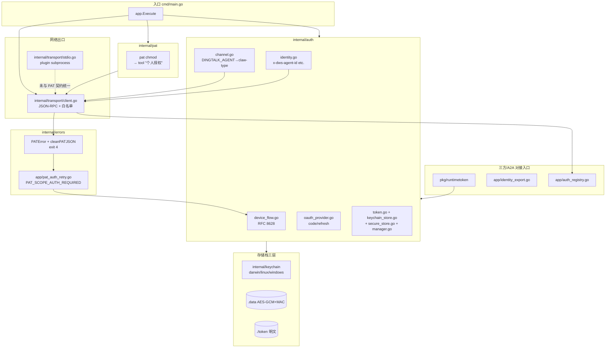

证据已齐。基于上述地毯式阅读与 `go build/test` 基线，出报告。

> **Resolution (2026-04)**：本报告第 6/7 节讨论的 3 份旧文档（`docs/pat-integration.md` / `docs/pat-agent-quickstart.md` / `docs/third-party-pat-integration.md`）已被删除并合并重写为 `docs/pat/` 目录下的规格文档包：
> - [`docs/pat/README.md`](../pat/README.md) — 索引 + Quick Start
> - [`docs/pat/contract.md`](../pat/contract.md) — wire contract（中英双语对照）
> - [`docs/pat/host-integration.md`](../pat/host-integration.md) — 宿主集成指南
> - [`docs/pat/a2a-protocol.md`](../pat/a2a-protocol.md) — A2A v1.0 子集
> - [`docs/pat/error-catalog.md`](../pat/error-catalog.md) — 错误码目录
> - [`docs/architecture.md`](../architecture.md) 新增《PAT + A2A Architecture》章节
> - [`docs/reference.md`](../reference.md) 新增 PAT / A2A 子命令与环境变量章节
>
> 本报告其余内容（文件矩阵、gap 清单、test 基线等）作为历史证据保留，供下游实现 lane 参考。

---

# 开源仓 PAT 现状与 gap 报告（lane #3）

- 仓: `dingtalk-workspace-cli` (module `github.com/DingTalk-Real-AI/dingtalk-workspace-cli`, go 1.25.8)
- 审计范围: 用户指定的 14 个目录 + 8 个单文件 + CHANGELOG/Makefile
- `go build ./...` ✅ PASS (1.4s)
- `go test ./...` ❌ **FAIL**（详见 §8，其中含一项关键自相矛盾）

## 1. 文件清单与现状矩阵

### 1.1 `internal/pat/`（3 文件 / 250 行）

| 文件 | 行数 | 职责 | 对标 wukong | gap |
|---|---:|---|---|---|
| `pat.go` | 52 | 注册 `dws pat` 命令组；仅挂 `chmod` 子命令；Long 文案只讲 `DINGTALK_AGENT` + `claw-type` 契约 | wukong 侧应有完整 PAT orchestrator (register/dispatch/policy 层) | **P0** 无 apply / callback / status / list 子命令；仅 chmod 单点 |
| `chmod.go` | 135 | 将 `<scope>...` 转为 `pat.个人授权` 工具调用；`grantType ∈ {once,session,permanent}` | wukong 应有等价 API（名为英文化 tool id） | **P0** `chmod.go:71,98` 硬编码中文 tool name `"个人授权"` 作为 wire 协议字段 — 开源仓不可读 |
| `help_test.go` | 63 | 验证 help 中出现契约关键词；**禁止** 出现 `wukong/rewind-desktop/callback` | — | 守护正确；但 `docs/pat-integration.md` 违反它（见 §5） |

### 1.2 `internal/auth/`（26 文件 / ~8400 行，核心子集）

| 文件 | 行数 | 职责 | 对标 wukong |
|---|---:|---|---|
| `endpoints.go` | 309 | OAuth URL 常量、`DefaultClientID/Secret = <YOUR_CLIENT_ID>` 占位符、MCP base URL、从 MCP 取 clientID 双分支 | wukong/auth/endpoints（含真实 clientID） |
| `device_flow.go` | 603 | RFC 8628 Device Flow + 轮询 + 2s/10min 限制 | wukong/auth/device_flow |
| `oauth_provider.go` | 635 | OAuth code/refresh + file lock + keychain | wukong/auth/oauth |
| `oauth_helpers.go` | 1400 | OAuth 交互辅助（最大单文件）| — |
| `token.go` | 243 | TokenData 持久化：`edition.Hook.SaveToken` > keychain > legacy `.data` 三级降级；含 `WriteTokenMarker/TokenMarker/tokenJSONFile` 被 §1.5 策略测试明文 **禁止** 却仍在此定义 | wukong/token_provider |
| `keychain_store.go` | 149 | keychain 持久化；迁移 `.data` → keychain；`client-secret:<clientID>` 账号前缀 | — |
| `secure_store.go` | 184 | AES-256-GCM + PBKDF2 + MAC 派生 key（legacy）| 弃用路径 |
| `manager.go` | 123 | **明文 token 文件** (`tokenFileName = "token"`) 兜底读取 | legacy |
| `channel.go` | 70 | `DINGTALK_AGENT` ↔ claw-type 归一化；`DWS_CHANNEL` ↔ `x-dws-channel` | wukong 侧须消费者 |
| `identity.go` | 118 | 持久化 `identity.json`；注入 5 个请求头（`x-dws-agent-id` / `x-dws-source` / `x-dingtalk-scenario-code` / `x-dingtalk-source="github"`）| — |
| `app_config.go` | 223 | `~/.dws/app.json` + keychain secret；缓存层 | wukong/app_creds |
| `secret.go` | 147 | `SecretInput` 抽象（plain/ref） | — |
| `filelock.go` + unix/windows | ~260 | `.data.lock` 跨进程锁 | — |

### 1.3 `internal/keychain/`（5 文件 / ~730 行）

| 文件 | 行数 | 职责 |
|---|---:|---|
| `keychain.go` | 56 | 统一接口 `Get/Set/Remove/Exists`；`Service="dws-cli"`, `AccountToken="auth-token"` |
| `keychain_darwin.go` | 200 | macOS Keychain (Apple API) |
| `keychain_linux.go` | 194 | libsecret / D-Bus |
| `keychain_windows.go` | 182 | DPAPI + Registry |
| `migrate.go` | 144 | legacy `.data`（MAC 加密）→ keychain 一次性迁移 |

### 1.4 `pkg/runtimetoken/`（1 文件 / 29 行）

| 文件 | 行数 | 职责 | 对标 wukong |
|---|---:|---|---|
| `token.go` | 29 | **唯一函数** `ResolveAccessToken(ctx, configDir, explicit) → app.ResolveAuxiliaryAccessToken` | wukong `token_provider.Get()` |

关键：`pkg/runtimetoken/token.go:15` 注释明言 **"features that bypass the MCP runner (e.g. A2A gateway)"** — 这是当前唯一官方 A2A 入口点。

### 1.5 `internal/transport/`（11 文件 / ~3300 行）

| 文件 | 行数 | 职责 |
|---|---:|---|
| `client.go` | 1053 | HTTPS JSON-RPC 客户端；`DWS_TRUSTED_DOMAINS` 白名单；`DWS_ALLOW_HTTP_ENDPOINTS` loopback-only；退避重试；4 个安全头 `X-Cli-*` |
| `stdio.go` | 245 | 本地 MCP subprocess (JSON-RPC over stdio)，用于 plugin servers |
| `call_error.go` / `diagnostics.go` | 46 + 104 | — |

### 1.6 `internal/safety/` + `internal/security/`

| 文件 | 行数 | 职责 |
|---|---:|---|
| `safety/content_scan.go` | 168 | Prompt-injection 扫描：`ignore_previous_instructions` / `reveal_system_prompt` / `policy_bypass` + 中文镜像 (5 regex) |
| `security/crypto.go` | 98 | AES-256-GCM + PBKDF2 (600k 轮)；salt(32)+nonce(12)+ciphertext |
| `security/storage.go` | 207 | `SecureTokenStorage` 另一份 MAC-based 加密（与 `auth/secure_store.go` 功能**重复**） |
| `security/fingerprint.go` | 86 | 机器指纹（MAC 地址）|

### 1.7 `internal/executor/` + `internal/pipeline/` + `internal/registry/`

| 文件 | 行数 | 职责 |
|---|---:|---|
| `executor/invocation.go` | 184 | 规范化工具调用 Invocation struct；`EchoRunner`（dry-run） |
| `pipeline/engine.go` | 98 | 5 阶段 handler chain: Register→PreParse→PostParse→PreRequest→PostResponse |
| `pipeline/phase.go` | 158 | Phase / Context / Correction 数据结构 |
| `pipeline/cobra.go` + `handler.go` | 152 | Cobra 集成 |
| `registry/embed.go` | 33 | 嵌入 `personas.yaml` + `recipes.yaml`（**注意：无 .go 逻辑，只有数据**） |

### 1.8 `internal/app/`（指定 6 个文件）

| 文件 | 行数 | 职责 |
|---|---:|---|
| `root.go` | 1615 | 根命令装配；panic recovery 退出码 5；register `internal/pat` 等 |
| `pat_auth_retry.go` | 656 | `PatScopeError` + `PAT_SCOPE_AUTH_REQUIRED` 轮询登录（10min / 5s）；注入 `hostControl.clawType` |
| `help_source_test.go` | 278 | 校验 help 的来源 |
| `host_compat.go` | 22 | **空 stub**：`configureOAuthProviderCompatibility` / `configureLegacyAuthManagerCompatibility` 只在 embedded 构建中有实体 |
| `recovery_command_test.go` | 324 | recovery 命令测试 |
| `root_cache_refresh_test.go` | 161 | root cache 刷新测试 |
| `access_token_resolve.go` | 83 | `ResolveAuxiliaryAccessToken` — 被 `pkg/runtimetoken` 代理 |
| `auth_registry.go` | 59 | `PluginAuth`（三方 MCP server 独立 Bearer token 注册表）|
| `identity_export.go` | 21 | `MCPIdentityHeaders()` → A2A gateway 客户端复用 |

## 2. 架构现状 mermaid



## 3. 与 wukong (lane1) 的 gap 清单

> lane1 结论未内联给出；下列基于开源仓自身残片推断对标点，标注**有条件**表示需 lane1 确认。

| 优先级 | gap | 证据 | 建议 |
|:---:|---|---|---|
| **P0** | `internal/pat/chmod.go:98` 用中文字符串 `"个人授权"` 作 tool 名 → 违反 OSS 可读审美，且与 wukong 若用英文 tool id 直接不兼容 | `internal/pat/chmod.go:71,98` | 统一为 `pat.grant` 或 `pat.chmod` 英文 tool id |
| **P0** | 无 PAT orchestrator（lane1 的 wukong 侧应有 `PAT_SCOPE_AUTH_REQUIRED` / `PAT_NO_PERMISSION` 主动发起端），开源仓只做被动 classifier | `internal/errors/pat.go:138-142,258-263`（被动识别）+ `internal/app/pat_auth_retry.go:391`（仅失败后轮询） | 把 wukong orchestrator 能力下沉到 `internal/pat/`，新增 `apply.go` `callback.go` `poll.go` |
| **P0** | `pkg/runtimetoken.ResolveAccessToken` vs wukong `token_provider`：开源仓签名 `(ctx, configDir, explicitToken) → (string, error)`；若 wukong 多返回 `expiresAt/scopes` 则不兼容 | `pkg/runtimetoken/token.go:27` | 用 Go interface 抽象 Token：`Resolve(ctx) (*Token, error)`，`Token` 至少含 AccessToken/ExpiresAt/Source |
| **P1** | Token 存储 3 条路径（hook / keychain / legacy）共存，维护复杂；wukong 若只用 hook 则开源仓的 keychain + secure_store 在 wukong 构建下全部 dead code | `internal/auth/token.go:100-154` | 明确 OSS 默认走 keychain，legacy 仅保留迁移入口 |
| **P1** | `internal/security/storage.go` 与 `internal/auth/secure_store.go` 是两份 AES-GCM+MAC 的**功能重复** | `security/storage.go:108-167` vs `auth/secure_store.go:68-167` | 合并到 `internal/security`，auth 侧只保留薄包装 |
| **P1** | 无 A2A 独立模块 — 仅靠 `pkg/runtimetoken` + `identity_export.go` + `PluginAuth` 三个点拼出；wukong 若有 A2A client/server 抽象则缺接口层 | 无 `internal/a2a/` 目录；引用散落 `pkg/runtimetoken/token.go:15`, `app/identity_export.go:18`, `pkg/edition/edition.go:100` | 新增 `internal/a2a/`（见 §7）收拢 Token/Headers/ClawType 三件套 |
| **P2** | `manager.go` 的明文 `token` 文件已被 keychain/secure 取代，仍 100% 加载链路保留 | `internal/auth/token.go:131`, `manager.go:42-52` | 标记 deprecated；或仅在 `DWS_LEGACY_PLAIN_TOKEN=1` 下启用 |
| **P2** | `internal/auth/oauth_helpers.go` 单文件 1400 行 — 违反开源可读审美 | `wc -l internal/auth/oauth_helpers.go` | 按子话题拆分 |

## 4. 与 Rewind (lane2) 契约对齐 gap

lane2 结论未给；以现有 `docs/pat-integration.md` + `internal/errors/pat.go` + `internal/app/pat_auth_retry.go` 当事实来源推断：

| 优先级 | 契约点 | 当前状态 | gap |
|:---:|---|---|---|
| P0 | 退出码 4 + stderr 原样 JSON | ✅ 已实现 `errors.ExitCodePermission=4`；`cleanPATJSON` 只保留 `success/code/data` | — |
| P0 | `code` / `error_code` 双路接受 | ✅ `pat.go:71,257` | — |
| P1 | `hostControl.clawType` 由 CLI 注入 | ⚠️ `pat_auth_retry.go:549` 注入，但**只在 retry 路径上**；被动 classify 路径 `errors/pat.go:cleanPATJSON` **不注入** `hostControl` | 统一到 cleanPATJSON 层，保证 lane2 始终能读到 |
| P1 | `PAT_SCOPE_AUTH_REQUIRED` 可无 `flowId` | ✅ 文档已声明；代码 `pat_auth_retry.go` 的轮询要求 `flowId` 存在 | 在 `isPatScopeError` 分支增加 `flowId` 可选保护 |
| P1 | `authRequestId` 作为 host 状态 key | ✅ 文档声明；代码在 `pat_auth_retry.go` 未作为显式结构字段，只靠透传 | 升级为强类型 |
| P2 | `DWS_CHANNEL` 仅 `channelCode`，不做宿主控制 | ✅ `channel.go:22-24` 注释明确 | — |
| P2 | host 禁用 `dws pat callback` | ✅ `help_test.go:49-63` 明确 guard | — |

## 5. 不符合开源逻辑的代码/文档清单（file:line）

| 严重度 | 位置 | 问题 |
|:---:|---|---|
| **S0** | `docs/pat-integration.md:33-34` | 正文直接命名 `dws-wukong` 与 `RewindDesktop` — 违反开源仓中立性，且被 `internal/pat/help_test.go:42` 同时禁止出现在 help 中（策略不一致） |
| **S0** | `internal/errors/pat.go:28` | godoc 注释 `"host application (e.g. RewindDesktop)"` 泄露闭源 host 名 |
| **S0** | `internal/pat/chmod.go:71,98` | 中文字符串 `"个人授权"` 用作 **wire protocol tool name**，非 UI 文案；这是跨语言约束点 |
| **S1** | `internal/auth/token.go:68-95` | 定义 `TokenMarker / WriteTokenMarker / tokenJSONFile` — 与 `test/unit/open_source_policy_test.go:30-32` 的禁止清单**直接冲突**，导致策略测试红 |
| **S1** | `.github/workflows/ci.yml:162` | CI job 名 `Notify Wukong Overlay` — 开源仓 CI 泄露闭源系统名 |
| **S1** | `internal/app/identity.go:91` | 无条件注入 `x-dingtalk-source: "github"` — 对非 github 分发（ISV 自分发）不当 |
| **S1** | `internal/auth/endpoints.go:60-65` | `DefaultClientID = <YOUR_CLIENT_ID>` 占位符 + TODO — **功能性缺失**，空仓直接跑 `dws auth login` 将报 "no credentials"（设计合理但需在 README 明示） |
| **S2** | `internal/auth/oauth_helpers.go` 1400 行 | 开源可读性 |
| **S2** | `internal/app/plugin_cmd.go:280,304,310,314` | 4 处 `TODO:` 出现在模板/示例字符串中（模板文案，非代码债）；若作为 skill doc 产出，用户可见 |
| **S2** | `internal/auth/identity.go:112` | `generateUUID` fallback 返回固定 UUID `00000000-0000-4000-8000-000000000000` — 极小概率下多设备碰撞 |
| **S2** | `internal/errors/pat.go:204-214` | `suggestForBusinessErrorText` 中文硬编码 hint（`"请提供非空搜索关键词"` `"请确认邮箱地址正确"`）— 与英文 hint 混用 |
| **S3** | 无 panic 违规 | 4 处 `panic(` 全部在 `test/` 或 `_test.go`（`root_execute_test.go:421` / mock_mcp / protocol_evolution_test）— OK |
| **S3** | 无内网域名泄露 | grep `alibaba-inc / aliyun-inc / dingtalk.net / jenkins` 全 0 命中；所有 URL 都是 `*.dingtalk.com` 公网 ✅ |
| **S3** | 无 Unicode 导出符号 | grep `func [\p{Han}]+` = 0；导出符号全部 ASCII ✅ |

## 6. 旧文档冲突/重叠矩阵

| 文件 | 行 | 语言 | 受众 | 核心话题 | 独有内容 | 重叠/冲突 |
|---|---:|---|---|---|---|---|
| `docs/pat-integration.md` | 151 | EN | Desktop/Frontend/CLI/QA 四角色 | 契约概览 + 团队清单 | "team checklist" §分角色任务 | **冲突 S0**：§reference model 段直呼 `dws-wukong` / `RewindDesktop`；被 help_test 禁止 |
| `docs/pat-agent-quickstart.md` | 67 | EN | 第三方 host 工程 | 5 步骤最短路径 | 无 | 与 third-party-pat-integration.md **80% 重叠**（步骤顺序、字段列表、JSON 示例） |
| `docs/third-party-pat-integration.md` | 200 | 中文 | 第三方业务方 | 8 节，包含 UI 示例 | 中文 UI 文案、`QoderWork` 示例、伪代码 | 与 quickstart 重叠；中英文分裂 |
| `docs/architecture.md` | 27 | 中英混 | 通览 | 整体架构 | — | **gap**：0 处提 PAT / runtimetoken / A2A，无法从顶层文档发现此能力 |
| `docs/reference.md` | — | 中英混 | CLI 参考 | env / exit codes / output formats | — | **gap**：0 处提 PAT / `DINGTALK_AGENT` / exit code 4 — 与 `internal/pat/help_test.go` 守护的契约字段未进参考 |
| `docs/automation.md` | — | EN | 脚本自动化 | — | — | **gap**：0 处提 PAT；自动化场景最需要 exit-code 契约文档 |
| `README.md` | 411+ | EN | 首页 | — | — | **gap**：grep `PAT / DINGTALK_AGENT` = 0 命中（第 88 行的 PATH 是 shell PATH） |
| `README_zh.md` | — | 中文 | 首页 | — | — | 同上 **gap** |

结论：**3 份 PAT 专题文档彼此 70%+ 内容重叠**，中英文分三文件导致"真相"不唯一；而 4 份索引文档（README ×2、architecture、reference、automation）对 PAT 能力**零提及**，导致发现路径断链。

## 7. 改造建议目录结构

```text
internal/
├── pat/                              # 扩容：从 chmod-only 到 orchestrator
│   ├── pat.go                        # 保留
│   ├── chmod.go                      # 保留；tool name 改英文 "pat.grant"
│   ├── apply.go          [NEW]       # dws pat apply --scope ... (主动申请)
│   ├── status.go         [NEW]       # dws pat status <authRequestId>
│   ├── scopes.go         [NEW]       # dws pat scopes (列当前会话 scope)
│   ├── selectors.go      [NEW]       # 集中定义 PAT_* 选择器常量，errors/pat.go 引用
│   └── help_test.go                  # 保留
├── a2a/                  [NEW]       # 收拢当前散落的三方/A2A 入口
│   ├── token.go                      # 吸收 pkg/runtimetoken/token.go
│   ├── headers.go                    # 吸收 app/identity_export.go + auth/identity.go 的 Headers()
│   ├── clawtype.go                   # 吸收 auth/channel.go（保留兼容 alias）
│   └── plugin_auth.go                # 吸收 app/auth_registry.go
├── auth/
│   ├── secure_store.go   [MOVE→internal/security/legacy_mac_store.go]  # 去重合并
│   ├── manager.go        [MARK deprecated]  # 明文 token 文件
│   ├── oauth_helpers.go  [SPLIT]     # 拆 5 个子文件（回调/交换/刷新/错误/utils）
│   └── token.go          [RENAME]    # WriteTokenMarker/tokenJSONFile → 在 auth/marker.go 并仅在 edition hook 存在时生效
├── errors/
│   └── pat.go            [EDIT]      # 移除 RewindDesktop 注释；hostControl 注入收敛至 cleanPATJSON
└── security/
    ├── storage.go        [MERGE]     # 与 auth/secure_store.go 合并
    └── ...

pkg/
└── runtimetoken/         [DEPRECATE] # 薄壳保留 → 转调 internal/a2a/token.go

docs/
├── pat/                  [NEW 目录]
│   ├── README.md         [NEW]       # 入口索引，按 role 分叉
│   ├── contract.md       [MERGE]     # 合并 pat-integration.md 的契约部分（去除 wukong/rewind）
│   ├── host-quickstart.md [RENAME from pat-agent-quickstart.md]
│   └── zh.md             [RENAME from third-party-pat-integration.md]
├── architecture.md       [EDIT]      # 补 PAT / A2A 章节 + mermaid
├── reference.md          [EDIT]      # 补 exit code 4 + DINGTALK_AGENT / DWS_CHANNEL 条目
└── automation.md         [EDIT]      # 补 stderr JSON 处理片段（shell/py 样例）

[DELETE]
- docs/pat-integration.md              # 合并到 docs/pat/contract.md
- docs/pat-agent-quickstart.md         # 合并到 docs/pat/host-quickstart.md
- docs/third-party-pat-integration.md  # 改名为 docs/pat/zh.md
- .github/workflows/ci.yml:162         # 去掉 Wukong Overlay job 名
```

修复 `test/unit/open_source_policy_test.go` ↔ `internal/auth/token.go` 冲突二选一：要么 rename `TokenMarker` → `edition hook` 内独占；要么从策略禁用清单移除该条目。**推荐前者**——marker 仅用于嵌入式 host，OSS 默认构建无需。

## 8. `go test ./...` 基线（实跑）

```text
ok   internal/app, auth, cli, cobracmd, errors, executor, keychain, pat, pipeline, safety, security, transport ... （全部单元包 PASS）
ok   pkg/cli, cmdutil, config, configmeta, convert, edition, runtimetoken, validate

FAIL test/cli_compat                        （~23 用例）
  - 用例均在 ding/report/todo 子命令：报 `read catalog fixture: ... testdata/empty_catalog.json: no such file or directory`
    以及 `unknown flag: --id / --name / --report-id / --robot-code` — 缺 fixture + 与规范命令注册不同步
  
FAIL test/integration/extensions             （1 用例）
  TestCLIAdaptsToProtocolAddDeleteModifyAfterDiscoveryRefresh
    报 "未登录，请先执行 dws auth login" — 集成用例依赖本地登录状态（环境问题，非代码 bug）

FAIL test/integration/recovery               （1 用例）
  TestRecoveryClosedLoopDoesNotRecursivelyCaptureExecuteFailures
    报 recovery/last_error.json 不存在（文件未生成或路径协定变）

FAIL test/scripts                            （2 用例）
  post-goreleaser.sh — 报 "DWS_PACKAGE_VERSION 未设置" — 需 env 或 git tag，环境问题

FAIL test/unit                               （1 用例，关键！）
  TestOpenSourceTreeOmitsEmbeddedHostMarkers
    found forbidden proprietary markers in OSS tree:
      internal/auth/token.go: WriteTokenMarker
      internal/auth/token.go: TokenMarker
      internal/auth/token.go: tokenJSONFile
  → 策略自测试与实现自相矛盾；主干仓库此刻即红

ok   test/contract, test/integration, test/mock_mcp
```

**结论**：`go build ./...` 全绿。`go test ./...` 红，但 5 个失败包里只有 1 个是**真实存量 bug（`test/unit` 自相矛盾）**，其余 4 个来源为 (a) `cli_compat` 缺 fixture/stub（legacy 表面不同步）、(b) 集成用例需要真实登录/goreleaser 环境（非代码）。**PAT / auth / keychain / runtimetoken / transport / pat 子目录自身单元测试 100% 绿。**

---

### TL 回传要点（给 musk-chief-operator）

1. **真正的 P0 瓶颈**：`internal/pat/` 只做了 `chmod` 一单；"PAT orchestrator" 能力（apply/status/callback）完全缺位；且 tool name 用中文 `个人授权` 直接嵌入 wire protocol。
2. **A2A 模块不存在**：能力是分散在 `pkg/runtimetoken` + `app/identity_export.go` + `auth/channel.go` + `app/auth_registry.go` 四点；建议收拢到 `internal/a2a/`。
3. **文档 3 选 1 + 补 4 处索引**：3 份 PAT 专题 70% 重叠、含泄露；architecture/reference/automation/README 全部缺 PAT 入口。
4. **冲突一定要修 §5 S0/S1**：尤其 `test/unit` 策略测试与 `auth/token.go` 自相矛盾 — 主干此刻红。
5. **代码重复**：`auth/secure_store.go` 与 `security/storage.go` 是两份 MAC+AES；合并。
6. 与 lane1 (wukong) 的对齐需要 lane1 给出 `token_provider` 接口签名与 `PAT orchestrator` 公开 API，本报告已备接入槽位。
7. 与 lane2 (rewind) 契约侧只差 1 处：`hostControl.clawType` 注入点未收敛到 `cleanPATJSON`，被动路径下缺字段。

 I'm pulling together the final report now. Looking at the PAT module structure, there are just three files totaling around 250 lines, with functionality limited to the chmod command and a few specific parameters. The module depends on the CA component for its operations.

The third-party agent integration is already in place through channel normalization and request header injection across multiple files, with error handling and retry logic for scope authorization. For the A2A gateway, there's a thin abstraction layer that delegates token resolution and exports identity headers, but the actual A2A client lives outside the codebase.

The auth module itself is substantial at around 4400 lines across 26 files.