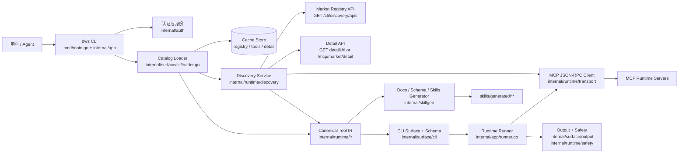
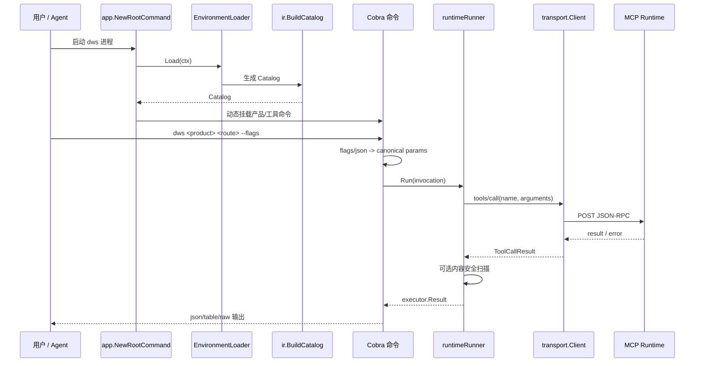
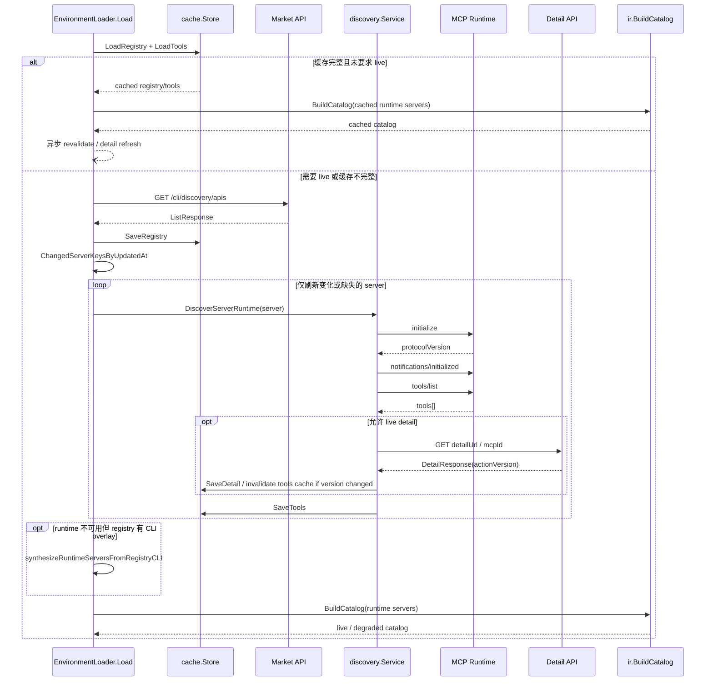
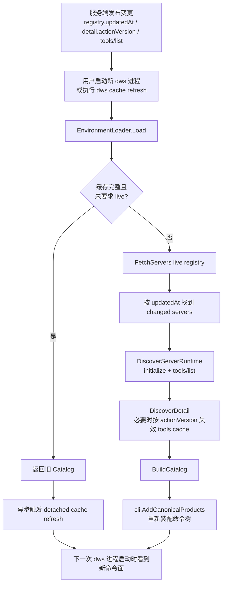
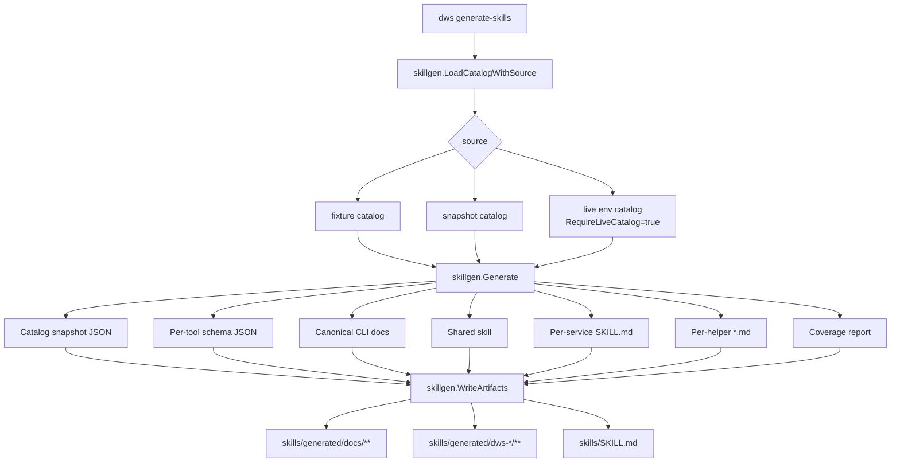

# DWS 架构评审文档

本文档面向评审，覆盖仓库整体分层、服务发现、MCP 协议、协议演进后 CLI/Client 的自动更新链路，以及 skills/schema/docs 的生成路径。文件级职责清单见 `docs/architecture-file-map.md`。

## 1. 系统定位

`dws` 是一个 Go/Cobra CLI，同时也是 DingTalk MCP 生态的客户端装配器：

- 上游输入是市场注册表、Detail API、以及各个 MCP Runtime Server 的 `initialize` / `tools/list` / `tools/call` 协议面。
- 中间层把动态发现结果归一为一份 Canonical Tool IR。
- 下游输出包含四类产物：
  - 用户可执行的 Cobra 命令树
  - `dws schema --json` 暴露的结构化 schema
  - `skills/generated/docs/**` 文档与 snapshot
  - `skills/generated/dws-*/**/*.md` AI/Agent skill 文档

一句话概括：`dws` 把“动态 MCP 服务目录”稳定地投影成“可缓存、可执行、可文档化、可给 AI 用”的客户端表面。

## 2. 总体分层图



## 3. 核心对象

| 对象 | 所在模块 | 作用 |
| --- | --- | --- |
| `market.ServerDescriptor` | `internal/runtime/market` | 注册表归一化后的服务描述，包含 endpoint、lifecycle、CLI overlay、detail locator。 |
| `discovery.RuntimeServer` | `internal/runtime/discovery` | 某个服务经过 `initialize` + `tools/list` 之后的运行时视图，带协议版本与 degraded 标记。 |
| `ir.Catalog` | `internal/runtime/ir` | 全仓库唯一的 canonical 工具目录，是 CLI、schema、skills 的共同真相源。 |
| `ir.CanonicalProduct` | `internal/runtime/ir` | 一个规范化产品模块，持有稳定 product ID、endpoint、lifecycle 与 tools。 |
| `ir.ToolDescriptor` | `internal/runtime/ir` | 一个规范化工具描述，融合 runtime schema 与 registry CLI overlay。 |
| `executor.Invocation` | `internal/runtime/executor` | 从 Cobra 命令解析出来的最终执行请求，包含 canonical product/tool/params。 |
| `transport.ToolCallResult` | `internal/runtime/transport` | MCP `tools/call` 的统一结果模型，兼容 `structuredContent` 和 block content。 |
| `skillgen.Artifact` | `internal/skillgen` | skills/docs/schema 生成器写盘前的统一产物单元。 |

## 4. 启动与命令执行主链路

### 4.1 进程启动

`cmd/main.go` 只做一件事：调用 `app.Execute()`。真正的装配都在 `internal/app/root.go` 里完成。

启动阶段的关键动作：

1. 构造 `EnvironmentLoader`，把 `DiscoveryBaseURL()`、`SetDynamicServers()` 等依赖注入进去。
2. 用 `cli.AddCanonicalProducts(...)` 根据当前 catalog 动态挂载产品命令。
3. 再补上静态 utility commands：`auth`、`cache`、`completion`、`version`，以及隐藏的 `schema`、`generate-skills`。
4. 从缓存恢复 dynamic server allow-list，并用 `hideNonDirectRuntimeCommands()` 隐藏未发现的产品。

### 4.2 命令执行



这条链路里有两个重要设计点：

- CLI 的“结构”来自 `Catalog`，执行时的“路由”来自 `Invocation`。
- `runtimeRunner` 对已发现产品支持 direct-runtime fast path；如果 `directRuntimeEndpoint(product)` 能命中，就不必再重新加载 catalog 才能执行。

## 5. 服务发现全流程

服务发现由 `internal/surface/cli/loader.go` 和 `internal/runtime/discovery/service.go` 共同完成。前者负责编排，后者负责真正的 registry/detail/runtime 探测。



### 5.1 发现阶段的关键规则

- 缓存优先：正常启动时，如果 registry + tools cache 完整且可用，会直接返回 cached catalog，不阻塞命令树装配。
- 短窗口重校验：缓存即使还在 TTL 内，只要超过 `RevalidateAfter`，仍会触发异步 refresh。
- 精准刷新：`cache.ChangedServerKeysByUpdatedAt` 只会对 `updatedAt` 变化的 server 做 runtime 重新探测。
- unchanged 复用：未变化且 tools cache 仍 fresh 的 server 会直接复用 cached runtime snapshot。
- degraded fallback：当 runtime 不可达但 registry CLI overlay 足够完整时，会从 `_meta.cli` 合成 tool surface，避免整个产品消失。
- detail enrich：Detail API 负责补齐 runtime schema 缺失的标题、说明、请求/响应 schema、敏感标记等元数据。

### 5.2 缓存模型

`internal/runtime/cache/store.go` 定义了三类 snapshot：

| Snapshot | 作用 | 典型来源 |
| --- | --- | --- |
| `RegistrySnapshot` | 市场服务列表快照 | `GET /cli/discovery/apis` |
| `ToolsSnapshot` | 某 server 的 `initialize` + `tools/list` 结果 | `DiscoverServerRuntime` |
| `DetailSnapshot` | 某 server 的 Detail API 响应 | `DiscoverDetail` |

关键 freshness 策略：

- `RegistryTTL = 24h`
- `ToolsTTL = 7d`
- `DetailTTL = 7d`
- `RevalidateAfter = 1h`

缓存分区不是全局单例，而是 `tenant/authIdentity` 维度；这意味着不同租户或身份上下文可以拥有独立的 discovery 视图。

## 6. MCP 协议演进后，如何自动更新成新的 Client/CLI

这是评审最关键的链路。`dws` 不是把命令面硬编码进仓库，而是把命令面视为“registry + runtime + detail + cache”共同驱动的动态结果。



### 6.1 实际行为边界

- 同一进程里的 Cobra tree 不会热更新。
  - `cache refresh` 更新的是 cache，不是已经挂载完成的命令树。
  - 新命令面会在下一次 `app.NewRootCommand()` / 下一次 CLI 进程启动时生效。
- 正常启动默认不做同步强刷。
  - aged cache 会先给出旧表面，再异步刷新。
  - 这是为了让启动速度和命令可用性优先。
- `schema` 与 `generate-skills` 会要求 live catalog。
  - 这两条链路不能容忍“命令面已经变了但我还在看旧 snapshot”，因此设置了 `RequireLiveCatalog = true`。

### 6.2 变更来源与影响范围

| 变更来源 | 触发点 | 影响 |
| --- | --- | --- |
| registry `updatedAt` 变化 | `ChangedServerKeysByUpdatedAt` | 该 server 重新执行 `initialize` + `tools/list`。 |
| Detail API `actionVersion` 变化 | `invalidateToolsIfVersionChanged` | 删除对应 tools cache，迫使下次 runtime 重新发现。 |
| `_meta.cli` 变化 | `BuildCatalog` / fallback synthesis | 影响 CLI 路由、group、aliases、flags 展示与 helper skill 路径。 |
| runtime `tools/list` 变化 | `BuildCatalog` | 影响工具存在性、RPC 名、schema、敏感标记。 |

### 6.3 测试证据

`test/integration/extensions/protocol_evolution_test.go` 已经把这条链路作为集成测试固定下来，覆盖了：

- 新增产品/工具后 CLI surface 自动扩张
- 删除/重命名工具后旧命令失效、新命令生效
- aged cache 启动时继续暴露旧 surface，但 refresh 之后下一次启动拿到新 surface

## 7. 协议与交互方式

### 7.1 Registry 协议

注册表入口是 HTTP GET `/cli/discovery/apis`，返回分页列表：

```json
{
  "metadata": {
    "count": 2,
    "nextCursor": ""
  },
  "servers": [
    {
      "server": {
        "$schema": "https://example/schema.json",
        "name": "钉钉文档",
        "description": "文档服务",
        "remotes": [
          {
            "type": "streamable-http",
            "url": "https://runtime.example.com/mcp/doc"
          }
        ]
      },
      "_meta": {
        "com.dingtalk.mcp.registry/metadata": {},
        "com.dingtalk.mcp.registry/cli": {}
      }
    }
  ]
}
```

其中 `_meta` 下有两类对 CLI 很关键的协议数据：

- `com.dingtalk.mcp.registry/metadata`
  - `mcpId`
  - `detailUrl`
  - `updatedAt`
  - `publishedAt`
  - `status`
  - `lifecycle`
- `com.dingtalk.mcp.registry/cli`
  - `id`
  - `command`
  - `aliases`
  - `group`
  - `groups`
  - `tools`
  - `toolOverrides`

`market.NormalizeServers(...)` 会把这份 registry 原始 payload 归一成 `ServerDescriptor`。

### 7.2 Detail 协议

Detail API 有两种定位方式：

- 优先用 registry 提供的 `detailUrl`
- 否则 fallback 到 `/mcp/market/detail?mcpId=<id>`

典型 payload：

```json
{
  "success": true,
  "result": {
    "mcpId": 9629,
    "name": "钉钉文档",
    "tools": [
      {
        "toolName": "create_document",
        "toolTitle": "创建文档",
        "toolDesc": "创建一篇文档",
        "toolRequest": "{\"type\":\"object\"}",
        "toolResponse": "{\"type\":\"object\"}",
        "isSensitive": false,
        "actionVersion": "v3"
      }
    ]
  }
}
```

Detail API 在这里承担三件事：

- 给 runtime tool 补全更稳定的人类语义信息
- 作为 `actionVersion` 变更探针，决定是否失效 tools cache
- 在 runtime 失败时，仍然为 degraded 模式提供更高质量的 tool metadata

### 7.3 MCP JSON-RPC 协议

`internal/runtime/transport/client.go` 实现了 MCP JSON-RPC Client，当前支持的 protocol versions 依次为：

- `2025-03-26`
- `2024-11-05`
- `2024-06-18`

握手顺序固定为：

1. `initialize`
2. `notifications/initialized`
3. `tools/list`
4. `tools/call`

请求与返回遵循 JSON-RPC 2.0：

```json
{
  "jsonrpc": "2.0",
  "id": 3,
  "method": "tools/call",
  "params": {
    "name": "create_document",
    "arguments": {
      "title": "评审文档"
    }
  }
}
```

工具调用的返回兼容两种内容模型：

- `structuredContent`
- `content` block 列表

客户端会把它们统一折叠为 `ToolCallResult.Content`，让上层输出和 safety scan 不需要知道服务端的具体返回风格。

### 7.4 鉴权与请求头

运行时请求头有两层：

- OAuth/Device Flow 拿到的 access token
  - 写入 `Authorization: Bearer ...`
  - 同时写入 `x-user-access-token`
- identity / trace 透传头
  - `DINGTALK_AGENT`
  - `DINGTALK_TRACE_ID`
  - `DINGTALK_SESSION_ID`
  - `DINGTALK_MESSAGE_ID`

安全边界：

- 默认只对受信任 HTTPS 域名发送 token
- 开发模式下只有设置 `DWS_ALLOW_HTTP_ENDPOINTS=1` 且目标是 loopback 地址，才允许 HTTP
- `DWS_TRUSTED_DOMAINS=*` 虽然可用，但会给出 wildcard warning

### 7.5 支持项计数总表

这一节专门回答评审里最容易被追问的“到底支持多少种”的问题。下面的数字都对应当前代码，不是概念性描述。

| 类别 | 数量 | 说明 |
| --- | --- | --- |
| 上游协议面 | 3 | Registry HTTP JSON、Detail HTTP JSON、MCP JSON-RPC 2.0 over HTTP POST。 |
| MCP protocol versions | 3 | `2025-03-26`、`2024-11-05`、`2024-06-18`。 |
| dws 实际使用的 JSON-RPC 方法 | 4 | `initialize`、`notifications/initialized`、`tools/list`、`tools/call`。 |
| `tools/call` 结果形态 | 3 | 纯 `structuredContent`、`content` object、`content` blocks。 |
| 缓存 snapshot 类型 | 3 | `RegistrySnapshot`、`ToolsSnapshot`、`DetailSnapshot`。 |
| skillgen catalog source | 3 | `fixture`、`snapshot`、`env`。 |
| CLI 显式参数输入面 | 3 | typed flags、`--json`、`--params`。 |
| CLI flag kind | 9 | `string`、`integer`、`number`、`boolean`、`string_array`、`integer_array`、`number_array`、`boolean_array`、`json`。 |
| 输出格式 | 3 | `json`、`table`、`raw`。 |
| `schema` 自省 scope | 3 | `catalog`、`product`、`tool`。 |
| 命令行自反省机制 | 4 | `--help`、`schema`、`--dry-run`、`test/mcp-probe`。 |
| root 命令族类型 | 7 | 动态产品命令、`auth`、`cache`、`completion`、`version`、隐藏 `schema`、隐藏 `generate-skills`。 |

补充说明：

- 上表里的“root 命令族类型 = 7”是“命令类别”的计数，不是“产品命令个数”。产品命令个数由 discovery 决定，会随 registry/runtime 变化。
- “命令行自反省机制 = 4”里，前三种是 CLI 自带能力，第四种 `test/mcp-probe` 是仓库测试侧的黑盒对照工具。

### 7.6 CLI 参数输入方式与合并优先级

工具命令不是只有一套输入方式，而是 3 层显式输入面叠加：

1. typed flags
2. `--json '<object>'`
3. `--params '<object>'`

合并顺序是：

```text
--json 作为 base
-> --params 覆盖 --json
-> typed flags 覆盖前两者
-> env/default 注入缺省值
-> transform
-> required 校验
-> dotted path 嵌套回对象
```

这套顺序的意义是：

- `--json` 适合一次性给整包 payload
- `--params` 适合在已有 `--json` 基础上做局部覆盖
- typed flags 适合最终的人类/Agent 精确改写

对评审来说，关键不是“有 3 种入口”，而是“3 种入口最终会收敛成同一个 canonical params 对象”，所以 CLI surface 和 runtime request 不会分叉。

### 7.7 命令行自反省能力

这里把“命令行自反省”定义成：CLI 能否向人、向机器、向测试系统说明“我当前支持什么、将要发什么、是否真的和 schema 一致”。

当前一共 4 层：

1. `--help`
   - 面向人类
   - 说明命令路径、flags、usage、分组命令
2. `dws schema`
   - 面向机器和 Agent
   - 支持 3 个 scope：
     - `dws schema`
     - `dws schema <product>`
     - `dws schema <product>.<tool>`
3. `--dry-run`
   - 面向执行前审查
   - 直接输出最终 `tools/call` request preview，不真正发到 runtime
4. `test/mcp-probe`
   - 面向黑盒一致性验证
   - 先读 `dws schema --json`，再真实调用 CLI，最后比较捕获到的 `tools/call.arguments`

如果评审里问“CLI 是怎么知道自己支持什么的”，答案是两层：

- 运行态靠 `Catalog`
- 自省态靠 `schema` / `help` / `dry-run`

如果评审里问“你怎么证明 help/schema/真实调用不是三套东西”，答案是：

- `test/mcp-probe` 就是拿 `schema` 生成输入，再去打真实 CLI，然后对比最终 MCP payload
- `test/integration/extensions/protocol_evolution_test.go` 负责证明协议演进后这套自省和真实 surface 会一起变

## 8. Skills / Schema / Docs 生成流程

`dws generate-skills` 是把同一份 `Catalog` 投影为多套 AI 可消费产物的入口。



### 8.1 生成链路中的关键规则

- `Catalog` 来源可以是：
  - `fixture`
  - `snapshot`
  - `env`
- `env` 模式强制 live catalog，避免从陈旧 cache 生成 skills。
- generator 一次性产出三类内容：
  - docs：`skills/generated/docs/**`
  - schema：`skills/generated/docs/schema/**`
  - skills：`skills/generated/dws-*/**` 与 `skills/SKILL.md`
- helper skill 的路径来自真实 CLI route，而不是简单的 RPC 名。
  - 所以 AI 表格会生成 `base/create.md`、`record/query.md` 这种分组路径。
- flag 展示使用 CLI alias / hint，而不是内部字段名原样输出。

### 8.2 为什么必须由 IR 驱动

如果 skills/docs/schema 不基于同一份 IR，而分别从 runtime、detail、help 文本、或人工模板生成，就会产生四种漂移：

- CLI 路由和 skill 路由不一致
- schema flag 名和 help flag 名不一致
- degraded 模式下产品消失
- 旧命令文档在协议升级后残留

当前实现通过 `ir.BuildCatalog(...)` 让这些产物共用同一个中间表示，避免了这类分叉。

## 9. 模块地图

| 模块 | 目录 | 作用 |
| --- | --- | --- |
| 入口层 | `cmd` | 程序主入口，只负责交给 `internal/app`。 |
| 应用装配层 | `internal/app` | root command、global flags、cache/auth/version/schema/generate-skills 以及 runtime runner。 |
| 认证层 | `internal/auth` | OAuth、Device Flow、token 安全存储、legacy token 兼容、identity headers。 |
| 平台公共层 | `internal/platform` | 常量、结构化错误、i18n、本地校验。 |
| 发现与协议层 | `internal/runtime/market`、`internal/runtime/discovery`、`internal/runtime/transport` | registry/detail 获取、runtime 握手、JSON-RPC 调用。 |
| 缓存层 | `internal/runtime/cache` | registry/tools/detail snapshot 的持久化与 freshness 判定。 |
| Canonical IR 层 | `internal/runtime/ir` | 把动态发现结果归一成稳定的产品/工具目录。 |
| 执行模型层 | `internal/runtime/executor` | Invocation / Result 抽象、dry-run 和 tool-call request 预览。 |
| 安全层 | `internal/runtime/safety` | runtime 内容扫描，阻断明显 prompt-injection 结果。 |
| CLI Surface 层 | `internal/surface/cli` | Cobra command tree、flag spec、参数规整、schema 输出、本地 schema 校验。 |
| 输出层 | `internal/surface/output` | json/table/raw 格式化与终端安全清洗。 |
| 生成层 | `internal/skillgen` | 把 Catalog 生成成 docs/schema/skills。 |
| 运维与交付层 | `scripts` | build、lint、policy、install、release。 |
| 验证层 | `test` | CLI、integration、contract、mock runtime、script、probe 测试。 |

## 10. 评审时需要特别关注的设计点

### 10.1 强项

- 动态命令面不是散落在各处，而是汇聚到一份 IR。
- 服务发现具备 cache-first 和 degraded fallback，启动稳定性较高。
- 协议升级路径有集成测试，能覆盖新增/删除/改名/改 flags 的场景。
- skills/schema/docs 和 CLI 共用同一个 catalog，不容易出现“help 对、skill 错”的双轨问题。

### 10.2 风险与边界

- CLI 命令面是“按进程重建”的，不是热更新。
- registry CLI fallback 只能合成近似 schema，精度低于真实 `tools/list`。
- detail 默认异步刷新，某些文案/元数据可能落后一轮进程。
- direct runtime allow-list 依赖 discovery cache；冷启动且 discovery 失败时，部分产品会被隐藏。
- token 发送严格受 trusted domains 限制，若环境配置错误，可能表现为“命令存在但运行报 auth/discovery 错误”。

## 11. 阅读顺序建议

面向评审建议按下面顺序读代码：

1. `cmd/main.go`
2. `internal/app/root.go`
3. `internal/surface/cli/loader.go`
4. `internal/runtime/discovery/service.go`
5. `internal/runtime/transport/client.go`
6. `internal/runtime/ir/catalog.go`
7. `internal/surface/cli/canonical.go`
8. `internal/skillgen/generator.go`
9. `test/integration/extensions/protocol_evolution_test.go`
10. `docs/architecture-file-map.md`

## 12. 附录

- 文件职责附录：`docs/architecture-file-map.md`
- 自动化维护说明：`docs/automation.md`
