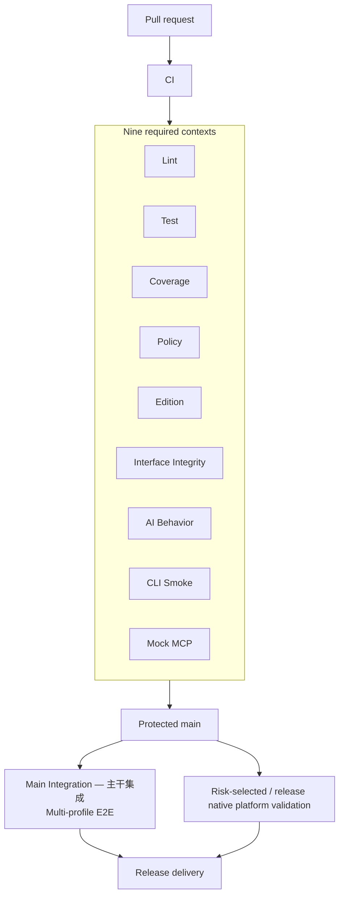

# Architecture

`dws` is a Go CLI with a versioned, static command surface for DingTalk MCP capabilities. Cobra help serves humans; the embedded Command Catalog serves AI agents.

## Change Rules

Prescriptive layering for new code. Keep descriptions here concise; scoped
guides own the details.

1. Dependencies point inward: `cmd` → `internal/app` → `internal/helpers` →
   shared layers (`executor`, `transport`, `output`, `errors`, `safety`,
   `cobracmd`). Shared layers never import `helpers` or `app`.
2. New product commands go to `internal/helpers` following
   [`helpers-structure-guide.md`](helpers-structure-guide.md); do not add
   product logic to `internal/app`, `internal/cli`, or transport.
3. New shared behavior joins the existing shared package that owns the
   contract; do not create a new shared package for a single caller.
4. Schema/Agent metadata changes start from reviewed inputs in `internal/cli`
   per [`schema-contributor-guide.md`](schema-contributor-guide.md); never
   hand-edit generated Catalog output.
5. Bundled skill content under `skills/` follows
   [`skill-authoring-guide.md`](skill-authoring-guide.md); skills are embedded
   via `skills/embed.go` and ship with the binary.
6. A new top-level package (under `internal/` or `pkg/`) requires a stated
   boundary reason in its PR and an update to the Repository Structure list
   below.

## High-Level Flow

1. `cmd` is the CLI entrypoint, invoking `internal/app` to build the root Cobra command tree.
2. `internal/app` wires static utility commands (`auth`, `audit`, `schema`, `completion`), product helpers, and versioned plugin descriptors.
3. `internal/helpers` contains the main command handlers for all product surfaces (`dev`, `chat`, `calendar`, `contact`, `aitable`, etc.).
4. `internal/executor` and `internal/transport` execute MCP JSON-RPC calls; `internal/output` formats responses.
5. `internal/auth` manages login state, PAT tokens, and agent-code detection.
6. Schema generation starts from the reviewed `CommandRegistry`, binds each identity to the exact current Cobra leaf, and then resolves typed constraints, sanitized MCP snapshots, Agent hints, and Skills into one `SchemaRegistry`. Startup and Schema queries do not call MCP `tools/list`.
7. The embedded Catalog is a downstream release artifact and never backfills identity or participates in regeneration. Stable flag-to-interface property bindings come from the reviewed, content-addressed v3 manifest in `schema_parameter_bindings.json`; its exact active tuples, corrections, removals, and mapping exclusions are validated against the final bound `SchemaRegistry`. CLI `required` and constraints come from the resolved typed contract, while MCP `required` remains interface-only metadata.
8. Agent selection results are fixed in versioned review inputs. Every public tool has explicit use/avoid/example and interface disposition metadata; Skill references that are not current leaves require an explicit alias/group/stale/out-of-surface review instead of fuzzy runtime matching.

## Repository Structure

- `cmd`: CLI entrypoint
- `internal/app`: root command wiring, static utility commands, and plugin loading
- `internal/helpers`: product command handlers (dev, chat, calendar, contact, etc.)
- `internal/plugin`: versioned plugin manifest, hook, skill, and transport descriptor loading
- `internal/cli`: embedded Agent Command Catalog, static schema query, and catalog contracts
- `internal/generator`: deterministic Agent metadata and Command Catalog generators
- `internal/executor`: invocation dispatch and result handling
- `internal/transport`: MCP HTTP client and request signing
- `internal/auth`: login, token management, agent-code detection, identity
- `internal/audit`: user operation audit log (JSONL, hash chain, forwarding)
- `internal/errors`: structured error model with categories and hints
- `internal/keychain`: OS keychain integration for credential storage
- `internal/security`: endpoint allowlist and domain trust
- `internal/safety`: runtime safety checks (confirm prompts, dry-run guards)
- `internal/cobracmd`: shared Cobra command builders
- `internal/pat`: PAT (Personal Access Token) authorization flow
- `internal/output`: response formatting (json, table, raw, pretty)
- `internal/logging`: structured logging and argument sanitization
- `internal/tui`: terminal UI helpers
- `internal/recovery`: panic recovery and graceful degradation
- `pkg/configmeta`: environment variable registry and documentation
- `pkg/config`: configuration constants and paths
- `pkg/edition`: edition detection (oss vs enterprise)
- `pkg/mcptypes`: MCP protocol type definitions
- `internal/syncdata`: generated static endpoint and command-routing data synced from the Wukong baseline
- `skills/`: bundled agent skills (mono/ and multi/ layouts)
- `test/`: CLI, integration, contract, unit, and skill E2E tests
- `scripts/`: install scripts, policy checks, and CI helpers

## Quality Pipeline

Quality enforcement is layered so a pull request receives fast, deterministic
admission feedback without pretending that downstream integration has already
run.

```mermaid
flowchart TB
  PR["Pull request"] --> CA["CI"]
  subgraph CA_CHECKS["Nine required contexts"]
    L["Lint"]
    T["Test"]
    C["Coverage"]
    P["Policy"]
    E["Edition"]
    I["Interface Integrity"]
    A["AI Behavior"]
    S["CLI Smoke"]
    M["Mock MCP"]
  end
  CA --> CA_CHECKS
  CA_CHECKS --> MAIN["Protected main"]
  MAIN --> MP["Main Integration — 主干集成<br/>Multi-profile E2E"]
  MAIN --> PLATFORM["Risk-selected / release native platform validation"]
  MP --> RELEASE["Release delivery"]
  PLATFORM --> RELEASE
```

Complete Multi-profile E2E and the ordinary full native-platform matrix are
downstream of PR admission. PRs still run primary-environment assurance and
fast cross-platform compilation; auth, keychain, OS-specific, installer, and
release changes additionally select native platform tests before merge. See
[`docs/ci-pr-gates.md`](ci-pr-gates.md) for the exact context and ruleset
contract.
