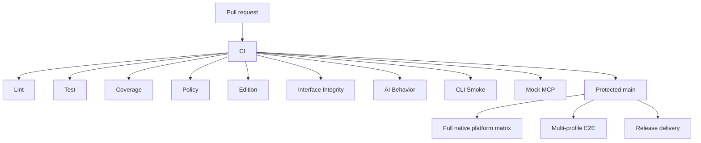

# CI — PR 合入门禁

The pull-request admission layer has exactly nine required external contexts:

| Required context | Contract |
|---|---|
| `Lint` | Stable PR revision/risk classification plus applicable formatting, `go vet`, and Actionlint |
| `Test` | Tier-selected race/unit/release-script tests plus representative cross-platform compilation |
| `Coverage` | Scope-matched overall non-regression and 100% changed-code coverage |
| `Policy` | Repository policy and the fail-closed CHANGELOG contract |
| `Edition` | Edition contract tests |
| `Interface Integrity` | CLI, Schema, Skill, and stable-release compatibility |
| `AI Behavior` | Base-owned policy for PRs labeled `ai-generated` |
| `CLI Smoke` | Offline help for every public top-level command |
| `Mock MCP` | HTTP and stdio MCP lifecycle smoke tests |

The workflow display name is `CI`. Parallel helper
jobs may implement `Test` and `Coverage`, but they are not ruleset contexts.
Do not require an aggregate alias or a downstream integration check in place of
the nine contracts above.

`AI Behavior` is evaluated by a `pull_request_target` workflow that never
checks out or executes PR code. It writes the exact `AI Behavior` status to the
current PR head. Its Files API read is bracketed by base/head revision checks,
so a synchronize race fails closed. The same workflow supplies a successful
`AI Behavior` check run on protected `main` pushes for release governance.

## Exact CHANGELOG-only fast path

A pull request qualifies only when GitHub reports exactly one changed file,
that file is an in-place modification of `CHANGELOG.md`, and the base and head
both retain it as a regular non-executable `100644` blob. Add, delete, rename,
symlink, executable-mode, and second-file changes do not qualify.

`Lint` classifies the Files API result only after verifying that the API's base
and head equal the event revision both before and after pagination. `Policy`
checks out GitHub's PR merge ref and verifies its parents:

```text
HEAD^1 = pull_request.base.sha
HEAD^2 = pull_request.head.sha
```

It then runs:

```sh
./scripts/policy/check-changelog-pr.sh \
  --fast-path "$PR_BASE_SHA" HEAD
```

Because the verified PR diff contains only `CHANGELOG.md`, the validator and
its policy dependencies in that merge tree are byte-for-byte the current base
versions. Validation targets the synthetic merge tree, not the feature-branch
tree, so a stale branch cannot supply an older validator or combine with newer
base notes into an invalid final CHANGELOG.

All nine admission contexts are still emitted and must succeed. Expensive
implementation helpers are skipped; the named contexts record that their code
surface is unaffected.

The protected `main` push keeps that fast path only when all of these
fail-closed conditions hold:

- the event is a non-forced update of the existing `refs/heads/main`;
- the event `after` SHA is the exact workflow SHA, and both event SHAs are
  complete, non-zero commit IDs;
- GitHub's comparison reports the previous main tip as the unique linear merge
  base, with no commits behind it;
- the complete resulting tree diff is exactly one in-place modification of
  `CHANGELOG.md`;
- the previous main tip already has successful GitHub Actions checks for all
  nine Code Admission contexts.

`Policy` then independently checks out the pushed revision and runs the same
`check-changelog-pr.sh --fast-path` contract from the event's `before` SHA to
its `after` SHA. If identity, ancestry, file scope, tree mode, CHANGELOG
content, or predecessor admission cannot be proved, classification falls back
to the complete main admission suite. A source change can therefore never
inherit the CHANGELOG-only result.

Any PR that touches `CHANGELOG.md` but also changes another file runs the same
content contract in `Policy` with `--content-only`. That mode permits the
second file but still rejects invalid dates or versions, missing bullets,
placeholder `TODO`/`TBD`, unmanaged-section changes, and unsafe tree modes.
Adding a second file therefore cannot bypass CHANGELOG validation.

## Risk tiers and downstream boundaries

`Lint` resolves the complete base/head diff before any helper is skipped.
Unknown or truncated input fails closed into the high-risk tier.

| Tier | Selection | Admission work |
|---|---|---|
| Documentation-only | Only prose/documentation assets; no executable, generated, workflow, packaging, or interface surface | Documentation and repository-asset validation; expensive code helpers skip while every required context still succeeds |
| Standard | Ordinary code change with a stable package graph | Race tests for changed Go packages and their reverse dependencies; candidate and merge-base coverage over the same impacted scope and `coverpkg`; representative Darwin/Windows compilation |
| High-risk / protected `main` | Workflow/policy, package add/remove/rename, generated Schema/registry, platform, auth/keychain, installer, packaging, release, transport, recovery, or an unprovable infrastructure classification | Complete race suite and full native macOS/Windows tests, plus every affected domain gate |

Domain helpers (`Edition`, `Interface Integrity`, `CLI Smoke`, and `Mock MCP`,
for example) execute their substantive suites when the diff can affect that
contract or when the high-risk tier is selected. Otherwise their stable named
contexts still report a successful, explicit unaffected result. Release-script
tests follow the same impact rule. This preserves the ruleset contract without
charging every developer for unrelated work.

Platform-sensitive changes additionally run native changed-code coverage.
Protected `main` always runs native tests; generic portable changes are held to
the Linux changed-code gate rather than being forced to manufacture
platform-only coverage.

Complete `Multi-profile E2E` is not a PR admission context. It belongs to the
`Main Integration — 主干集成` workflow and runs only after a push to `main` (or
an explicit manual dispatch). A failing downstream run remains a real
regression and must be repaired, but it must not be represented by a synthetic
successful PR check.



## Review ownership and auto-merge

A base-owned `pull_request_target` workflow routes newly opened, updated,
reopened, or newly ready PRs targeting `main` to one eligible peer reviewer. It
does not check out or execute PR code, excludes both the author and the known
latest pusher, and balances the open requested-review load across the reviewed
maintainer pool. A current-head approval or change request is preserved; after
a new push, stale activity does not suppress a fresh request, and an
outstanding change requester is preferred for continuity.

The branch ruleset keeps one human approval and all nine strict required
contexts, and requires someone other than the latest pusher to approve after
the most recent head update. Repository auto-merge is enabled for ready PRs,
so a PR merges after that approval and the current revision's nine checks are
green. If `main` advances, strict checks rerun before merge. The reviewer
router is orchestration, not a quality context, and must not be added to the
ruleset.

## Running focused gates locally

Run the contracts relevant to the change. Ordinary contributors are not
expected to repeat every CI job locally:

```sh
make build
make policy
make interface-integrity
make authoritative-interface-integrity BASE_REF=<merge-base>
make schema-compatibility BASE_REF=<merge-base>
make skill-command-integrity
make cli-smoke
make mock-mcp-smoke
go test -v -count=1 ./pkg/editiontest/...
```

For an exact CHANGELOG-only branch:

```sh
base_ref=$(git merge-base HEAD origin/main)
./scripts/policy/check-changelog-pr.sh --fast-path "$base_ref" HEAD
```

`make coverage-gate` is an enforcement step, not a profile generator. For a
standard PR, CI derives changed packages and their reverse-dependency test
closure, then generates candidate and merge-base profiles with the same test
scope and `coverpkg`. High-risk and protected-main runs use the complete
profiles. Supporting and (when platform-selected) native profiles are
generated before the aggregate `Coverage` context evaluates them. The
aggregate and native gates require 100% coverage for changed executable Go
statements. Overall coverage remains an unrounded, zero-tolerance,
scope-matched merge-base non-regression check. Candidate and baseline profiles
are evaluated by the same block-deduplicating checker; supporting policy and
shortcut profiles contribute to changed-code coverage only. The checked-in
badge is presentation only and is never read as a gate input.

Compatibility checks derive authoritative Interface snapshots from the PR
merge-base and the latest reachable stable release. The candidate cannot bless
a breaking change by editing a fixture. Schema additions are allowed;
historical products, tools, parameters, mappings, positional execution fields,
constraints, and safety semantics remain protected.

## Required GitHub repository settings

The `main` quality ruleset must enable strict required-status-check policy
(`strict_required_status_checks_policy=true`) so a PR is revalidated whenever
`main` advances. It must require these exact contexts and no legacy aliases:

- `Lint`
- `Test`
- `Coverage`
- `Policy`
- `Edition`
- `Interface Integrity`
- `AI Behavior`
- `CLI Smoke`
- `Mock MCP`

Do not require helper jobs, `Multi-profile E2E`, or an aggregate admission
alias. Update ruleset contexts only after the new names have appeared on the
protected branch, so a rename cannot silently remove enforcement or leave an
unproducible required context.

The branch ruleset also requires one approval after the latest push. Enable
repository auto-merge and automatic head-branch deletion; keep the base-owned
reviewer router outside the required-context list.
