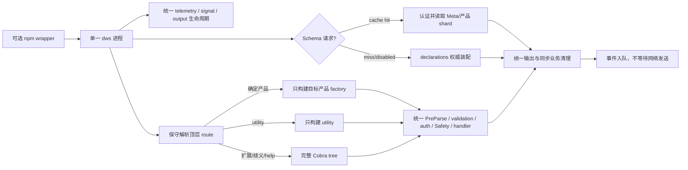

# PR #1296 性能专项技术方案

状态：实施中。规范性选择见 [Schema 与 CLI RFC](rfc-schema-runtime-cache.md)，数字见[性能附件](rfc-schema-runtime-cache-performance.md)。

## 问题

旧候选默认入口约 300 ms 的主要成本是 telemetry 退出等待；业务命令还有 launcher/core 委派、完整 core SHA-256 与全量产品树装配。Schema cache 已证明查询计算可以明显下降，但它不能替代业务 handler，也不能解决这些固定启动税。

## 方案

改动分三层：

1. 入口恢复 main 的单二进制，撤回 PR 新增的 launcher/core、逐次哈希和双份 help。
2. telemetry 保持字段与异步 SDK，取消退出等待，明确接受最后事件可能丢失；业务 cleanup 继续同步。
3. core 内按需构建一个产品树，Schema 只在 Schema 请求上读缓存。未知状态完整回退，框架仍拥有最终执行。

## 边界

轻量 route 只识别根级已注册 flag 和第一个顶层 token。它不解析 leaf 参数。公共 root constructor 总是完整；真实进程且无插件/edition 扩展时才启用选择性装配。

产品 name、factory 和 alias 放在同一 registry；shortcut 先按 service 过滤再 build。过滤发生在 factory 调用前，因此真正避免构造无关命令、flags、annotations 和 PostMount 数据。

Schema embedded identity 缺失走 live，非法则退出 125；用户 cache 损坏走 live 自愈。正式支持 target 在发布前用两个原生 runner 生成一致 proof，并把 identity 链接进同一个 `dws`。

## 当前局部结果

Apple M3 Pro、Go 1.25.9、同一工作树、每组 5 次：

| 构造路径 | 时间 | B/op | allocs/op |
|---|---:|---:|---:|
| 完整 `NewRootCommand` | 约 14.0～14.4 ms | 17.1 MB | 169k |
| process `calendar list` | 约 0.84～0.86 ms | 1.17 MB | 10.1k |
| process `config get` | 约 0.35～0.38 ms | 0.46 MB | 3.7k |

这只证明装配层收益。最终结论等固定 main 的端到端 30 样本及 Linux/Darwin CI；不得把微基准直接写成用户总体加速。
