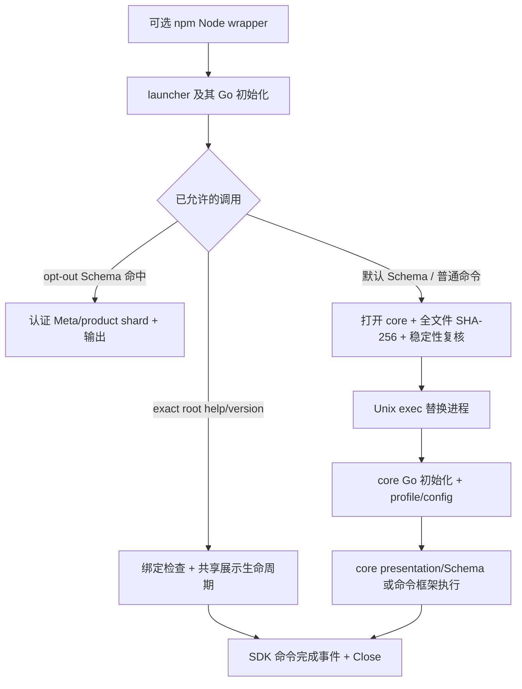
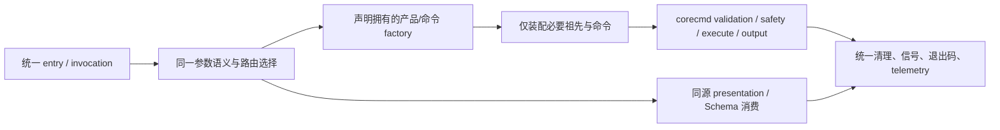

# PR #1296 性能专项：技术分析与优化方案

状态：Draft / 已开始实施，整体目标尚未达成。基准为 PR #1296 实现 `7cbf7f52`、[原生 run 34018840739](https://github.com/DingTalk-Real-AI/dingtalk-workspace-cli/actions/runs/34018840739)。相关：[性能报告](rfc-schema-runtime-cache-performance.md)、[执行计划](plan-cli-performance-parity.md)、[当前 Schema RFC](rfc-schema-runtime-cache.md)。

本次范围是 PR #1296 的性能专项：在当前 verified Schema cache 与 canonical CLI packages 上定位和削减真实成本。已开始实施有 profile 支持的 Schema 校验和初始化优化。当前 RFC 的发布合同继续有效；单二进制与 outbox 仅用于分析现有模型的上限，不能把它们排成这次专项的默认前置改造。

用户约束更新（2026-09-06）：本轮目标是默认入口性能超过 Lark CLI；GWS 保留为进一步优化的对照。用户明确决定**不修改统计行为**：保留官方 SDK 异步发送、退出前最多 300 ms 的等待及既有字段/投递方式。下文 outbox 等分析仅作历史备选，本轮不实施。保留默认入口的全部失败格，不能以 opt-out 或组件收益替代“超过 Lark”的结论。

## 1. 结论与判断边界

真正需要解决的是三种成本：**退出时的上报等待、执行前的制品读取校验、进入 main 前后无关模块的初始化与装配**。Schema cache 只解决其中一部分工作。

本轮优先优化 **现有 Schema 认证/解码、launcher 校验、core 初始化/命令装配、共享展示生命周期及整体分配**。先把每项 CPU、墙钟、I/O 和 RSS 分解清楚，尤其定位 config/dry-run/mock 的 8.39%–12.74% 回退。所有命令执行继续集中到统一框架。单原生二进制和按需 runtime 的大范围迁移只作为后续突破结构成本的候选，不能先推翻形态再补性能证明。

Telemetry 决策已明确：保留当前行为，因此在不受控的慢网络上不能承诺几毫秒退出。继续削减实际执行成本，并在默认测量中诚实保留上报等待造成的差距。持久 outbox 不属于本轮实施范围。

**当前没有证据证明以上改造足以达到 GWS 的所有延迟与内存指标。** 技术方案的责任是给出成本模型、可实现结构与可证伪实验；最终达标仍以执行计划的完整矩阵为准。

### 1.1 本次专项的直接工作包

按 O0 → O1/O2/O3 → O4 → O5 的顺序执行。O0 完成后以真实 profile 排序 O1/O2/O3；每个优化点要有改前、改后、同机同制品条件的证据，只有收益与合同同时成立才保留改动。

| 工作包 | 具体分析与候选修改 | 代码落点 | 验证/退出条件 |
|---|---|---|---|
| O0：生产路径分解 | 为独立诊断记录 launcher hash/exec、core init/config、Schema read/hash/decode/index/render、SDK enqueue/close；同时采 CPU/alloc/heap 与文件 I/O | launcher、schemafastpath、schemareader、app、clitelemetry；复用 scripts/dev 测量框架 | 形成每个场景的成本表，标明重叠与未知项。tracing 不进入正式延迟样本；不能拿 Python SHA 代替 Go 校验阶段 |
| O1：Schema 热命中 | 查 Meta/product 的重复解码、无关 map/index 构建与 DTO/wire 副本；在单次 invocation 复用已认证结果、缩短大对象存活；profile 证实后才改变查询粒度 | `internal/schemareader/read.go`、`internal/cli/schemaruntime`、`internal/schemafastpath/schema.go` | 真实 warm leaf/product/overview/--all 分开；先验证后解码、格式与输出等价、自愈仍成立；报告延迟与分配，不能只报组件 ns/op |
| O2：canonical package 委派 | 实测 Go crypto/sha256 的完整文件吞吐和文件元数据操作；确认编译目标/实现、读缓冲、重复检查是否有可减少工作；剖析 core payload 体积组成 | `internal/launcher/launcher.go`、`internal/launcher/delegate_unix.go`、build/release 脚本 | 完整字节认证与执行前稳定性复核保留；减少字节只可删除确认无用的载荷并重签/重绑定。逐次校验成本仍高则明确结构下界，不缓存验证结论 |
| O3：help/普通命令与初始化 | 分别看 root/leaf help、config、dry-run、mock；找实际执行前无用的 factory、metadata、profile、transport 初始化，推迟到需要处；共享生命周期避免重复 setup | `internal/app/root.go`、`internal/launcher/version_tracking.go`、roothelp、profilemetadata、corecmd | 先消除不必要装配/副作用；保留统一解析、安全/退出语义。root help 已有轻量路径，普通命令不得复制到 launcher；回退是否消除按逐项数据判断 |
| O4：telemetry 因果验证 | 快速/慢 collector 对比，区分身份读取、序列化、网络、response body、Close 等待；只修证实的 SDK 无用等待或资源取消问题 | `internal/clitelemetry` 与 vendored 官方 SDK | 默认 budget/字段/投递方式不悄悄改；若等待就是当前合同的成本，把结论与需要的新合同另提评审。当前上报正常工作也算有效定位结果 |
| O5：全进程内存与 public 复验 | 依据 peak heap/profile 删除重复对象和过早初始化，复测 native 与 npm 父子同时 RSS；确认 wrapper 自身成本 | runtime/typed renderer、`build/npm/bin/dws.js`、native/tree samplers | 两平台、真实安装包、默认模式五维报告齐全。B/op、RSS、CPU、页故障分别报告；不得把后台资源移出统计 |

本轮先保持现有 release gate。专项增加“普通 config/dry-run/mock 回退消除”的验收目标：相对固定 pre-PR 对应场景的 p50/p95 ≤1.05 倍，RSS 同口径不回退超过 5%；这是真实工作目标，未做到即保留失败项，不能更改口径将其改绿。

Lark/GWS 的追齐矩阵仍是最终目标。O0–O5 的优化若无法越过当前 telemetry 或逐次校验的结构成本，就以测得的下界决定下一轮设计，而不是把“已优化”改称“已追齐”。后文单二进制/outbox 属于这一条件下的技术备选，不扩展当前 PR 的实施范围。

## 2. 当前执行结构与实测事实

### 2.1 路径

Unix `syscall.Exec` 替换当前进程，并非常驻 launcher 父进程再启动 core 子进程。它仍有两个程序映像顺序启动和一次完整 core 读取。npm Node wrapper 则与 native 子进程同时驻留，必须做进程树测量。其他平台的委派实现不能从 Unix 推断。

| 来源 | 直接代码事实 | 实测/推断边界 |
|---|---|---|
| [SDK Run/close](../third_party/aem-go-sdk/clitrack/clitrack.go) | 先执行命令，再 track 完成事件，再等待 inner Close；默认最多 300 ms | 300 ms 是等待上限，非固定 sleep；已有完成通知，尚未发现“完成了还必等满”的 bug |
| [SDK worker](../third_party/aem-go-sdk/aem/tracker.go) / [sender](../third_party/aem-go-sdk/internal/sender/sender.go) | 异步队列；Close 等 worker；HTTP client 超时 5 秒，sender 没有由 CLI 300 ms deadline 传下来的 context | CLI 超时退出不等于 sender 成功或被正确取消；需分别测请求已发出/服务端接受/响应完成/父进程退出 |
| [launcher 校验](../internal/launcher/launcher.go) | 全量哈希打开的 core 并复核文件状态，随后委派 | Python 全文件 SHA 诊断 p50：Darwin 22.38 ms、Linux 35.41 ms；不是生产 Go 阶段的精确数字 |
| [capability 分类](../internal/launcher/capabilities.go) | 默认 Schema 不走 launcher Schema 分支；只有 opt-out 命中才走纯消费路径 | 默认与 opt-out Schema 不只是有无网络，执行路径也不同，不能相减后都称为 telemetry |
| [root 构造](../internal/app/root.go) | 挂载 utility 与产品命令、配置框架生命周期；还有多个包级 init/注册 | 确认存在工作，不等于已证明它是主要瓶颈；必须 profile 后归因 |
| [npm wrapper](../build/npm/bin/dws.js) | 扫描 vendor 目录、定位程序、Node spawn 和信号转发 | 目录扫描很少，不能凭阅读认定主要成本在 readdir；Node 启动和父子同时驻留需单独量化 |

同批独立入口测量的 Linux root help default p50 为 305.95 ms、opt-out 为 4.83 ms；version 为 304.97/3.55 ms。Darwin 分别为 318.49/10.28 ms、317.86/9.05 ms。这支持“退出生命周期是展示入口的主要成本之一”。

但缓存 Schema 的 opt-out p50 仍为 Linux 21.46 ms、Darwin 22.79 ms；五维报告中的 GWS Schema p50 约 4.34/8.38 ms。两张表是同 run 的不同测量阶段，只能辅助定位，不能直接当配对回归 gate。即使不考虑上报，Schema 消费路径仍需要优化。

### 2.2 模型

同一 invocation 的近似墙钟模型：

`T = wrapper + image/startup/init + metadata/config + command work + output + post-command telemetry wait`

委派路径额外包含 `core authentication + exec/new image initialization`。并发发送、I/O、调度存在重叠，以上各项不能不加分析直接相加；输出完成时间与进程退出时间必须分别测，用户 shell 等待的是后者。

内存以真实峰值为准：native 的 Go runtime、静态初始化、命令树、decoded schema/index、输出缓冲和临时副本可能同时驻留；public 还包括 Node。不能用 Go B/op 代表整体 RSS，也不能把多个进程不同时刻的峰值相加称为同时峰值。

## 3. 结构成本上限与后续备选（非本次默认改造）

| 路径 | 可消除的成本 | 保留的限制与风险 | 结论 |
|---|---|---|---|
| A：保持现有双二进制，改善 SDK/装配 | 展示入口等待、部分 core 工作 | 普通命令逐次校验完整 core；若扩 launcher 处理更多命令，会增加路由/生命周期双重维护 | 可做 v1 内安全优化，不足以支撑“全部默认命令追齐 GWS”的承诺 |
| B：单原生二进制 + 按需 runtime | launcher→core 哈希/exec、两边重复 entry 生命周期；有机会省掉无关装配 | 所有静态导入包仍先 init；信任模型、help 密封与包装升级要重新设计；大体积文件不必全读，但首次页入仍可能贵 | 只有专项证实当前结构下界后才验证；通过真实合同实验与信任评审后才能冻结为 v2 |
| C：小客户端 + 常驻本地服务 | 长进程可复用初始化、网络连接、已认证内存 | 冷启动仍贵；常驻 RSS、服务更新、IPC 权限/身份、租户隔离与崩溃恢复都新增；前台看似很快不代表整体更轻 | 不作为默认 CLI 追齐方案；未来若产品本来需要服务，单独讨论 |
| D：重写原生语言/专用查询程序 | 可能降低特定入口的 runtime 下界 | Go/GWS 的差异未完成等合同归因；迁移框架、auth、输出和 Schema 语义成本高，容易产生第二套权威 | 不在当前技术结论中承诺；仅当 B 的真实依赖下界实验失败后再评估 |

这些路径与 telemetry 决策正交：单二进制仍等 300 ms 就不会获得毫秒退出；小 launcher 取消等待也不会自动解决默认业务命令的成本。

## 4. 后续备选：单二进制如何保持统一框架

### 4.1 所有权与调用链

名称为概念结构，尚未新增这些包/API。具体边界：

- entry 只拥有进程生命周期、输入输出、取消与最终退出码。`corecmd` 继续拥有命令规范化、validation、safety 和执行，不把 auth/transport 搬到轻量消费包。
- 产品/命令 factory 源自 owning declaration；可提前注册轻量描述和 factory 函数，不能在注册时创建完整树、读取用户文件或初始化 transport。原始 `LeafSpec/Contract` 与 product declaration 仍是语义源。
- 不能手写一份 `argv → handler` 表再旁路 Cobra。按需装配必须保留 persistent/local flags、aliases、`--`、flag value、group policy、Traverse、required/group constraints、未知参数以及 help precedence。
- 路由选择只决定装配范围，不能发布另一份参数解析结果。由统一框架完成最终解析/validation；遇到影响路由的未知全局 flag、动态扩展或歧义时，在尚未执行/输出前回到同进程全树装配。回退必须可测试，不能把解析失败误当作选择了另一条命令。
- 同一 declaration 的 full-tree 和按需 tree 双向校验 command identity、flags、safety、Schema、error classification。root/group 导航可以使用同源轻量目录，不能因少装配兄弟节点改变 help/completion/建议命令。
- SDK/profile/信号/输出清理在所有路径共享；presentation 只省略本来无需的业务依赖。用户选择 profile、edition、plugin 的行为仍按原合同处理。

### 4.2 Go init 是独立工程

Go 不支持通过普通 factory 延迟导入已静态链接的包。任何被链接依赖的 init、包级 map/slice 构造都可能在路由选择前发生。因此按需 runtime 要同时做：

1. 用 `GODEBUG=inittrace=1` 的独立诊断进程和启动 profile 列出每个包初始化时间/分配，普通验收样本不带 tracing。
2. 将构造完整 Shortcut/Contract/Cobra 对象的全局注册改为声明所属的显式 factory；无副作用的紧凑描述尽可能只读驻留。不得把事实搬到手工 reviewed 路由文件。
3. 把 runtime payload 加载、auth/keychain、transport/client 和插件加载推迟到确实需要的执行阶段；仍应保持错误、清理和信号语义。
4. 分别测一个最小 Go 程序、当前完整依赖但不构树、仅选定产品、完整执行四组。前两组只是下界诊断，不能冒充最终制品。

如果完整依赖的初始化本身超过约 3–10 ms 的目标数量级或内存下界高于 GWS，单二进制方案必须继续裁剪依赖/初始化，不能因为不再 exec 就宣布成功。文件大小、RSS、页故障分别报告；磁盘映像大不等于每次全量驻留，也不等于零成本。

### 4.3 help 密封与信任迁移

当前 `roothelp.Snapshot` 绑定 finalized core SHA，launcher 在 core 完成后链接。单二进制不能把自己的最终 SHA 嵌入自身并要求它等于最终文件摘要，这会产生循环依赖。

v2 候选应使用两层绑定：

- 内部衍生品绑定规范化源码/声明/edition/工具链/格式版本生成的 BuildID；help 与 Schema 同源，字段不能自封为独立权威。
- 最终可执行文件完成 payload 处理与签名后，由外部 release manifest/可信签名绑定最终 bytes；真实 native runner 比较 en/zh 输出及 live/cache Schema，发布后不改签名字节。

这是新 snapshot/manifest 格式，须版本化；旧包仍按旧格式验证，不能重解释旧 CoreSHA256。无效已注入身份仍 fail-closed，用户可写 cache 损坏仍按权威声明自愈。

安全边界不能含糊：当前 launcher 可以发现 core 被替换，但不能对抗“同一攻击者把 launcher 也换掉”。单二进制在安装时验签不能自动防止安装后的可写文件被替换；Linux 普通用户目录尤其不能假定有 OS 执行时完整性保障。macOS 签名/公证也不能一概描述成所有来源/路径都逐次验签。

因此要明确选择实际威胁合同：可信安装且防止混包，还是还要求执行前检测本地可写文件篡改。若必须保留后者，就需要可信外部验证者/平台保障；不能用用户可写的 marker、mtime 或自声明摘要替代，相关成本也必须进入测量。该问题未解决则 v2 不进入生产实现，v1 继续生效。

## 5. Telemetry 技术选项与正确性

### 5.1 首先查证，而非假定 SDK bug

可控 collector 实验覆盖立即 2xx、延迟响应头、延迟响应体、连接拒绝、DNS/连接超时、返回错误、并发和信号。记录 execute 完成、Track 入队、请求开始、服务端接受、HTTP 完成、Close 返回、进程退出七个时间点。当前 sender 会读完 response body；响应头成功但 body 延迟也可能阻挡 Close。

预期应是发送完成立即返回，未完成最多等待上限。若发现符合此行为，300 ms 差距应归因为当前发送/退出合同和环境，而不是修复一个不存在的 sleep。

修正 context/deadline 传播可避免 CLI 放弃等待后在长存活 embedding 场景里留下请求；但取消更及时不等于远端发送更快，不能据此宣称追齐。

### 5.2 三种合同

| 选项 | 退出条件 | 代价 | 使用判断 |
|---|---|---|---|
| T0：维持 bounded flush | 网络处理完成或 300 ms budget 用尽 | 弱网/不可达仍可能占满预算；最快入口仍受网络约束 | 当前默认合同；可修真实实现问题，但不能保证绝对毫秒退出 |
| T1：SDK 有界持久 outbox | 本地记录持久化成功/明确失败；后续具备发送机会的进程投递 | 本地 I/O 与 fsync 成本；短命令用户可能始终未送达并过期；本地存储增加隐私/并发管理 | **需要快退出且允许延迟/丢失时的优先候选**；接受率和投递率必须分别呈现 |
| T2：外部 sender/helper/daemon | IPC 接受或 helper 已启动 | 启动/IPC/后台 RSS、权限和服务寿命；冷启动/卸载/重启更复杂 | 不默认引入；如果选用，所有资源计入总体，不允许隐藏成本 |

仅把 goroutine 留在当前进程后立即退出会丢失内存队列；仅缩短 FlushTimeout 改变发送机会。两者都不是等价的 T0 优化。完成事件包含退出码/错误，不能提前发送“成功”来与业务重叠。

### 5.3 T1 可实现的最小协议（待语义评审）

职责仍由官方 SDK 统一拥有。DWS 的 `internal/clitelemetry` 仅提供已有脱敏字段和调用结果，不新增自有 HTTP sender。

- 记录：唯一 event ID、创建时间、有限版本头及既有 privacy projection；单记录硬上限、目录/文件权限、禁止 symlink 和原始凭据/argv。UID/用户名/corp ID 虽不是 token，仍是身份数据；从内存变成本地持久化必须单独评审保留/删除策略。
- 接受：有界追加或独立临时文件→同步→原子发布。未持久化不得标记 durable accepted。`fsync` 不保证在固定 1 ms 内完成；接受过程是前台成本，必须实际测量。
- 投递：已有较长业务生命周期在 SDK 中尝试排空，截止业务结束不为旧事件额外延长网络等待；新完成事件按同样接受合同入队。只调用短命令时可能永远没有发送机会，必须公开这一限制。
- 并发：记录从 pending 以原子 claim/lease 进入 in-flight；成功收到认可的服务端响应后删除；超时/崩溃恢复可重试。响应丢失时服务端可能已接受，至少一次投递会重复；服务端不支持 event ID 幂等时只能承诺允许重复，不能宣称 exactly-once。
- 上限：上一版计划提出的 1 MiB/1,000 条/24 小时只是评审起点，需明确超限优先淘汰、配额竞争和过期规则。清理不能每次启动全量扫大目录，否则成本又回到前台。
- opt-out：停止记录与发送；撤回同意后不能让之后另一个默认调用自动发送旧记录。需要同一 privacy generation/删除机制，具体操作的 I/O 也要披露，不能沿用“完全零 I/O”的旧承诺而暗中清理磁盘。
- 故障：磁盘满/只读/锁竞争/记录损坏不覆盖业务退出码或污染 stdout；报告 bounded drop/reject 原因。local accepted、sent、expired、dropped、retried 分别统计，不能把 enqueue 计作 delivery。

T1 不天然比 GWS 的 3 ms 快，也不天然比 T0 更可靠。若持久化 p95 本身超预算，必须回到合同选择，而不是取消 fsync 后继续声称持久接受。需低延迟、离线可用、持久不丢、无后台资源同时成立的要求可能不可满足。

## 6. Schema、help 与整体内存

### 6.1 保留的边界

`schemacache` 负责有界 I/O/认证/原子发布；`schemareader` 组合二进制 identity 与 typed decoder；`schemaruntime` 消费 DTO；assembly/repair 仍由唯一声明协调器拥有。`ReadMeta → authenticated descriptor → ReadProduct` 的“先验证后解析”不能为优化省略。

### 6.2 优化顺序

| 候选改造 | 要验证的收益来源 | 必须保持 |
|---|---|---|
| 不重复初始化/解析 metadata/profile | 相同进程内避免多次读取、转换；按需要触发 | profile 与 edition 行为，不读取凭据来补 presentation 信息 |
| Meta 精确消费 | 当前 query 只需要 locator/目标 product；识别是否解码了大量无关 overview/索引 | locator 必须来自已认证数据，不能先信任磁盘 offset |
| 减少 product Decode→DTO→index→wire 的副本 | 用 alloc/heap profile 找到真实峰值共存对象，减少转换和临时 map | nil/empty、optional、约束、安全、result 以及 JSON 输出等价 |
| 目标 leaf 的独立认证块 | 若 product 颗粒度仍超预算，再评估版本化 locator + leaf range；这是额外格式复杂度 | 每 leaf 的摘要由已认证根绑定；聚合全量时保持同一最终合同，缺块不得输出不完整结果 |
| 输出与 help 渲染 | 小数据直达同一 renderer、避免 base64/JSON 多轮重复解码；校验后一次输出 | 一份 declarations→model 权威，原子错误/输出语义 |

per-leaf 分片在旧 RFC 曾因收益不足而延后；新的竞品目标可以重新评估，但历史 microbenchmark 不能直接证明真实发行二进制获益。不能引入未经版本化的第二个 Catalog，也不先决定换 codec。

减少全局 init 与临时对象存活往往同时影响 CPU/RSS；Go GC 参数、强制 GC、mmap 只是在分配/驻留/I/O 间换成本。默认运行的 heap、峰值 RSS、页故障、mapped bytes 都要测，不能只挑某个指标改善的版本。长期事件/分页负载与短命令分开验证，不能从 help 的 RSS 推断长期运行内存。

## 7. Public 安装入口

当前 npm wrapper 是 Node 常驻父进程并转发信号；即使 native 达标，public 仍有 Node 启动与 RSS。先测真实 wrapper 自身和 native 的配对差值。

可选简化包括安装时确定唯一目标路径、减少每次包发现/检查；只有 profile 证明确有收益才改。是否让 npm bin 直接指向 native/平台 shim，需要验证 npm 打包及 Windows 可执行入口、交互 TTY、进程组、Ctrl-C、SIGTERM 与退出码，不把 Unix shell exec 技巧当跨平台通用方案。public 对比必须比较用户真实调用的已安装命令；保留 Node 的方案也应如实承担父子峰值。

## 8. 最小技术验证与决策条件

这些实验产出架构证据，不是立即切换生产行为的计划：

1. **SDK 验证**：实现可控 collector 时间线，量化 T0 的真实完成/失败机制。产出网络健康与受控故障的分位数和投递结果；没有证据不改默认 flush。
2. **单映像验证**：以真实产品依赖构建研究二进制，对比当前 launcher、同包 core、完整依赖不构树、按需 product 执行。统一上报模式并保留 auth/config/输出合同；确认 init/装配和 RSS 下界。禁止空 main 原型冒充可发行结果。
3. **生产哈希验证**：对当前 Go 校验函数独立 profile，记录文件体积、页缓存状态、CPU/读字节/总退出耗时；Python SHA 继续标为诊断。明确 A 的剩余成本是否已高于目标。
4. **Schema 验证**：同一二进制比较现有 product 分片、减少复制的方案，只有仍不足时验证新 leaf 格式。每个性能样本先通过完整语义 oracle。
5. **T1 验证**：在慢盘/并发/故障条件下测持久接受 p50/p95、退出码、退出后记录存活和后续真实投递。证明到达目标的可能性与事件损失边界，不能只测内存 enqueue。
6. **信任验证**：写出两平台实际安装位置、写权限、签名信任根、运行时篡改检测范围和混包失败路径。不能靠性能实验代替安全合同评审。

判定规则：单映像真实路径与资源下界可行、制品威胁合同被接受、telemetry 投递语义可接受，才冻结 B+选定 T 方案为 v2。若任一不满足，输出失败原因和需改变的约束，保持“尚未追齐”；不通过加大容差或删掉默认模式结束工作。

最终验收沿用执行计划的 20 场景格、80 个 wall/RSS 分位数判定和三轮独立测量；native/public 分开、两平台分开。配置/mock 以及真实 RPC/长期事件只作可比的自身基线回归，不伪造跨产品等价。

## 9. 本次技术结论

已有证据足以否定“只继续优化 Schema，就能全面追齐”的假设；也不足以证明“换成单二进制或 outbox 就必然追齐”。

本轮先按 O0–O5 对 #1296 做专项：生产路径分段、Schema 解码/分配、canonical package 委派、命令装配与 telemetry 因果分析。结果决定后续是否值得改变产品形态或上报合同。命令执行始终集中到统一框架；任何优化都不能产生第二份 validation、安全或业务执行规则。

实施记录：[PR #1296 性能专项实施记录](performance-optimization-progress.md)。
