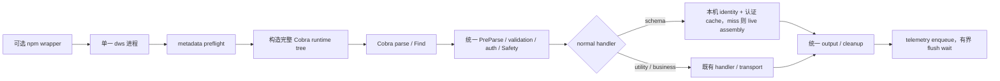

# PR #1296 性能专项技术方案

状态：实施中。规范性选择见 [Schema 与 CLI RFC](rfc-schema-runtime-cache.md)，执行阶段见[完整命令树专项计划](plan-command-framework-performance.md)，数字见[性能附件](rfc-schema-runtime-cache-performance.md)。

## 问题

旧候选的主要固定税来自 telemetry 退出等待；launcher/core 又引入第二进程和逐次哈希。撤回 launcher 后，root help 与普通业务命令共同承担完整 Cobra 树的构造成本。此前用按 argv 选择产品和 root help projection 降低局部数字，会长期维护两套 command surface，已被本方案废止。

## 最终结构

root help 直接遍历 `T`；version、completion、Schema、config 和业务命令都使用同一棵树。Schema 查询由正常 schema handler 处理：受支持端先校验本机 identity 再读 protobuf shards；miss/损坏则 live assembly 并修复发布。测试仍可注入 identity。

## 完整树优化

1. ContractFinal 从 builder 向 command-owned weak store 转移所有权，读取侧继续 defensive clone。
2. RunE closure 只保留执行事实，不捕获已落到 Cobra/ContractFinal 的 help 和 contract 大对象。
3. Safety scanner 等执行期资源延迟到第一次真实使用。
4. 通用 flag builder 消除 empty string-slice 的 4 KiB 临时 writer，同时保持 pflag 行为。
5. shortcut 装配通过 declaration pointer 构造，避免构树期间复制大型声明。

本机同提交父子对照显示完整树 B/op 降低 22.8%，allocs/op 降低 9.8%，ns/op 变化为 +0.3%，属于门槛内噪声。端到端延迟与 RSS 仍由 Go 1.25.9 的 Darwin/Linux clean-head CI 决定。

## 正确性与发布边界

- 公开 command、flags、aliases、help、validation、Safety、错误分类和输出不变。
- Schema identity 不在编译期或发布期生产。受支持端在安装或首次 schema 从本机 declarations 生成 identity 并写认证 cache；后续命中先校验摘要。测试仍可注入 identity。
- 正式 release 仍是一个 `dws`；不重新引入 launcher/双二进制。
- telemetry 明确接受最后一条分析事件可能丢失；业务 cleanup 继续同步。
- Lark 用于验证“完整树也可足够快”的结构选择；GWS 只用于观察更小映像/init 的上限。
