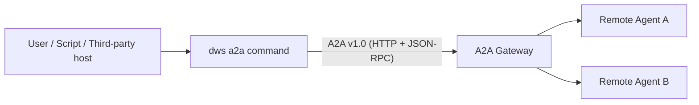
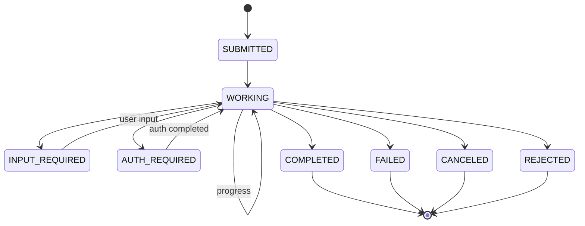

# A2A Protocol (v1.0 subset)

> **Status（两件事分别对齐）**
>
> - **SDK helpers (Go package `internal/a2a/`): Shipped** — 可在 CLI 进程内复用，也可被第三方宿主直接 import。涵盖 access-token 解析、identity / claw-type / channel HTTP 头规范化、插件独立 bearer token 注册表等 thin shims。对应代码：[`internal/a2a/a2a.go`](../../internal/a2a/a2a.go)、[`channel.go`](../../internal/a2a/channel.go)、[`headers.go`](../../internal/a2a/headers.go)、[`registry.go`](../../internal/a2a/registry.go)、[`token.go`](../../internal/a2a/token.go)。
> - **`dws a2a` CLI subcommand tree: Planned, not yet registered** — `dws a2a agents list/info`、`dws a2a send [--stream]` 等命令**尚未**接入 `cmd` 注册，追踪 milestone `dws-a2a-cli`。当前 OSS CLI 不绑定 `DWS_A2A_GATEWAY`、不直接发 HTTPS/SSE 请求、不暴露 `dws a2a ...` 命令。
>
> 以下章节既作为 **wire contract**（给宿主自建客户端时参考），也作为已 shipped SDK helpers 的协议参照（helpers 仅覆盖 token / headers / channel / registry 语义，不覆盖端点调用与 AgentCard 发现——端点调用仍是宿主自有职责）。

> `dws` CLI 与 MCP Gateway 之间的 Agent-to-Agent（A2A）协议说明。
> 协议自称 **A2A v1.0**；宿主实现的是其**子集**，专注于：Agent 发现 + JSON-RPC 消息调用 + 可选 SSE 流式。

<!-- evidence: internal/a2a/ SDK-only helpers; no cobra.Command registered for `dws a2a` -->

---

## 1. 协议定位 / Position

A2A 定义了 agent 之间可跨组织、跨语言互通的**消息交换协议**。CLI 作为 A2A Client，通过 A2A Gateway 向**远端 Agent**（如搜索、文档问答、数据分析 agent）发送消息并接收响应。



`dws` 不承担 Agent 服务端角色，也不转发三方 Agent 互相调用。

---

## 2. 传输层 / Transport

| Aspect | Value | Tier |
|---|---|---|
| Base URL | `DWS_A2A_GATEWAY` env (default points at DingTalk's public gateway). **Planned**: consumed only once the `dws a2a` CLI command tree ships | Planned |
| Transport | HTTPS | Frozen |
| Request encoding | UTF-8 JSON | Frozen |
| Non-streaming content type | `application/json` | Frozen |
| Streaming content type | `text/event-stream` (SSE) | Frozen |
| Default request timeout | 60 s | Stable |
| Streaming timeout | 60 min | Stable |
| Retries | Exponential backoff 1s → 2s → 4s → 8s, max 3 attempts | Stable |
| Retryable classes | Timeout, EOF, connection reset, HTTP 429 / 5xx, rate-limit | Stable |

<!-- evidence: A2A v1.0 subset wire contract for CLI clients -->

### 2.1 必备请求头 / Required headers

| Header | Tier | Value |
|---|---|---|
| `A2A-Version` | Frozen | `1.0`（未来会改为从 AgentCard 协商） |
| `x-user-access-token` | Frozen | 用户 access token；由 CLI 的 `pkg/runtimetoken.ResolveAccessToken` 取得 |
| `Content-Type` | Frozen | `application/json`（非流式）/ `application/json` + `Accept: text/event-stream`（流式） |
| `Accept` | Stable | 流式时 `text/event-stream` |
| *identity headers* | Stable | 见 [contract.md](./contract.md) §7 |

**重要**：A2A 不使用标准 `Authorization: Bearer ...` 头；token 放在自定义头 `x-user-access-token`。<!-- evidence: pkg/runtimetoken/token.go + internal/a2a/token.go -->

---

## 3. 端点目录 / Endpoint catalog

### 3.1 Agent 发现 / Discovery

| Method | Path | Response |
|---|---|---|
| `GET` | `/a2a/agents` | 列表；可为裸数组 `AgentCard[]` 或 `{ agents: AgentCard[], total: number }` |
| `GET` | `/a2a/agents/{agentName}/.well-known/agent-card.json` | 单个完整 `AgentCard` |

客户端 SHOULD 兼容两种列表响应形状。

<!-- evidence: A2A v1.0 subset wire contract — discovery endpoints -->

### 3.2 消息调用 / Messaging (JSON-RPC 2.0)

| Method | Path | JSON-RPC method | Body params |
|---|---|---|---|
| `POST` | `/a2a/agents/{agentName}/rpc` | `SendMessage` | `SendMessageParams`（§5.1）|
| `POST` | `/a2a/agents/{agentName}/rpc` | `SendStreamingMessage` | `SendMessageParams`（§5.1）|

JSON-RPC envelope：

```json
{
  "jsonrpc": "2.0",
  "id": 1,
  "method": "SendMessage",
  "params": { "message": { "...": "..." }, "configuration": { "...": "..." } }
}
```

响应 envelope：

```json
{
  "jsonrpc": "2.0",
  "id": 1,
  "result": { "...": "Task object" }
}
```

或

```json
{
  "jsonrpc": "2.0",
  "id": 1,
  "error": { "code": -32603, "message": "Internal error" }
}
```

<!-- evidence: A2A v1.0 subset wire contract — JSON-RPC envelope -->

---

## 4. Task 状态机 / TaskState



| State | Kind | Tier | Host behavior |
|---|---|---|---|
| `SUBMITTED` | transient | Frozen | Task 已被 gateway 接收，尚未执行 |
| `WORKING` | transient | Frozen | 正在执行，可能有 streaming updates |
| `INPUT_REQUIRED` | **interrupt** | Frozen | 需要用户追加输入；客户端应补充 `Message` 并再次发送 |
| `AUTH_REQUIRED` | **interrupt** | Frozen | 需要补授权（可能触发 PAT 流程）；客户端应处理后再重发 |
| `COMPLETED` | **terminal** | Frozen | 任务成功完成；`Task.artifacts` 是最终产出 |
| `FAILED` | **terminal** | Frozen | 任务失败；`Task.status.message` 携带原因 |
| `CANCELED` | **terminal** | Frozen | 客户端或服务端显式取消 |
| `REJECTED` | **terminal** | Frozen | 网关 / 服务端拒绝（权限 / 配额 / 策略） |

客户端结束循环的判据：`StatusUpdate.isFinal == true` **或** `state` 属于终态集合。<!-- evidence: A2A v1.0 subset wire contract — TaskState terminal set -->

---

## 5. 数据结构 / Data structures

### 5.1 `SendMessageParams`

```json
{
  "message": {
    "messageId": "<uuid>",
    "contextId": "ctx-...",
    "taskId": "task-...",
    "role": "ROLE_USER",
    "parts": [
      { "text": "hello", "mediaType": "text/plain" }
    ],
    "metadata": {},
    "extensions": [],
    "referenceTaskIds": []
  },
  "configuration": {
    "acceptedOutputModes": ["text/plain"],
    "historyLength": 10,
    "returnImmediately": false
  },
  "metadata": {}
}
```

| Field | Tier | Notes |
|---|---|---|
| `message.messageId` | Frozen (required) | 客户端生成，建议 UUIDv4 |
| `message.contextId` | Stable | 多轮会话续接 id |
| `message.taskId` | Stable | 关联某个已存在 Task |
| `message.role` | Frozen | `ROLE_USER` / `ROLE_AGENT` |
| `message.parts[]` | Frozen | 至少一项；见 §5.2 |

### 5.2 `Part`

一个 Part 可承载 text / 结构化数据 / 资源引用 / 文件。字段**共存但语义互斥**：

| Field | Type | When used |
|---|---|---|
| `text` | string | 文本内容 |
| `mediaType` | string | 如 `text/plain` / `application/json` |
| `data` | any JSON | 结构化数据 |
| `url` | string | 远端资源引用 |
| `filename` | string | 上传的文件名 |
| `raw` | string (base64) | 内联二进制 |
| `metadata` | object | 任意扩展 |

CLI `dws a2a send --text <s>` 映射为 `{ text, mediaType: "text/plain" }`；`--data <json>` 映射为 `{ data: <parsed> }`。

### 5.3 `Task` & `Artifact`

```json
{
  "id": "task-...",
  "contextId": "ctx-...",
  "status": {
    "state": "COMPLETED",
    "timestamp": "2026-04-20T10:00:00Z",
    "message": { "parts": [{ "text": "done" }] }
  },
  "artifacts": [
    {
      "artifactId": "art-1",
      "name": "summary",
      "description": "final output",
      "parts": [{ "text": "..." }],
      "metadata": {},
      "extensions": []
    }
  ],
  "history": [],
  "metadata": {},
  "createdAt": "2026-04-20T09:59:50Z",
  "lastModified": "2026-04-20T10:00:00Z"
}
```

### 5.4 `AgentCard`

```json
{
  "name": "example-agent",
  "description": "...",
  "version": "1.2.3",
  "supportedInterfaces": [
    { "url": "https://gw/.../rpc", "protocolBinding": "jsonrpc-http", "protocolVersion": "1.0" }
  ],
  "skills": [
    { "id": "search", "description": "...", "inputSchema": {...}, "outputSchema": {...} }
  ],
  "capabilities": {
    "streaming": true,
    "extendedAgentCard": false
  }
}
```

客户端 SHOULD 从 `supportedInterfaces[*].protocolVersion` 协商实际版本；当前 CLI 硬编码 `1.0`，未来版本会改为协商。<!-- evidence: A2A v1.0 subset wire contract — protocolVersion roadmap -->

### 5.5 SSE 帧 / Streaming event

```
data: {"statusUpdate": {"state": "WORKING", "isFinal": false, "message": {...}}}
data: {"artifactUpdate": {"artifact": {...}, "append": true, "lastChunk": false}}
data: {"task": {"status": {"state": "COMPLETED", "isFinal": true}, "artifacts": [...]}}
```

每帧是一个 JSON 对象，四选一：`statusUpdate` / `artifactUpdate` / `message` / `task`。

---

## 6. 错误处理 / Errors

### 6.1 JSON-RPC error codes

| Code | Meaning | Host behavior |
|---|---|---|
| `-32700` | Parse error | 客户端 bug，不重试 |
| `-32600` | Invalid Request | 客户端 bug |
| `-32601` | Method not found | 该 agent 不支持此方法 |
| `-32602` | Invalid params | 修参数后重试 |
| `-32603` | Internal error | 可重试（退避） |

### 6.2 SSE 帧内错误

SSE 帧如果包含 `error` 字段（JSON-RPC error 形式），客户端应立即终止循环并以 `SSE JSON-RPC error <code>: <message>` 抛出。

### 6.3 HTTP 层错误

- `401` → token 无效；退出码 2，宿主应触发重新登录
- `403` → 权限不足；若响应体是 PAT JSON，退出码 4；否则退出码 2
- `404` → agent 不存在；宿主应提示用户
- `429` / `5xx` → 可重试（按 §2 退避表）

---

## 7. CLI 命令映射 / CLI surface  *(Planned — not yet shipped)*

> ⚠️ 本节命令尚未在 OSS CLI 中实现；属于 `dws-a2a-cli` milestone 的 future work。下表描述**计划中的**命令面与 endpoint 映射，可作为自建客户端或未来 PR 的设计基准。

| Command *(planned)* | Under the hood |
|---|---|
| `dws a2a agents list` | `GET /a2a/agents` |
| `dws a2a agents info --agent <name>` | `GET /a2a/agents/{name}/.well-known/agent-card.json` |
| `dws a2a send --agent <name> --text "..." [--context-id <id>]` | `POST /a2a/agents/{name}/rpc` with `SendMessage` |
| `dws a2a send --agent <name> --text "..." --stream` | `POST /a2a/agents/{name}/rpc` with `SendStreamingMessage` + SSE |
| `dws a2a send --agent <name> --data '<json>'` | 同上，但 `Part.data` 代替 `Part.text` |

计划中的输出格式：

- `--format table`（默认）：人类可读
- `--format json`：非流式返回完整 Task；流式每行一个 SSE event

CLI **按需装配（planned）**：CLI 层命令树落地后，只有命令路径以 `dws a2a` 开头时才会初始化 A2A 客户端与 token 解析，避免为其他命令带入不必要开销。在此之前，宿主可直接 `import "internal/a2a"` 的 helper 包在自己进程内拼出等价能力。

<!-- evidence: internal/a2a/ SDK helpers — CLI command tree tracked under milestone `dws-a2a-cli` -->

---

## 8. 第三方 A2A 平台对接建议 / Third-party gateway guidance

如果你要实现自己的 A2A Gateway 并让 `dws` 作为客户端对接，建议：

1. **兼容两种列表响应**：裸 `AgentCard[]` 和 `{agents, total}` 都要能返回；已有客户端会同时尝试。
2. **Streaming 帧守序**：同一个 task 的 `statusUpdate` 事件必须按时间序；`isFinal=true` 之后不得再下发事件。
3. **401/403 语义分清**：身份过期用 401；权限不足用 403 + PAT JSON 响应体，这样宿主才能靠 exit code 分类。
4. **支持 SSE keep-alive**：建议每 ≤ 30s 下发一个 `statusUpdate`（可为空 progress）以绕过中间代理 / 公网 60s idle timeout。
5. **protocolVersion 返回**：在 `AgentCard.supportedInterfaces[*].protocolVersion` 声明真实协议版本号；即便当前所有客户端都发 `A2A-Version: 1.0`。
6. **错误返回 JSON-RPC 形式**：HTTP 200 + `{"error": {...}}` 优于 HTTP 4xx + 文本，前者客户端有统一分类器。
7. **messageId 幂等**：同一 `messageId` 应可安全重试（网络重试 / 客户端崩溃恢复）。
8. **skills 小而稳**：`AgentCard.skills[]` 是给 LLM / 调度器看的，字段更新会触发上游重刷新；不要把易变的细节放这里。

---

## 9. 未来演进 / Roadmap hints

- **Version negotiation**：从硬编码 `A2A-Version: 1.0` 迁移到基于 `AgentCard.supportedInterfaces[].protocolVersion` 的协商。
- **Multiplexed streams**：SSE 到 WebSocket / QUIC 的升级路径（仅在 CLI 对端主动升级时启用）。
- **Observability headers**：把 `REWIND_REQUEST_ID` 等 trace id 统一为 W3C Trace Context（`traceparent` / `tracestate`）。
- **Auth header convergence**：评估用标准 `Authorization: Bearer` 替换 `x-user-access-token`（非 breaking，双写过渡期至少 1 个 minor 版本）。

以上均为**非契约提示**；本文档其余部分是 Frozen / Stable 契约。
