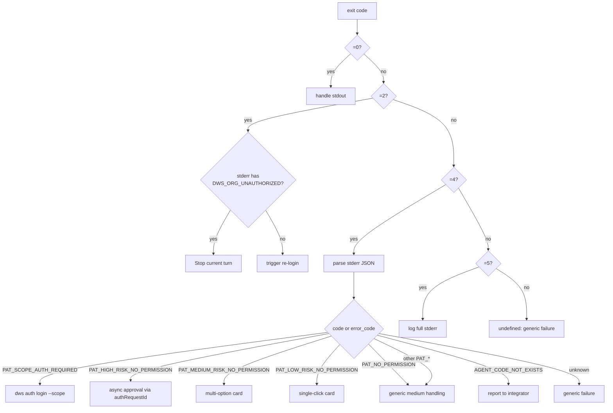

# PAT Error Catalog / 错误码目录

> 按 `code` 分组：触发条件、期望宿主行为、stderr 示例、exit code。
> 权威常量见 [contract.md](./contract.md)；本文档是查阅手册。

<!-- evidence: internal/errors/pat.go patNoPermissionCodes + patAuthRequiredCodes + cleanPATJSON -->

---

## 概览表 / Summary

> **Risk tier (Low / Medium / High) is assigned server-side.** Neither the CLI nor the host exposes a configuration surface to influence it; the `code` in the table below is a passive reflection of the server's classification based on scope and organization policy. 风险档位（Low / Medium / High）由服务端判定；CLI 与宿主不提供任何配置入口调节，下表 `code` 仅为服务端分类结果的被动回显。

| `code` | Exit | Risk | `authRequestId` | Host polling | Retry path |
|---|:-:|:-:|:-:|:-:|---|
| [`PAT_NO_PERMISSION`](#pat_no_permission) | 4 | — | optional | no | chmod → re-run |
| [`PAT_LOW_RISK_NO_PERMISSION`](#pat_low_risk_no_permission) | 4 | Low | optional | no | chmod → re-run |
| [`PAT_MEDIUM_RISK_NO_PERMISSION`](#pat_medium_risk_no_permission) | 4 | Medium | optional | no | chmod → re-run |
| [`PAT_HIGH_RISK_NO_PERMISSION`](#pat_high_risk_no_permission) | 4 | High | **required** | host-owned async | async approval → re-run |
| [`PAT_SCOPE_AUTH_REQUIRED`](#pat_scope_auth_required) | 4 | — | — | — | `dws auth login --scope` → re-run |
| [`AGENT_CODE_NOT_EXISTS`](#agent_code_not_exists) | 4 | — | — | no | 修正 agent code，不重试 |
| [`DWS_ORG_UNAUTHORIZED`](#dws_org_unauthorized) ⚠ Reserved | 2 | — | — | no | 宿主终止当前 turn（当前 CLI 尚未发出此 code，宿主应按 exit=2 兜底） |

---

## `PAT_NO_PERMISSION`

- **Exit**: `4` · **Tier**: Frozen
- **触发**：服务端返回的权限错误未分档，或旧服务端使用的通用 selector
- **宿主行为**：按中敏处理；渲染多选授权卡片，用户选择后 `dws pat chmod <scopes...> --agentCode <id> --grant-type <choice>`；`grantOptions` 缺失时按 SSOT §3.3 中敏默认回退至 `["session","permanent"]`
- **建议卡片形态**：多选 radio 授权卡（Medium 档同款）；`grantOptions` 缺失时仅保留 `session` 单选；主按钮「授权」+ 次按钮「取消」
- **grantOptions（回退建议）**：服务端若下发值则以下发为准；缺省时宿主按中敏默认 `["session","permanent"]`

```json
{
  "success": false,
  "code": "PAT_NO_PERMISSION",
  "data": {
    "requiredScopes": ["contact.user:read"],
    "grantOptions": ["session", "permanent"],
    "authRequestId": "req-001",
    "hostControl": { "clawType": "my-copilot", "mode": "host", "pollingOwner": "host", "retryOwner": "host" }
  }
}
```

---

## `PAT_LOW_RISK_NO_PERMISSION`

- **Exit**: `4` · **Risk**: Low · **Tier**: Frozen
- **触发**：服务端评估为低风险（只读、低敏感资源）
- **宿主行为**：单按钮一键授权；按 SSOT §3.3，服务端**固定下发** `grantOptions: ["session","permanent"]`；宿主可选择仅暴露主按钮（默认 `session`）并在"更多选项"里提供 `permanent`；`authRequestId` 若有透传，若无可缺省
- **建议卡片形态**：单键授权卡；标题显示 `displayName`，副标题显示 `productName`；主按钮默认 `grant-type=session`；次级入口可提供 `permanent`
- **grantOptions（SSOT §3.3 契约值）**：`["session","permanent"]`

```json
{
  "success": false,
  "code": "PAT_LOW_RISK_NO_PERMISSION",
  "data": {
    "requiredScopes": ["contact.user:read"],
    "grantOptions": ["session", "permanent"],
    "displayName": "通讯录只读",
    "productName": "Contact",
    "hostControl": { "clawType": "my-copilot", "mode": "host", "pollingOwner": "host", "retryOwner": "host" }
  }
}
```

---

## `PAT_MEDIUM_RISK_NO_PERMISSION`

- **Exit**: `4` · **Risk**: Medium · **Tier**: Frozen
- **触发**：服务端评估为中风险（写入、批量、跨资源）
- **宿主行为**：多选卡片，展示 SSOT §3.3 契约下发的 `grantOptions` 全集（`["session","permanent"]`）；用户显式选择后再发 `dws pat chmod`；`permanent` 建议二次确认
- **建议卡片形态**：多选 radio 授权卡；`grantOptions` 每项渲染一个 radio；默认预选 `session`；选中 `permanent` 时弹出二次确认对话框后才启用主按钮
- **grantOptions（SSOT §3.3 契约值）**：`["session","permanent"]`

```json
{
  "success": false,
  "code": "PAT_MEDIUM_RISK_NO_PERMISSION",
  "data": {
    "requiredScopes": ["aitable.record:write"],
    "grantOptions": ["session", "permanent"],
    "authRequestId": "req-002",
    "displayName": "AITable 写入",
    "productName": "AITable",
    "hostControl": { "clawType": "my-copilot", "mode": "host", "pollingOwner": "host", "retryOwner": "host" }
  }
}
```

---

## `PAT_HIGH_RISK_NO_PERMISSION`

- **Exit**: `4` · **Risk**: High · **Tier**: Frozen
- **触发**：服务端评估为高风险（批量删除、跨组织、敏感导出）
- **宿主行为**：`authRequestId` **必带**；宿主用它绑定异步审批 future；宿主**自备**审批通道（Webhook / 同步推送 / 轮询 API）；按 SSOT §3.3，服务端**固定下发** `grantOptions: ["once"]` 且**禁止**用 `--grant-type permanent` / `session` 绕过
- **建议超时**：30 分钟；超时后释放 pending future 并提示用户
- **建议卡片形态**：异步等待卡 + `authRequestId` 绑定；正文显示「审批发起中」+ `displayName` / `productName`；倒计时 30 分钟；不提供"立即授权"按钮，只保留"取消"；回执到达后卡片自动切换为成功态并触发 re-run
- **grantOptions（SSOT §3.3 契约值）**：`["once"]`

```json
{
  "success": false,
  "code": "PAT_HIGH_RISK_NO_PERMISSION",
  "data": {
    "requiredScopes": ["doc.file:delete"],
    "grantOptions": ["once"],
    "authRequestId": "req-high-003",
    "displayName": "文档删除",
    "productName": "Doc",
    "hostControl": { "clawType": "my-copilot", "mode": "host", "pollingOwner": "host", "retryOwner": "host" }
  }
}
```

---

## `PAT_SCOPE_AUTH_REQUIRED`

- **Exit**: `4` · **Tier**: Frozen
- **触发**：OAuth token scope 不足；需要重登录追加 scope
- **宿主行为**：执行 `dws auth login --scope <data.missingScope>` 或宿主托管的等价登录流程；**不得**假设 `data.flowId` 存在
- **建议卡片形态**：跳转登录卡；标题「需要补全权限」+ 副标题显示缺失 scope `data.missingScope`；主按钮「重新登录」直接调起 device flow 或宿主托管登录；次按钮「取消」

```json
{
  "success": false,
  "code": "PAT_SCOPE_AUTH_REQUIRED",
  "data": { "missingScope": "mail:send" }
}
```

---

## `AGENT_CODE_NOT_EXISTS`

- **Exit**: `4` · **Tier**: Frozen
- **触发**：`--agentCode <id>` 在服务端不存在（拼写 / 跨组织未刷新 / 算法错误）
- **宿主行为**：**不要**自动重试；上报给集成方 / 开发人员
- **建议卡片形态**：错误横幅（非授权卡）；标题「Agent 未注册」+ 正文显示当前 `agentCode` 与对照项；提供「复制 agent code」+「联系集成方」两个辅助按钮；不提供授权主操作

```json
{ "success": false, "code": "AGENT_CODE_NOT_EXISTS", "data": {} }
```

---

## `DWS_ORG_UNAUTHORIZED`

- **Exit**: `2` · **Tier**: Frozen *(contract)*
- ⚠️ **Status**: **Reserved / Not yet emitted by the current OSS CLI.** 本 selector 已纳入契约并冻结，但当前开源 CLI 版本**尚未**产生带此 code 的 stderr JSON：身份所在组织未开通 DWS 使用权时，CLI 会以 exit=2 + 通用 auth 错误结构返回。未来版本将把该分支上升为 terminal code `DWS_ORG_UNAUTHORIZED`。**在此之前宿主应做 defensive parsing**：按 exit code 做一级分类（2 → 身份层终止），再按 code 字段做二级分支，允许 code 缺失。
- **触发（计划）**：身份所在组织未开通 DWS 使用权（管理员关闭 / 超限 / 未授权）
- **宿主行为**：**终止当前 turn**；不重试，不走 PAT chmod；向用户展示"组织未开通"终态
- **建议卡片形态**：终态错误横幅；标题「组织未开通」+ 正文指引用户联系管理员到钉钉后台开通；不提供任何授权 / 重试按钮

```json
{
  "success": false,
  "code": "DWS_ORG_UNAUTHORIZED",
  "data": { "blockedReason": { "code": "DWS_ORG_UNAUTHORIZED", "message": "organization not authorized for DWS" } }
}
```

> 注意：本 code 的 exit 是 `2`（身份层），而非 `4`（PAT 层）；宿主必须用 exit code 做一级分类。即便 `code` 字段缺失，只要 exit=2 宿主就应终止当前 turn 并按需触发重登录。<!-- evidence: internal/errors/errors.go CategoryAuth ExitCode -->

---

## 解析流程 / Parsing flow



---

## 监控建议 / Observability

| Metric | 含义 |
|---|---|
| `pat.events.total{code}` | 按 code 分组的 PAT 事件计数 |
| `pat.approval.duration{risk}` | exit=4 到完成 chmod / 审批的耗时 |
| `pat.high_risk.pending{agent}` | 当前挂起 `authRequestId` 数 |
| `pat.high_risk.timeout.total` | 高敏审批（宿主侧）超时次数 |
| `dws.exit{code}` | CLI 退出码分布 |

`AGENT_CODE_NOT_EXISTS` 的任何稳态流量都应视为配置问题而非用户行为，建议单独告警。
