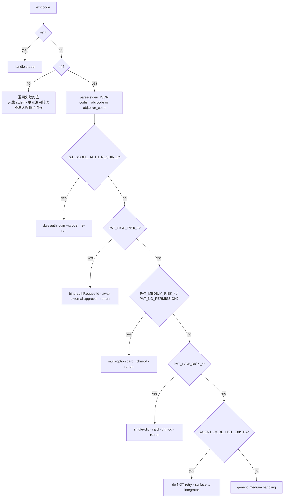
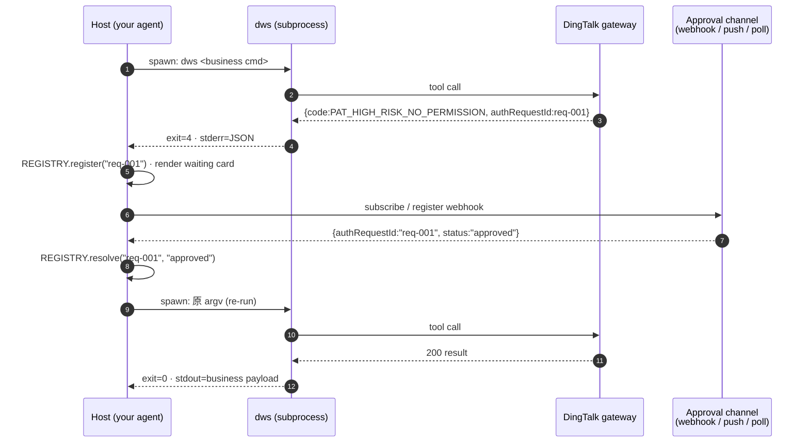

# dws CLI 第三方 Agent 接入指南

> **Stability**：本指南对应 **wire contract 版本 1.0**。Frozen / Stable 字段受契约等级保护（见 §13）；Evolving / Planned 字段可能随 minor 版本演进。
> **Last updated**：YYYY-MM-DD
> **If something breaks**：请在开源仓（`dingtalk-workspace-cli`）开 Issue，并附：`dws version` 输出、`DINGTALK_DWS_AGENTCODE` 值、原始 stderr JSON（可脱敏）、宿主侧关键日志切片。

---

## 1. 这份文档适合谁

### 1.1 读者画像

你正在为自己的 Agent / Copilot / Workflow 产品把 `dws` 作为**子进程**调用，需要：

- 在 **Go / Python / Node / Rust / Java** 任意一种宿主语言里 spawn `dws`
- 捕获它的 exit code、stdout、stderr
- 当 CLI 以 exit=4 + JSON stderr 返回时，在你自己的 UI 里**渲染授权卡片**
- 用户确认后回调 `dws pat chmod` 或 `dws pat apply`，再重跑原命令

你**不需要**是本仓 contributor；你也**不需要**读任何内部架构文档——本文档是唯一入口。

### 1.2 你将在 30 分钟内学到什么

1. PAT（Personal Authorization Token）与 OAuth 的关系（§2）
2. 4 步 Quick Start（§3）
3. 端到端集成（env-first spawn → 分支 → 渲染 → 重跑），含 Go / Python 代码（§5）
4. 如何设计**自定义授权卡片**：字段映射、三档风险分支、组织侧档位（§6）
5. 完整 wire contract 精华（§7）
6. 环境变量全集（Chain A / Chain B 分离、多 agent）（§8）
7. 错误码速查表（§9）
8. `dws pat` 四个子命令参考（§10）
9. 一份可直接 copy 的参考实现（§11）
10. FAQ + 稳定性承诺 + 下一步（§12–§14）

---

## 2. 什么是 PAT，为什么需要它

### 2.1 一句话定义

> **PAT** = DingTalk Workspace 在 OAuth 之上做的**细粒度、按场景下发**的授权。
>
> **授权卡片** = 当 CLI 命中 PAT 拦截时，由**宿主**（不是 CLI）在自己 UI 里渲染的交互组件；CLI 只负责把"需要哪些 scope、什么风险档位、相关性 id 是什么"**以结构化 JSON 交给宿主**，由宿主决定长什么样。

### 2.2 与 OAuth 的区别

| 维度 | OAuth | PAT |
|---|---|---|
| 决定的事 | **身份**（你是谁） | **行为**（这次能不能做 `<resource>:<action>`） |
| 什么时候获取 | 首次 `dws auth login` | 命中 PAT 拦截时动态申请 |
| 谁签发 | 身份服务 | 服务端的 PAT 授权服务 |
| 失败时 CLI exit code | `2` | `4` |
| 恢复方式 | 重新登录 | `dws pat chmod` / `dws pat apply` |
| 影响范围 | 整个身份 | 单个 scope `<product>.<entity>:<permission>` |

**OAuth 让你拿到"能访问平台"的令牌；PAT 让你回答"这次命令能不能读写某个资源"**。同一个身份，在不同业务 Agent / 不同会话里，仍可能被服务端以 `PAT_*_NO_PERMISSION` 打回；需要先 `dws pat chmod ...` 拿到 scope 才能继续。

### 2.3 CLI 的职责边界

PAT 的签发与吊销在**服务端**；CLI 端只做两件事：

1. 把授权申请（`dws pat chmod` / `dws pat apply`）透传给服务端
2. 捕获服务端打回的"权限不足"，用 **exit code 4 + stderr 单行 JSON** 交给宿主接管 UI

**风险档位（Low / Medium / High）完全由服务端判定**。CLI 与宿主都**不提供**任何配置入口来调节档位；`code` 字段只是服务端分类结果的被动回显。**CLI 不内置任何授权 UI**，一律把授权交互交给宿主渲染。

---

## 3. 最短可运行示例（Quick Start，4 步）

下列示例假定你已完成 `brew install dingtalk-workspace-cli` + `dws auth login` 的一次性准备。

```bash
# 1) 声明当前 shell / subprocess 的业务 Agent 身份
#    DINGTALK_DWS_AGENTCODE = 业务 Agent 在组织侧的唯一 code（例 agt-xxxx）
#    每次宿主 spawn 子进程时作为 per-shell 临时 env 注入；同一机器不同 agent 各开一个 shell。
export DINGTALK_DWS_AGENTCODE=agt-xxxx

# 2) 声明当前会话 / trace 上下文（env-first，不走 argv）
export DWS_SESSION_ID=conv-001          # 会话相关性：由宿主在执行前注入
export DWS_TRACE_ID=req-001             # 请求 trace id
export DWS_MESSAGE_ID=msg-001           # 消息 id

# 3) 调用业务命令
dws aitable record list --sheet-id <id>
#    ↑ 若被 PAT 拦截，进程 exit_code=4，stderr 是单行结构化 JSON。
#      宿主据此渲染授权 UI，用户选定后再调：

# 4) 用户确认后，按卡片选项回调 chmod，然后重跑原命令
DINGTALK_DWS_AGENTCODE=agt-xxxx DWS_SESSION_ID=conv-001 \
  dws pat chmod aitable.record:read --grant-type session
dws aitable record list --sheet-id <id>   # 与 (3) 完全相同的 argv
```

**四个关键约定**：

1. **`exit_code == 4` = PAT 权限不足**（唯一触发授权卡片的信号）；`0` = 成功，走 stdout；其他非 0 值一律按通用失败处理，不进入授权卡流程。
2. **stderr 是结构化 JSON**，**不是日志**；按 §7.2 解析。
3. **身份绑定在 token 文件里**，CLI **不读 env 里的任何身份参数**；宿主通过 env 把 agent / 会话 / trace 上下文透传给 CLI。
4. **主路径是 env-first**：`DINGTALK_DWS_AGENTCODE` + `DWS_SESSION_ID` / `DWS_TRACE_ID` / `DWS_MESSAGE_ID`。agent code 的历史别名 `DWS_AGENTCODE` / `DINGTALK_AGENTCODE` / `REWIND_AGENTCODE` 均**不再识别**——现网宿主必须立即切到 `DINGTALK_DWS_AGENTCODE`；`REWIND_*` trace 三件套同样是 CLI **不识别**的历史别名（§8）。

---

## 4. 核心概念速查表

| 术语 | 含义 | 谁拥有 |
|---|---|---|
| **CLI** | 本仓编译出的 `dws` / `dws.exe` 可执行文件 | 你通过 `spawn` 消费 |
| **Host / 宿主** | 你的产品进程；以子进程方式调用 `dws` | 你 |
| **PAT** | Personal Authorization Token；按 scope 下发的细粒度授权 | 服务端签发，CLI 透传 |
| **Scope** | 格式 `<product>.<entity>:<permission>`，例：`aitable.record:read` | 服务端枚举 |
| **Agent Code** | 业务 Agent 在组织侧的稳定标识；由**宿主**在 spawn 时通过 `DINGTALK_DWS_AGENTCODE` 注入。CLI 只做透传 | 你 |
| **`authRequestId`** | 服务端为授权流程签发的**相关性 id**，不是 token；宿主用它绑定异步回执 / 查询状态 | 服务端签发（缺失时 CLI 回落 UUID v4） |
| **授权卡片 Approval card** | 宿主 UI 侧渲染的授权交互组件（弹窗 / 卡片 / 横幅） | **你** 渲染；CLI 只产出数据 |
| **风险档位 Risk tier** | Low / Medium / High / No；由服务端组织策略决定，通过 `code` 回显（§6.6） | 服务端 |

---

## 5. 端到端集成

### 5.1 集成前检查清单

- [ ] 已阅读本文 §2 + §3，理解 PAT 与 exit code 的关系
- [ ] 决定了每个业务 Agent 对应的 `DINGTALK_DWS_AGENTCODE`（由宿主在 spawn 时按 agent 身份临时注入）
- [ ] 宿主有一个可以弹授权 UI 的前端层 / 或等价的可异步确认通道
- [ ] 对**高敏授权**准备好异步回执通道（Webhook / 同步推送 / 轮询 API 等）
- [ ] 已知晓 CLI **不读**身份类 env / header；身份由 `dws auth login` 一次写入本地凭证

### 5.2 Step 1 — env-first 注入：spawn 时把 agent / 会话上下文都放进 env

**核心原则**：sessionId、agent code、trace 三件套都**通过环境变量**在宿主 spawn `dws` 子进程的那一刻注入；CLI 执行命令的那一刻直接从 env 读取。**不要**把这些 id 放进 CLI argv。

> **参考姿态**：sessionId 作为**系统级 / 会话级环境变量**由宿主在 spawn 子进程时注入，不在 argv 里带；每次 spawn 都显式注入当次的 session / trace。这是业界成熟 agent 宿主（含本仓内部参考宿主）对接 CLI 类工具的通用做法。

推荐的全量 env 注入清单（每次 spawn）：

| Env | 语义 |
|---|---|
| `DINGTALK_DWS_AGENTCODE` | 业务 Agent 在组织侧的唯一 code（每 shell 临时注入） |
| `DWS_SESSION_ID` | 当次会话 id；**同时喂** Chain A（`pat chmod --grant-type session`）与 Chain B（出站 `x-dingtalk-session-id` 头） |
| `DWS_TRACE_ID` | 当次请求 trace id → `x-dingtalk-trace-id` |
| `DWS_MESSAGE_ID` | 当次消息 id → `x-dingtalk-message-id` |

**Go 示例：**

```go
cmd := exec.CommandContext(ctx, dwsBin, "aitable", "record", "list", "--sheet-id", sheetID)
cmd.Env = append(os.Environ(),
    "DINGTALK_DWS_AGENTCODE="+agentCode,   // per-spawn；不要写进用户 profile
    "DWS_SESSION_ID="+conversationID,      // CLI 在 chmod 那一刻从 env 读
    "DWS_TRACE_ID="+requestID,
    "DWS_MESSAGE_ID="+messageID,
)
```

**Python 示例：**

```python
env = {
    **os.environ,
    "DINGTALK_DWS_AGENTCODE": agent_code,
    "DWS_SESSION_ID": conversation_id,
    "DWS_TRACE_ID": request_id,
    "DWS_MESSAGE_ID": message_id,
}
proc = subprocess.run(
    [dws_bin, "aitable", "record", "list", "--sheet-id", sheet_id],
    env=env, capture_output=True, text=True,
)
```

**Node / TypeScript 示例：**

```ts
import { spawn } from "node:child_process";

const child = spawn(dwsBin, ["aitable", "record", "list", "--sheet-id", sheetID], {
  env: {
    ...process.env,
    DINGTALK_DWS_AGENTCODE: agentCode,
    DWS_SESSION_ID: conversationID,
    DWS_TRACE_ID: requestID,
    DWS_MESSAGE_ID: messageID,
  },
});
```

### 5.3 Session handoff：执行那一刻如何拿到 sessionId

宿主与 CLI 之间**没有长连接**——每条命令都是一次独立的 `spawn` + exit。"sessionId 如何传给 CLI"的答案是：

1. **宿主持有**会话状态（当前对话 id / 消息 id / trace id）。
2. **spawn 那一刻**，宿主把当前 sessionId 写入子进程 env（`DWS_SESSION_ID`）。
3. **CLI 执行命令的那一刻**（例如 `dws pat chmod --grant-type session`），从 env 读取 `DWS_SESSION_ID`。
4. **不要**把 sessionId 塞进 argv（如 `--session-id <id>`）作为主路径——这会让 id 进 shell history、进 `ps aux`、进 audit 日志的默认字段；env 方式对运维与合规更友好。
5. **不要**依赖某个"当前全局 sessionId"——每个 spawn 都要显式注入，即使 sessionId 没变。

**典型生命周期**：

```
宿主 UI 开启对话 (conv-001)
    ↓
用户指令触发宿主 spawn dws aitable record list
    ├─ env.DWS_SESSION_ID = "conv-001"   ← 宿主写
    ├─ CLI 启动，读 env，记录在本次 execution 的 context 里
    ├─ CLI 命中 PAT → exit=4，stderr JSON
    └─ 宿主根据卡片选项调 dws pat chmod --grant-type session
        ├─ env.DWS_SESSION_ID = "conv-001"   ← 宿主再写一遍（同值 OK）
        └─ CLI 在 chmod 的那一刻读 env，附到 Chain A 请求里
```

**为什么不用 flag？**

- flag 暴露在 argv：shell history、`ps -ef`、cloud VM 审计日志里都可见
- flag 让"每条命令都显式带 session id"变成宿主的命令行拼接责任——env 方式把 id 的管理放到 spawn 层，调用点（argv）更干净
- env 主路径一次性覆盖 Chain A（PAT 子命令）+ Chain B（出站 HTTP trace 头）两个用途

flag `--session-id` / `--agentCode` 仍保留，但仅作为**单次覆盖**能力使用，不是默认形态。

**绝对不要**把 OAuth access token / PAT token 放进 env；CLI 不读，只会浪费 IO 并制造泄漏面。

### 5.4 Step 2 — spawn + 捕获 exit

**Go 示例：**

```go
out, err := cmd.Output()
exitCode := 0
var stderr []byte
if ee, ok := err.(*exec.ExitError); ok {
    exitCode = ee.ExitCode()
    stderr   = ee.Stderr
}
```

**Python 示例：**

```python
proc = subprocess.run(argv, env=env, capture_output=True, text=True)
exit_code, stdout, stderr = proc.returncode, proc.stdout, proc.stderr
```

### 5.5 Step 3 — 按 exit code 分支

**只有三条分支**：`0` → 成功；`4` → PAT 授权卡流程；其他 → 通用失败兜底。`4` 是**唯一**触发授权卡片的信号，其他非 0 退出都不进入卡片流程。

```go
switch exitCode {
case 0:
    handleSuccess(out)          // 业务成功；stdout 是业务响应
case 4:
    handlePAT(stderr)           // PAT 权限不足；走 Step 4（stderr 必含结构化 JSON）
default:
    // 其他非 0 退出：采集 stderr、展示通用错误；不进入授权卡流程。
    // CLI 对外只承诺 0 / 2 / 4 / 5 / 6（见 §7.1），但对接入方而言
    // 除了 4 以外的非 0 值处理策略一致——通用失败兜底即可。
    handleGenericFailure(exitCode, stderr)
}
```

```python
if exit_code == 0:
    handle_success(stdout)
elif exit_code == 4:
    handle_pat(stderr)          # 见 §6 / §7.2
else:
    handle_generic_failure(exit_code, stderr)
```

> 想做更细的可观测性？见 §9 的「可选：按 exit code 细分兜底」小节——那是**可选增强**，不是接入授权卡片的必要条件。

### 5.6 Step 4 — 解析 PAT stderr JSON 并渲染授权卡片

见 §6 与 §7.2。核心思路：

1. 容忍 stderr 首尾的沙箱 / 日志行；用"首个可解析 JSON object"的宽容策略提取
2. 读 `code`，缺失时回落 `error_code`
3. 按 `code` 进入 Low / Medium / High / Scope / AgentCode 分支
4. 把 `data.requiredScopes[*]` **原样**带进 `dws pat chmod`——**不要**猜 scope

### 5.7 Step 5 — 授权完成后重跑

授权成功后，用**完全相同**的 argv 与 env 重新 spawn；**不要**在重试时重构命令行；**不要**假设 CLI 会"续传"先前的上下文。

```python
if chmod_result.returncode == 0:
    return run_with_pat_recovery(original_argv, env, budget - 1)
```

---

## 6. 自定义授权卡片

### 6.1 授权卡片是什么、谁渲染

**定义**：授权卡片（Approval Card）是当 CLI 返回 `exit=4` + PAT JSON 时，你的宿主 UI 需要展示给用户的交互组件。它可以是：

- 桌面端的 modal dialog
- 浏览器的 inline card
- 飞书 / 钉钉 / 邮件 中的卡片消息
- 终端里一条可交互提示（无 UI 宿主）

**谁渲染**：**完全由你（宿主）渲染**。CLI 不内置任何 UI，不弹窗，不接管用户。CLI 只负责：

- 用 `exit=4` 告诉你"发生了 PAT 拦截"
- 用单行 stderr JSON 告诉你"缺哪些 scope、什么风险档位、有没有相关性 id、给用户看什么名字"

### 6.2 授权卡片字段 → UI 控件映射

下表列出三档风险下，CLI 交付的字段、建议的 UI 控件、以及必要的防御式处理：

| `code` | Risk | 建议 UI 形态 | 主按钮行为 | 关键字段 |
|---|---|---|---|---|
| `PAT_LOW_RISK_NO_PERMISSION` | Low | **单按钮一键授权卡** | 直接 `dws pat chmod ... --grant-type session` | `requiredScopes` · `displayName` · `productName` |
| `PAT_MEDIUM_RISK_NO_PERMISSION` | Medium | **多选 radio 授权卡**（`once` / `session` / `permanent`） | 用户选中后再 `chmod` | `requiredScopes` · `grantOptions` · `authRequestId` · `displayName` · `productName` |
| `PAT_HIGH_RISK_NO_PERMISSION` | High | **异步等待卡**，绑定 `authRequestId` | **无"立即授权"按钮**，只保留"取消"；回执到达后自动 re-run | `requiredScopes` · `authRequestId`（必带） · `displayName` · `productName` |
| `PAT_NO_PERMISSION` | 未分档 / 兜底 | 按 Medium 处理（多选卡） | 同 Medium；`grantOptions` 缺失时默认 `["session"]` | 同 Medium |
| `PAT_SCOPE_AUTH_REQUIRED` | — | **跳转登录卡**（不是授权卡） | 调 `dws auth login --scope <data.missingScope>` | `missingScope` |
| `AGENT_CODE_NOT_EXISTS` | — | **错误横幅**（不是授权卡） | **无授权动作**；提示复制 agent code / 联系集成方 | （空 `data`） |

#### 6.2.1 Low 档：单按钮一键授权卡

- **标题**：`displayName`（e.g. "通讯录只读"）
- **副标题**：`productName`（e.g. "Contact"）
- **主按钮**：「授权」→ 直接 `dws pat chmod <requiredScopes...> --grant-type session`
- **次按钮**：「取消」
- 不展示 `grantOptions` 全集——低风险没必要让用户做选择

```json
{
  "success": false,
  "code": "PAT_LOW_RISK_NO_PERMISSION",
  "data": {
    "requiredScopes": ["contact.user:read"],
    "grantOptions": ["session"],
    "displayName": "通讯录只读",
    "productName": "Contact"
  }
}
```

#### 6.2.2 Medium 档：多选 radio 授权卡

- **标题 / 副标题**：同 Low
- **控件**：对 `grantOptions` 每一项渲染一个 radio；默认预选 `session`
- **二次确认**：选中 `permanent` 时弹出二次确认对话框后才启用主按钮
- **主按钮**：「授权」→ `dws pat chmod <requiredScopes...> --grant-type <choice>`（若 choice=`session` 则要求 env 里有 `DWS_SESSION_ID`）

```json
{
  "success": false,
  "code": "PAT_MEDIUM_RISK_NO_PERMISSION",
  "data": {
    "requiredScopes": ["aitable.record:write"],
    "grantOptions": ["once", "session", "permanent"],
    "authRequestId": "req-002",
    "displayName": "AITable 写入",
    "productName": "AITable"
  }
}
```

#### 6.2.3 High 档：异步等待卡 + `authRequestId` 绑定

- **标题**：「审批发起中」
- **正文**：显示 `displayName` / `productName` + 倒计时（推荐 30 分钟）
- **控件**：**不提供"立即授权"按钮**；只保留「取消」
- **异步**：宿主用 `authRequestId` 订阅自己的审批通道（Webhook / 同步推送 / 轮询 API），回执到达后自动切卡片为成功态并触发 re-run
- **禁止**：用 `--grant-type permanent` 绕过；服务端仍会要求审批

```json
{
  "success": false,
  "code": "PAT_HIGH_RISK_NO_PERMISSION",
  "data": {
    "requiredScopes": ["doc.file:delete"],
    "grantOptions": [],
    "authRequestId": "req-high-003",
    "displayName": "文档删除",
    "productName": "Doc"
  }
}
```

### 6.3 `PAT_SCOPE_AUTH_REQUIRED`：它不是普通授权卡

这是**身份层的补授权**——当前 OAuth token 的 scope 不足，需要**重新登录**以追加 scope。**不要**把它和 PAT scope 申请混为一谈。

- **UI 形态**：跳转登录卡。标题「需要补全权限」+ 副标题显示 `data.missingScope`
- **主按钮**：「重新登录」→ `dws auth login --scope <data.missingScope>` 或宿主托管的等价登录流程
- **完成后**：不需要再调 `dws pat chmod`；直接重跑原命令即可
- **`data.flowId`** 可能缺失；**不要**假设一定可轮询

```json
{
  "success": false,
  "code": "PAT_SCOPE_AUTH_REQUIRED",
  "data": { "missingScope": "mail:send" }
}
```

### 6.4 卡片上**应该**展示的字段

| 字段 | 展示位置建议 | 用途 |
|---|---|---|
| `data.displayName` | 卡片标题 | 让用户看到"要授权的是什么资源" |
| `data.productName` | 卡片副标题 / tag | 告诉用户所属产品 |
| `data.requiredScopes` | 权限条目（可折叠展开） | 透明展示请求的 scope；不需翻译，原样展示即可 |
| `data.grantOptions` | 控件选项集合 | Medium 档的 radio 来源 |
| `data.authRequestId` | UI 状态机的 key | 绑定异步回执 / UI 状态（**不要**展示给最终用户） |

### 6.5 卡片上**不应该**做的事

1. **不要缓存 PAT JSON 做离线审批**。`authRequestId` 是一次性的；重复使用会被服务端拒绝。
2. **不要猜 scope**。例如别把 `aitable.record:read` 擅自转写成 `aitable_record_read`；必须**原样转发** `data.requiredScopes[*]` 给 `dws pat chmod`。
3. **不要把 `authRequestId` 当 token**。它是**不透明相关性 id**，不能用于 API 调用；只用来做 UI 状态 / 回执绑定 / `dws pat status` 查询。
4. **不要假设 `data.flowId` 存在**。轮询场景必须判空。
5. **不要依赖 `dws pat callback` / `dws pat approve`**。开源 CLI **没有**这些命令；高敏回调通道**由你自备**。
6. **不要把 CLI 的中文错误提示当机器可解析字段**。所有机器字段都在 stderr JSON 里。
7. **不要复用 exit code `4`** 去表达非 PAT 语义——它是专属契约位。

### 6.6 组织侧数据权限档位：查看与配置

宿主与 CLI 都**无法**决定某个 scope 属于哪一档；档位由阿里钉组织后台的**数据权限策略**统一配置，随请求打回的 `code` 字段回显给宿主。第三方接入方在规划授权交互、接入宣传、用户沟通时需要理解这套 tier 与配置入口。

#### 6.6.1 档位枚举

| 档位 | `code` 示例 | 典型场景 | CLI 返回姿态 | 宿主授权卡姿态 |
|---|---|---|---|---|
| **no**（免授权） | —（CLI 不会返回 `PAT_*_NO_PERMISSION`；业务 stdout 直接 `exit=0`） | 完全公开 / 组织默认已授予 | 不触发 PAT 拦截 | 无卡片 |
| **low**（低敏） | `PAT_LOW_RISK_NO_PERMISSION` | 只读 / 非敏感元数据 | `exit=4` + `data.grantOptions=["session"]` | 单按钮一键授权卡（§6.2.1） |
| **medium**（中敏） | `PAT_MEDIUM_RISK_NO_PERMISSION` / 兜底的 `PAT_NO_PERMISSION` | 读写业务数据、跨会话生效 | `exit=4` + `data.grantOptions=["once","session","permanent"]`（子集） | 多选 radio 卡（§6.2.2） |
| **high**（高敏） | `PAT_HIGH_RISK_NO_PERMISSION` | 删除、批量、跨组织、财务类 | `exit=4` + `data.authRequestId` 必带 + `data.grantOptions=["once"]` | 异步等待卡（§6.2.3），必须等外部回执 |

> **CLI 只做被动分类**：CLI 不暴露 `dws pat risk set` / `get` 之类命令；宿主也不应尝试"调档"——所有档位由服务端的组织级策略决定。

#### 6.6.2 组织管理员如何查看与配置

阿里钉组织的超级管理员 / 主管理员可以在**组织管理后台**（oa.dingtalk.com 的「管理后台」/ 应用管理页面）里查看与调整 PAT 数据权限策略。**具体入口名称与层级随组织版本 / 后台迭代而变化**，第三方接入方应指导客户自行确认最新路径；常见形态如：

- 「管理后台」→「应用管理」→ 定位到你的业务 Agent → 「数据权限 / PAT 权限策略」
- 查看：每条 scope（如 `aitable.record:read`）当前所属档位（no/low/medium/high）+ 近期授权记录
- 配置（具备权限时）：在产品默认模版基础上调整个别 scope 的档位；高敏档位通常不允许向下降档
- 审批通道：high 档的异步审批可配置审批流（例如指定主管 / 安全团队作为审批人）

> 若组织管理员在自己的后台里找不到对应入口，说明该版本尚未向组织开放 PAT 数据权限策略自管能力；此时档位以产品默认模版为准，且无法由组织单独下调。

#### 6.6.3 第三方接入方需要理解的事

1. **不要承诺档位**。在你给用户看的接入文档 / 产品说明中，**不要**把某个 scope 写成固定某档——档位可能随组织策略调整。
2. **按 `code` 动态路由**。卡片交互以 stderr JSON 里的 `code` 为准（§9），而不是写死的 scope 档位表。
3. **高敏必带外部回执**。high 档的命令在 CLI 侧**不能**通过"换个 `--grant-type`"绕过；你必须对接组织配置的审批回执通道（Webhook / 管理后台 / 邮件 / 同步推送），并通过 `dws pat status <authRequestId>` 查询终态。
4. **`no` 档无须集成**。如果某个 scope 被组织设为 no 档，CLI 不会触发 PAT 拦截，你的授权卡代码路径根本不会被进入——不需要为 no 档设计 UI。
5. **档位对用户的叙事**：给终端用户解释"为什么第二次使用还要授权"时，引用**服务端风险分级**这个事实即可，不要暗示是 CLI 或宿主的策略。

---

## 7. Wire Contract 精华

> 这是宿主实现者最需要的契约切片。本节即为完整契约，**不需要**再去读别的文档；§14 提供的补充阅读只用于更深的细节。

### 7.1 Exit Codes

授权卡片的接入方只需要关心**三类**退出：

| Exit | 对接入方的意义 | 宿主动作 |
|---|---|---|
| **`0`** | 成功 | 读 stdout，业务继续 |
| **`4`** | **PAT 权限不足**（授权卡片的**唯一**触发信号）；stderr 是单行 JSON（§7.2） | 解析 stderr → 渲染授权卡 → 用户确认 → `chmod` → 重跑 |
| **其他（非 0 且非 4）** | 通用失败（身份层 / 内部错 / 服务发现等） | 采集 stderr，展示通用错误，不进入授权卡流程 |

> **`4` 专属 PAT**：discovery 失败用其他码；`4` **绝不**携带非 PAT stderr JSON。这意味着一旦 `exit_code == 4`，stderr 里**保证**能解析出合法 PAT JSON——宿主可以放心做"假定可解析"式的卡片渲染。

**细分参考（CLI 对外承诺的完整列表，仅做观测用）**：`0` 成功、`2` 身份层失败、`4` PAT 拦截、`5` 未预期内部错误、`6` discovery / catalog 失败。内部在个别分支可能出现 `1`（遗留 API 失败）或 `3`（参数校验失败），**属于非契约行为**，宿主视作未定义并按通用失败处理。关于如何按 exit 细分上报告警 / 退避策略，见 §9 的「可选：按 exit code 细分兜底」。

### 7.2 Stderr JSON Schema

**触发条件**：`exit_code == 4`。CLI 保证此时 stderr 首个可解析 JSON object（允许前后有沙箱 / 日志行）满足下列 schema。其他 exit code 下 stderr 是非结构化文本，接入方按通用错误日志处理即可——**不要**尝试从中解析 PAT 字段。

#### 7.2.1 顶层字段

| Field | Type | Tier | Required | 语义 |
|---|---|---|:---:|---|
| `success` | `boolean` | Frozen | Y | `exit=4` 时恒为 `false` |
| `code` | `string` | Frozen | Y (若 `error_code` 缺) | 主识别字段，取 §7.3 枚举 |
| `error_code` | `string` | Stable | Y (若 `code` 缺) | `code` 的旧别名；宿主必须兼容两者；新版 CLI 只写 `code` |
| `data` | `object` | Frozen | Y | 负载对象（§7.2.2） |

**解析规则**：先读 `code`，缺失时回落 `error_code`。两者都缺失视为非 PAT 响应。

#### 7.2.2 `data.*` 负载

| Field | Type | Tier | Required | 语义 |
|---|---|---|:---:|---|
| `requiredScopes` | `string[]` | Stable | N | 缺失的 scope 列表；每项是规范化字符串（§7.5） |
| `grantOptions` | `string[]` | Stable | N | 允许的授权时长（§7.4 枚举子集）；缺失时默认 `["session"]` |
| `authRequestId` | `string` | Stable | N | **不透明**相关性 id。高敏必带；宿主用它绑定异步回执 |
| `displayName` | `string` | Stable | N | 授权 UI 中展示的资源名 |
| `productName` | `string` | Stable | N | 授权 UI 中展示的产品名 |
| `missingScope` | `string` | Stable | N | `PAT_SCOPE_AUTH_REQUIRED` 专用的单 scope 字段 |
| `flowId` | `string` | Evolving | N | 可选审批流 id；宿主**不得**假设一定存在 |

**宿主兼容**：宿主 MUST 保留未知 `data.*` key，用于诊断 / 前向兼容。

**CLI 禁止**：

- MUST NOT 把 PAT 负载放到 stderr 以外的地方
- MUST NOT 跨行分隔
- MUST NOT 包进 markdown / ANSI escape

#### 7.2.3 JSON Schema 片段（draft 2020-12）

```json
{
  "$schema": "https://json-schema.org/draft/2020-12/schema",
  "type": "object",
  "required": ["success", "data"],
  "properties": {
    "success": { "const": false },
    "code": {
      "type": "string",
      "enum": [
        "PAT_NO_PERMISSION",
        "PAT_LOW_RISK_NO_PERMISSION",
        "PAT_MEDIUM_RISK_NO_PERMISSION",
        "PAT_HIGH_RISK_NO_PERMISSION",
        "PAT_SCOPE_AUTH_REQUIRED",
        "AGENT_CODE_NOT_EXISTS"
      ]
    },
    "error_code": { "type": "string" },
    "data": {
      "type": "object",
      "properties": {
        "requiredScopes":  { "type": "array",  "items": { "type": "string", "pattern": "^[a-z][a-z0-9_-]*(\\.[a-z][a-z0-9_-]*)+:[a-z][a-z0-9_-]*$" } },
        "grantOptions":    { "type": "array",  "items": { "enum": ["once", "session", "permanent"] } },
        "authRequestId":   { "type": "string" },
        "displayName":     { "type": "string" },
        "productName":     { "type": "string" },
        "missingScope":    { "type": "string" },
        "flowId":          { "type": "string" }
      },
      "additionalProperties": true
    }
  },
  "oneOf": [
    { "required": ["code"] },
    { "required": ["error_code"] }
  ],
  "additionalProperties": true
}
```

### 7.3 `code` / `error_code` 枚举

**Frozen** 枚举值：

- `PAT_NO_PERMISSION`
- `PAT_LOW_RISK_NO_PERMISSION`
- `PAT_MEDIUM_RISK_NO_PERMISSION`
- `PAT_HIGH_RISK_NO_PERMISSION`
- `PAT_SCOPE_AUTH_REQUIRED`
- `AGENT_CODE_NOT_EXISTS`

**宿主兼容性**：任何以 `PAT_` 开头但不在上表的 selector，应降级为"通用授权卡（Medium 同款）"。

### 7.4 `grant-type` 三值

`dws pat chmod` / `dws pat apply` 仅接受：

| Value | Tier | 语义 | 典型场景 |
|---|---|---|---|
| `once` | Frozen | 仅一次有效；一次成功调用后立即失效 | 一次性高风险动作（大批量删除、迁移） |
| `session` | Frozen | 在宿主声明的 session 范围内有效；需要 session id | 对话轮内多次复用同一 scope |
| `permanent` | Frozen | 直到用户撤销 / 服务端轮换前持续有效 | 需要长期授权的工具（高风险下仍需审批） |

### 7.5 Scope 字符串正则

```
^[a-z][a-z0-9_-]*(\.[a-z][a-z0-9_-]*)+:[a-z][a-z0-9_-]*$
```

即 `<product>.<entity>[.<sub>]:<permission>`，全部小写 ASCII。

示例：

- `aitable.record:read`
- `aitable.record:write`
- `contact.user:read`
- `doc.file:create`
- `chat.group:write`

**宿主实现要点**：`data.requiredScopes[*]` 与 `dws pat chmod` 的位置参数**使用同一规范化字符串**；旧格式（`{productCode, resourceType, operate}` 三字段）由 CLI 在交付给宿主前**已经归一化**，宿主不需要重复实现。

---

## 8. 环境变量

> **核心原则 — env 优先**：身份、会话、agent code 等上下文都**通过环境变量**在宿主 spawn `dws` 子进程的那一刻传入；CLI 执行命令的瞬间从 env 读。**不要**把它们放进 CLI argv——避免进 shell history / `ps aux` 泄露、也避免在参数里拼接相关性 id 让日志脱敏变复杂。flag（如 `--session-id`、`--agentCode`）仍保留为**单次覆盖**能力，但**不是推荐的主路径**。
>
> CLI 消费的 env 分两条**不互通**的链路：
>
> - **Chain A** — `dws pat *` 子命令的参数主通道（agent code / session id / authRequestId）
> - **Chain B** — 出站 HTTP trace 头注入（`x-dingtalk-trace-id` / `x-dingtalk-session-id` / `x-dingtalk-message-id`）
>
> **`DWS_SESSION_ID` 是两条链路的共同主路径**。`DINGTALK_DWS_AGENTCODE` 是 agent code 的**唯一**识别 env（SSOT §2 / §3.2 规范名）；`DWS_AGENTCODE` / `DINGTALK_AGENTCODE` / `REWIND_AGENTCODE` 均**不再识别**——现网宿主必须立即切到 `DINGTALK_DWS_AGENTCODE`。

### 8.1 Chain A — PAT 子命令的 env 主通道

| 子命令参数 | Primary env（推荐、env-first） | 可选 flag（单次覆盖） | CLI **不识别**（显式列出） |
|---|---|---|---|
| `dws pat chmod` / `dws pat apply` 的 session id（`--grant-type session` 必填） | `DWS_SESSION_ID` | `--session-id <id>` | `DINGTALK_SESSION_ID`（只走 Chain B） |
| `dws pat chmod` / `dws pat apply` / `dws pat scopes` 的 agent code | `DINGTALK_DWS_AGENTCODE` | `--agentCode <id>` | `DWS_AGENTCODE`、`DINGTALK_AGENTCODE`、`REWIND_AGENTCODE`（**均不识别**） |
| `dws pat status <authRequestId>` 位置参数 | `DWS_PAT_AUTH_REQUEST_ID` | 位置参数 | `DINGTALK_PAT_AUTH_REQUEST_ID`、`REWIND_PAT_AUTH_REQUEST_ID` |

**解析优先级**：flag（若传）> env > 错误。env 是推荐主通道；flag 仅用于"当次覆盖 env 的临时场景"（调试、单命令切换 agent）。

**同值校验**：当某个 env 主路径与其 flag 同时传入且**值不同**时，CLI 以 flag 为准并在日志中 `Warn`，便于排查宿主注入与命令行冲突。

### 8.2 Chain B — 出站 HTTP trace 头注入

| 出站 Header | Primary env | Compatibility alias | CLI **不识别**（显式列出） |
|---|---|---|---|
| `x-dingtalk-trace-id` | `DWS_TRACE_ID` | `DINGTALK_TRACE_ID` | — |
| `x-dingtalk-session-id` | `DWS_SESSION_ID` | `DINGTALK_SESSION_ID` | — |
| `x-dingtalk-message-id` | `DWS_MESSAGE_ID` | `DINGTALK_MESSAGE_ID` | — |

### 8.3 链路不互通的关键结论

- `DWS_SESSION_ID` 同时喂给 Chain A 和 Chain B——**新集成的单一真源**。只设它一项即可覆盖两条链路。
- 如果你只设置 `DINGTALK_SESSION_ID`：Chain B（trace 头）有值，但 `dws pat chmod --grant-type session` 会报 `missing session id`（Chain A 不读 `DINGTALK_*`）。**最小修复**：`export DWS_SESSION_ID=$DINGTALK_SESSION_ID`。**长期建议**：统一到 `DWS_SESSION_ID`。
- Agent code 与 session id 的命名空间**完全分离**：agent code 只认 `DINGTALK_DWS_AGENTCODE`（`DWS_AGENTCODE` / `DINGTALK_AGENTCODE` / `REWIND_AGENTCODE` 均不再识别）；session id 只认 `DWS_SESSION_ID`（+ flag 覆盖）。

### 8.4 全量 env 清单

| Variable | Tier | Consumer | 语义 |
|---|---|---|---|
| `DINGTALK_DWS_AGENTCODE` | **Frozen** | CLI | 业务 Agent 在组织侧的唯一 code（正则 `^[A-Za-z0-9_-]{1,64}$`）；**agent code 的唯一识别 env**（SSOT §2 / §3.2）；每 shell 临时注入 |
| `DWS_SESSION_ID` | Stable | CLI | **主**：Chain A + Chain B 共同真源 |
| `DWS_TRACE_ID` | Stable | CLI | **主**：Chain B `x-dingtalk-trace-id` |
| `DWS_MESSAGE_ID` | Stable | CLI | **主**：Chain B `x-dingtalk-message-id` |
| `DWS_PAT_AUTH_REQUEST_ID` | Stable | CLI | Chain A `dws pat status <id>` 位置参数回退 |
| `DINGTALK_SESSION_ID` | Stable | CLI | Chain B `x-dingtalk-session-id` 的兼容别名 |
| `DINGTALK_TRACE_ID` | Stable | CLI | Chain B `x-dingtalk-trace-id` 的兼容别名 |
| `DINGTALK_MESSAGE_ID` | Stable | CLI | Chain B `x-dingtalk-message-id` 的兼容别名 |
| `DWS_CONFIG_DIR` | Frozen | CLI | 覆盖 token / identity 存储目录 |

**不再兼容的历史别名**（CLI 直接忽略）：`DWS_AGENTCODE`、`DINGTALK_AGENTCODE`、`REWIND_AGENTCODE`、`REWIND_SESSION_ID`、`REWIND_REQUEST_ID`、`REWIND_MESSAGE_ID`。如果你的现网宿主仍在注入这些变量，请改注入本表"Primary"列。

**优先级规则**：

- **Chain B trace 三件套**（`DWS_*` vs `DINGTALK_*`）：两者同时设为不同非空值时，CLI 以 `DWS_*` 为准并 `Warn`。
- **Chain A agent code**：`--agentCode` flag > `DINGTALK_DWS_AGENTCODE` env > 错误（两层链路，不再支持任何兼容别名）。`DWS_AGENTCODE` 若被设置，CLI 完全忽略，单独设置会以"缺 agent code"硬失败。
- **Chain A session id / authRequestId**：只认 Primary env（`DWS_SESSION_ID` / `DWS_PAT_AUTH_REQUEST_ID`），无兼容别名。
- **Flag 永远最高优**：`--agentCode` / `--session-id` 一旦设置即覆盖任何 env（单次覆盖，不修改进程 env）。

### 8.5 多 agent 场景：per-shell 临时 env 注入

> 宿主进程（例如 IDE、Desktop App、Web backend）在**启动子进程**调用 `dws` 时，按 agent 身份**临时注入** `DINGTALK_DWS_AGENTCODE`——它是 per-shell / per-spawn 的临时 env，**不**写入用户持久化环境。

```bash
# 示例：宿主同机部署两个 agent 共用一个 CLI 二进制
# Subprocess A — agent A 子进程
DINGTALK_DWS_AGENTCODE=agt-a-001 \
DWS_SESSION_ID=conv-a01 DWS_TRACE_ID=req-a01 DWS_MESSAGE_ID=msg-a01 \
dws aitable record list --sheet-id <id>

# Subprocess B — agent B 子进程
DINGTALK_DWS_AGENTCODE=agt-b-007 \
DWS_SESSION_ID=conv-b01 DWS_TRACE_ID=req-b01 DWS_MESSAGE_ID=msg-b01 \
dws chat group list
```

**要点**：

1. 两个 agent 的 env **不能共享同一个进程上下文**；应分别在各自的 spawn 里用 `env={...}` 传入。
2. 同一台机器同一个用户的**身份（OAuth token）是共享的**；`DINGTALK_DWS_AGENTCODE` 只是让 CLI 以不同 agent 身份去路由 PAT 与工具调用。
3. 不推荐把 `DINGTALK_DWS_AGENTCODE` 写进用户的 `~/.bashrc` / `~/.zshrc`；**每次 spawn 都从宿主显式传**是推荐形态。
4. 无需多 agent 时，也强烈建议使用 per-spawn env（而非用户 profile），便于日后横向扩展。

---

## 9. 错误码处理速查表

接入授权卡片只需要关心 `exit=4` 下的 `code` 枚举与兜底姿态：

| `code` | Exit | Risk | `authRequestId` | 宿主最小动作 | 示例 |
|---|:-:|:-:|:-:|---|---|
| `PAT_NO_PERMISSION` | 4 | — | optional | 按 Medium 处理：渲染多选卡；`chmod` → 重跑 | §6.2.2 |
| `PAT_LOW_RISK_NO_PERMISSION` | 4 | Low | optional | 单按钮一键授权；`chmod --grant-type session` → 重跑 | §6.2.1 |
| `PAT_MEDIUM_RISK_NO_PERMISSION` | 4 | Medium | optional | 多选 radio；用户选 grant-type；`chmod` → 重跑 | §6.2.2 |
| `PAT_HIGH_RISK_NO_PERMISSION` | 4 | High | **required** | 异步等待卡；绑定 `authRequestId`；等回执 → 重跑（**不可** `--grant-type permanent` 绕过） | §6.2.3 |
| `PAT_SCOPE_AUTH_REQUIRED` | 4 | — | — | 调 `dws auth login --scope <missingScope>` → 重跑；**不需要** `chmod` | §6.3 |
| `AGENT_CODE_NOT_EXISTS` | 4 | — | — | **不要**自动重试；上报给集成方 / 开发人员 | §9.1 |
| (其他 `PAT_*`) | 4 | — | — | 按 Medium 兜底处理 | — |
| **其他非 0 exit** | ≠0,4 | — | — | **通用失败兜底**：采集 stderr，展示通用错误，不进入授权卡流程 | — |

### 9.1 `AGENT_CODE_NOT_EXISTS` 示例

```json
{ "success": false, "code": "AGENT_CODE_NOT_EXISTS", "data": {} }
```

- 宿主 UI 建议：错误横幅（非授权卡），标题「Agent 未注册」+ 当前 `agentCode` + 「复制 agent code」/「联系集成方」两个辅助按钮
- **不提供**授权主操作；**不自动重试**（重试只会继续失败）

### 9.2 解析流程图



### 9.3 可选：按 exit code 细分兜底（监控增强）

如果你在做可观测性 / 告警，希望对 "非 0 非 4" 这批退出做更细的分类，可以按 CLI 对外承诺的 exit code 再拆一层。**这是可选增强**，不影响授权卡片主流程是否正确工作。

| exit | 语义 | 建议兜底策略 |
|---|---|---|
| `2` | 身份层认证 / 授权失败 | 终止当前 turn；触发重登录；告警等级偏高 |
| `5` | 未预期内部错误（panic / 不可恢复 IO / bug） | 采集完整 stderr；展示通用错误；**不**自动重试；作为 bug 报告候选 |
| `6` | Discovery / catalog 层失败（注册表不可达、端点解析错） | 按指数退避重试；告警等级偏低 |
| `1` / `3` / 其他 | CLI 内部**非契约**分支（遗留 API / 参数校验等） | 视作未定义；通用失败处理；不要针对它们设计稳定代码路径 |

> 哪怕你不做这层细分，只用 §5.5 的 `0 / 4 / else` 三路也能完成一次标准授权卡片集成——`else` 统一兜底已足够。

---

## 10. PAT 子命令参考

四个命令都需要 agent code。**推荐形态**：宿主在 spawn 时把 `DINGTALK_DWS_AGENTCODE` / `DWS_SESSION_ID` 注入子进程 env，命令行**不写** `--agentCode` / `--session-id`——见 §8 的 env-first 原则。flag 仍保留为单次覆盖能力。

### 10.1 `dws pat chmod <scope>... [flags]`

授予指定 scope 的操作权限。

| 输入项 | 必填 | 语义 | 推荐主通道（env） | 单次覆盖（flag） |
|---|:-:|---|---|---|
| agent code | Y | Agent 唯一标识；正则 `^[A-Za-z0-9_-]{1,64}$` | `DINGTALK_DWS_AGENTCODE` | `--agentCode <id>` |
| 授权时长 | N（默认 `session`） | `once` / `session` / `permanent` | — | `--grant-type <type>` |
| session id | `grant-type=session` 时必填 | 会话标识 | `DWS_SESSION_ID` | `--session-id <id>` |

**推荐示例（env-first，不在 argv 暴露 id）：**

```bash
DINGTALK_DWS_AGENTCODE=agt-xxxx DWS_SESSION_ID=conv-001 \
  dws pat chmod aitable.record:read --grant-type session

DINGTALK_DWS_AGENTCODE=agt-xxxx \
  dws pat chmod chat.message:list --grant-type once

DINGTALK_DWS_AGENTCODE=agt-xxxx \
  dws pat chmod aitable.record:read aitable.record:write --grant-type permanent
```

**flag 覆盖示例（仅当单次场景需要临时换 agent / session 时）：**

```bash
DINGTALK_DWS_AGENTCODE=agt-default \
  dws pat chmod chat.group:read --agentCode agt-other --grant-type once
# flag wins：本次命令以 agt-other 执行，env 的 agt-default 被覆盖
```

**Exit code**：`0` 成功；`4` PAT 权限不足（按本文处理）；其他非 0 按通用失败兜底（详见 §9.3）。

### 10.2 `dws pat apply <scope>... [flags]`

主动发起一次 PAT scope 申请（orchestrator entry）。与 `chmod` 的区别：`apply` 面向 orchestrator，stdout 返回 `authRequestId` 给宿主后续绑定；`chmod` 直接尝试完成授权。

入参同 §10.1（agent code / grant-type / session id）。

**Stdout 契约**：

```json
{"success": true, "authRequestId": "..."}
```

- Schema **严格**为这两个字段
- 当服务端响应里缺 `authRequestId` 时，**CLI 会本地生成 UUID v4 填进去**（无指示字段区分）；宿主应把它当作**不透明相关性 token**，不要当作"服务端已提交授权"的证据
- 用这个 id 去 `dws pat status` 做状态确认

**示例：**

```bash
DINGTALK_DWS_AGENTCODE=agt-xxxx DWS_SESSION_ID=conv-001 \
  dws pat apply aitable.record:read --grant-type session
# stdout: {"success":true,"authRequestId":"c5e0..."}
```

### 10.3 `dws pat status [<authRequestId>]`

查询异步 PAT 授权流程的状态。

| 入参 | 来源 |
|---|---|
| `<authRequestId>` 位置参数 | 最高优先级 |
| `$DWS_PAT_AUTH_REQUEST_ID` | 位置参数缺失时回退 |

两者都空 = 硬错误。

**示例：**

```bash
dws pat status req-001
DWS_PAT_AUTH_REQUEST_ID=req-001 dws pat status
```

**Stdout**：服务端响应的 JSON 原样透传。

**Exit code**：`0` 拿到终态；`4` 查询本身触发了 PAT（罕见）；其他非 0 按通用失败兜底。

### 10.4 `dws pat scopes [--agentCode <id>]`

列出 agent 当前已授权的 scope 列表。

| 输入项 | 必填 | 语义 | 推荐主通道（env） | 单次覆盖（flag） |
|---|:-:|---|---|---|
| agent code | N | 缺省时服务端使用 default agent | `DINGTALK_DWS_AGENTCODE` | `--agentCode <id>` |

**示例：**

```bash
dws pat scopes                                        # 使用服务端 default agent
DINGTALK_DWS_AGENTCODE=agt-xxxx dws pat scopes        # 推荐
dws pat scopes --agentCode agt-xxxx                   # 单次覆盖
```

**Stdout**：服务端响应原样透传。

> **注意**：`dws pat status` 与 `dws pat scopes` **没有** legacy 工具名回退；若碰到 `TOOL_NOT_FOUND`，说明服务端尚未注册对应工具，需联系平台方升级服务端。`chmod` / `apply` 有灰度期的英文→遗留别名回退，对宿主透明。

---

## 11. 完整参考实现

下列 Python 代码是一份**可直接 copy 到自己项目里**的单文件参考实现。它覆盖：

- Spawn `dws` 子进程（env-first）
- 按 `0 / 4 / else` 三路分支
- Tolerant stderr JSON 解析（仅在 `exit=4` 时做）
- PAT 递归恢复（Medium + Low）
- High-risk oneshot registry（基于 `authRequestId` 绑定异步回执）
- 管道兜底：`exit=0` 但 stdout/stderr 混入 PAT JSON 时的补救

```python
#!/usr/bin/env python3
"""Reference host implementation for dws PAT integration."""
from __future__ import annotations

import json
import subprocess
import threading
from concurrent.futures import Future
from typing import Any

PIPE_MASKED = (
    '"code":"PAT_HIGH_RISK_NO_PERMISSION"',
    '"code":"PAT_MEDIUM_RISK_NO_PERMISSION"',
    '"code":"PAT_LOW_RISK_NO_PERMISSION"',
    '"code":"PAT_NO_PERMISSION"',
)


class HighRiskRegistry:
    """Oneshot authRequestId -> Future registry for PAT_HIGH_RISK_*."""

    def __init__(self) -> None:
        self._lock = threading.Lock()
        self._pending: dict[str, Future[str]] = {}
        self._processed: set[str] = set()

    def register(self, auth_request_id: str) -> Future[str]:
        with self._lock:
            if auth_request_id in self._processed:
                done: Future[str] = Future()
                done.set_result("expired")
                return done
            fut: Future[str] = Future()
            self._pending[auth_request_id] = fut
            return fut

    def resolve(self, auth_request_id: str, status: str) -> None:
        with self._lock:
            if auth_request_id in self._processed:
                return
            self._processed.add(auth_request_id)
            fut = self._pending.pop(auth_request_id, None)
            if fut and not fut.done():
                fut.set_result(status)


REGISTRY = HighRiskRegistry()


def parse_pat_stderr(stderr: str) -> dict[str, Any]:
    """Tolerant first-valid-JSON-object extraction from stderr."""
    for i, ch in enumerate(stderr):
        if ch != "{":
            continue
        try:
            obj, _ = json.JSONDecoder().raw_decode(stderr[i:])
        except json.JSONDecodeError:
            continue
        if isinstance(obj, dict) and ("code" in obj or "error_code" in obj):
            return obj
    raise ValueError("no PAT JSON found in stderr")


def effective_exit_code(exit_code: int, stdout: str, stderr: str, cmdline: str) -> int:
    """Pipe-masking fallback: shell pipelines may overwrite the real exit code."""
    if exit_code == 4:
        return 4
    if "|" in cmdline and any(p in (stderr + stdout) for p in PIPE_MASKED):
        return 4
    return exit_code


def run_with_pat_recovery(argv: list[str], env: dict[str, str], budget: int = 3) -> str:
    """Spawn dws with argv+env; recover from PAT exit=4 up to `budget` rounds.

    env MUST carry (at minimum):
      - DINGTALK_DWS_AGENTCODE  = <agent code>           (e.g. "agt-xxxx")
      - DWS_SESSION_ID          = <conversation id>      (read by chmod at exec time)
      - DWS_TRACE_ID / DWS_MESSAGE_ID                    (optional trace context)

    agent code / session id are NEVER appended to argv -- env-first per 8.
    """
    if budget <= 0:
        raise RuntimeError("PAT recovery budget exhausted")

    proc = subprocess.run(argv, env=env, capture_output=True, text=True)
    exit_code = effective_exit_code(proc.returncode, proc.stdout, proc.stderr, " ".join(argv))

    # Three-way branch: 0 / 4 / else (see 5.5 + 7.1)
    if exit_code == 0:
        return proc.stdout
    if exit_code != 4:
        # Generic failure bucket: everything that is NOT the approval-card
        # trigger. Consumers who want richer telemetry can split this branch
        # further using the optional table in 9.3.
        raise RuntimeError(f"dws failed: exit={exit_code} stderr={proc.stderr!r}")

    # exit == 4 -> PAT path; stderr is guaranteed to be parseable PAT JSON.
    pat = parse_pat_stderr(proc.stderr)
    code = pat.get("code") or pat.get("error_code") or ""
    data = pat.get("data") or {}
    if not code:
        raise RuntimeError(f"exit=4 but no PAT code parseable; stderr={proc.stderr!r}")

    if code == "PAT_SCOPE_AUTH_REQUIRED":
        subprocess.run(["dws", "auth", "login", "--scope", data["missingScope"]], check=True)
        return run_with_pat_recovery(argv, env, budget - 1)

    if code == "PAT_HIGH_RISK_NO_PERMISSION":
        auth_id = data["authRequestId"]
        fut = REGISTRY.register(auth_id)
        render_waiting_card(data)  # UI owns timeout; e.g. 30-min countdown
        status = fut.result(timeout=30 * 60)
        if status != "approved":
            raise RuntimeError(f"high-risk approval {status}")
        return run_with_pat_recovery(argv, env, budget - 1)

    if code == "AGENT_CODE_NOT_EXISTS":
        raise RuntimeError(f"agent code not registered: {env.get('DINGTALK_DWS_AGENTCODE')!r}")

    chosen = render_card_and_get_choice(data)  # "once" | "session" | "permanent"
    chmod_argv = ["dws", "pat", "chmod", *data.get("requiredScopes", []),
                  "--grant-type", chosen]
    # agent code & session id are read from env at exec time -- do NOT append to argv.
    chmod = subprocess.run(chmod_argv, env=env, capture_output=True, text=True)
    if chmod.returncode != 0:
        raise RuntimeError(f"chmod failed: exit={chmod.returncode} stderr={chmod.stderr!r}")
    return run_with_pat_recovery(argv, env, budget - 1)


def render_card_and_get_choice(data: dict[str, Any]) -> str:
    """Your UI renders here; stub returns session for the example."""
    options = data.get("grantOptions") or ["session"]
    return "session" if "session" in options else options[0]


def render_waiting_card(data: dict[str, Any]) -> None:
    """Your UI renders an async approval card; subscribe to your approval channel."""
    ...
```

### 11.1 高敏时序图



---

## 12. FAQ

**Q1：Agent Code 是什么？我应该怎么生成？**
A：Agent Code 是你的业务 Agent 在组织侧的稳定标识，由**宿主**决定生成方式（常见：`md5(openId + corpId + deviceId)`，或直接用业务注册的 agent code）。CLI 只做透传，不干预算法。正则约束 `^[A-Za-z0-9_-]{1,64}$`。每个 agent 在一个组织下应稳定且唯一。每次 spawn 时通过 `DINGTALK_DWS_AGENTCODE` 作为 per-shell 临时 env 注入。

**Q2：`sessionId` 推荐怎么传？为什么不用 `--session-id` flag？**
A：**推荐用环境变量 `DWS_SESSION_ID`**，在宿主 spawn `dws` 子进程的那一刻通过 env 注入；CLI 执行命令的瞬间从 env 读。三个理由：
1. **不暴露到 argv**：避免 session id 进 shell history / `ps aux` / 日志默认行。
2. **一次覆盖两条链路**：`DWS_SESSION_ID` 同时喂 Chain A（PAT 子命令）与 Chain B（出站 trace 头 `x-dingtalk-session-id`）。
3. **与业界成熟 agent 宿主口径一致**：sessionId 以系统级 / 会话级环境变量传入，不在命令行 argv 里带。

`--session-id` flag 仍保留，只用于"单次覆盖"这种临时场景；**不是**推荐形态。

**Q3：我的 host 只设了 `DINGTALK_SESSION_ID`，`dws pat chmod --grant-type session` 突然报 "missing session id"，为什么？**
A：这是 Chain A / Chain B 别名不共用的正常结果，**不是 CLI bug**。`DINGTALK_SESSION_ID` 只能让 trace 头注入（Chain B）拿到值，无法满足 PAT 子命令的 session id 回退（Chain A）。最小修复：`export DWS_SESSION_ID=$DINGTALK_SESSION_ID`。长期建议：统一切到 `DWS_SESSION_ID`。

**Q4：怎么在多 agent / 多 shell 之间切换 agent code？**
A：**每个 spawn 单独注入 `DINGTALK_DWS_AGENTCODE`**，作为 per-shell / per-subprocess 的临时 env（推荐形态）。`--agentCode` flag 仅作为单次覆盖，不是主路径。具体 per-spawn 示例见 §8.5。

```bash
# 推荐：per-spawn env
DINGTALK_DWS_AGENTCODE=agt-a  dws pat chmod aitable.record:read --grant-type once
DINGTALK_DWS_AGENTCODE=agt-b  dws pat chmod chat.group:read --grant-type once

# 单次覆盖：flag 赢
DINGTALK_DWS_AGENTCODE=agt-a  dws pat chmod chat.group:read --agentCode agt-b --grant-type once
#   本次命令以 agt-b 执行
```

**不再识别的历史别名（CLI 直接忽略）**：`DWS_AGENTCODE`、`DINGTALK_AGENTCODE`、`REWIND_AGENTCODE`。如果现网宿主还在注入这些变量，请改用 `DINGTALK_DWS_AGENTCODE`。

**Q5：`dws pat apply` 的 stdout JSON 里，`authRequestId` 一定是服务端签发的吗？**
A：**不保证**。Stdout schema 严格为 `{"success": bool, "authRequestId": string}`，**没有**字段区分服务端下发 vs 客户端回落。当服务端响应里缺 `authRequestId` 时，CLI 会本地生成 UUID v4 填进去以保持 stdout 契约稳定。宿主应把它当**不透明相关性 token** 送给 `dws pat status` 做状态确认；**不要**当作"服务端已提交授权"的证据。

**Q6：`dws pat status` / `dws pat scopes` 怎么偶尔报 `TOOL_NOT_FOUND`？**
A：这两条命令**没有** legacy 工具名回退；直接调用 `pat.status` / `pat.scopes`。如果你碰到 `TOOL_NOT_FOUND`，说明服务端还没注册这两个工具，需要联系平台方升级服务端。对比 `chmod` / `apply` 在灰度期内有英文→遗留别名回退，对宿主透明。

**Q7：我的宿主是 Web 服务端，没有 Desktop UI，能用 PAT 吗？**
A：能。高敏分支对"UI"的要求是**可以异步通知并等回执**——可以是邮件、卡片消息、管理后台。中敏可以用「默认 session」直接 chmod 跳过交互，但**不推荐**无人值守，会造成隐性授权扩张。

**Q8：我是不是只需要对 `exit=4` 做特殊处理？**
A：**是**。授权卡片的触发信号只有 `exit=4`。`exit=0` 走成功路径；其他非 0 值按通用失败兜底即可。如果你额外想做监控告警 / 告警分级，可以按 §9.3 的参考表对 `2 / 5 / 6` 再拆一层，但这是**可选增强**，不接入它也能完成标准授权卡集成。

**Q9：CLI 升级会破坏我的解析器吗？**
A：Frozen tier 的字段 / 常量需要 major 版本升级才会改；Stable tier 允许新增字段，**宿主必须忽略未知键**；Evolving tier 可在 minor 版本变化。见 §13。

---

## 13. 稳定性承诺与变更策略

| Tier | 含义 | 变更策略 | 对宿主要求 |
|---|---|---|---|
| **Frozen** | 进入本字段后，除非 major 版本升级否则不改 | 需 RFC + 预告 ≥ 2 个 minor 版本 | 可硬编码常量 |
| **Stable** | 稳定表面，允许**兼容扩展**（新增字段） | 新增字段允许；语义变化需 minor 升级 | **必须忽略未知键**；向后兼容旧字段 |
| **Evolving** | 正在演进，宿主必须容忍缺失 / 变化 | 可随 minor 版本变化 | 必须判空 / 判未知；不能假设一定存在 |
| **Planned** | 当前 OSS CLI **尚未**提供；已纳入计划但未 shipped | — | 不要依赖；以本文档明确标注的"Planned"字样为准 |

### 13.1 本指南涉及的分级速览

- **Frozen**：exit code `0` / `4`；stderr JSON 顶层 `success/code/data`；`code` 枚举六值；`grant-type` 三值；scope 正则；`DINGTALK_DWS_AGENTCODE` 作为 agent code 的**唯一**识别 env；`dws pat chmod` / `apply` / `status` / `scopes` 命令树
- **Stable**：exit code `2` / `5` / `6`（语义用于 §9.3 的可选兜底分层）；`error_code` 别名；`data.*` 大多数字段；`DWS_*` 主路径与 `DINGTALK_*`（仅 Chain B trace 头）兼容别名
- **Evolving**：`data.flowId`
- **Planned**：终态错误码 `DWS_ORG_UNAUTHORIZED`（当前可能以 exit=2 + 通用 auth 错误返回，宿主应按通用失败兜底）

### 13.2 常见误解

- CLI **不暴露** `dws pat risk set/get` 之类命令；组织侧风险策略由服务端维护（见 §6.6）。CLI 只做被动分类，宿主也不应尝试"调档"。
- `DINGTALK_DWS_AGENTCODE` 只是 agent code 的 per-shell env **唯一**通道，**不是**身份层凭证，也不进入 token 存储；`DWS_AGENTCODE` / `DINGTALK_AGENTCODE` / `REWIND_AGENTCODE` 均**不再识别**，宿主若仍在注入这些别名，CLI 会视为未设置 agent code 并硬失败，请立即迁移到 `DINGTALK_DWS_AGENTCODE`。
- **不要**把 `authRequestId` 当 token；它是一次性的相关性 id，只能用来绑定 UI 状态或 `dws pat status` 查询。
- **不要**依赖 `dws pat callback` / `dws pat approve`；开源 CLI **没有**这些命令，高敏回执通道由宿主自备。
- **不要**试图从 "`exit != 0 && exit != 4`" 的 stderr 里解析 PAT 字段——那是非结构化文本，按通用错误日志处理即可。

---

## 14. 下一步

本文档已覆盖 **90%+ 的实际集成场景**。大部分宿主工程师应该可以线性读完本文、直接开始集成。

以下是**可选的补充阅读**，用于特殊场景：

| 主题 | 何时需要 | 文档 |
|---|---|---|
| **Wire contract 更多细节** | 你要做契约测试 / 实现一个 mock server | `docs/pat/contract.md`（JSON schema、Migration rule 完整版） |
| **错误码详细行为** | 你要写监控告警 / 运维 playbook | `docs/pat/error-catalog.md`（每个 code 的完整 stderr 示例 + 监控 metric 建议） |

> **这些是补充阅读**。它们**不取代**本文；你不读它们也能完成一次标准集成。只有你的需求超出本文明确覆盖的范围时，才去查。

---

**祝集成顺利。**
