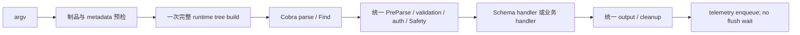

# DWS 完整命令树性能专项 Plan

状态：Draft，P0～P3 已完成本地实现，待两平台 clean-head 验收。日期：2026-09-07。

本计划执行 [单入口、完整命令树与 Verified Schema Cache RFC](rfc-schema-runtime-cache.md)。目标是在始终构造完整公开 Cobra 树的前提下，降低 root help、version、Schema 和业务命令共同承担的构树内存与分配。

## 1. 架构基线

所有公开调用共享 B～G。Schema cache 只改变 Schema handler 的 catalog 数据源。公开 help 直接从 B 得到的树渲染。不存在 launcher、argv 产品路由、utility-only tree、Schema 前置 handler 或 help projection。

Lark CLI 1.0.85 的可参考结构：生产 Build 每次挂载 utilities、service catalog 和 shortcuts；completion 只控制 callback 注册，不改变命令树来源。固定 SHA `13305ae51b62833c6cd07368be48ae523bb491df` 在本机约 905 个 command，暖 Build 约 7 ms / 10.3 MB / 84.6k alloc。

DWS 当前约 1,825 个 command。绝对总量不能只和 Lark wall time 比较；同时比较每节点 B/op、allocs/op、进程 RSS 和输出合同。

## 2. 实施阶段

### P0：删除双模式与第二投影

- [x] 删除 process argv route、产品/shortcut route index 和 selective-tree 构造器。
- [x] process、public、help、version、config、业务与 completion 均构造完整产品面。
- [x] 删除 Cobra 前的 Schema argv fast path；verified cache 留在正常 Schema command 内。
- [x] 删除 root help model/snapshot package；renderer 直接遍历 runtime tree。
- [x] 删除对应资格探测、回退矩阵、route benchmark 与 drift tests。
- [x] 新增跨平台测试，对 help、Schema、config、业务 argv 检查完整产品面。

交付标准：代码中不存在“选择性树与完整树等价”问题，因为公开运行时只有完整树。

### P1：压缩 typed metadata 的所有权

- [x] ContractFinal payload 在 builder 完成规范化和必要深拷贝后，转移给 command-owned weak store，避免第二次完整 clone。
- [x] RuntimeContractFinal 的读取仍返回 defensive deep copy。
- [x] RunE closure 不再捕获已经写入 Cobra/ContractFinal 的 Use、help prose、Contract 和 PostMount 等 build-only 字段。
- [x] 对 `ParamDecl.Enum`、`Required` 等嵌套引用增加调用者 mutation 隔离测试。

交付标准：Safety、identity、selection、result schema 和参数合同与父提交一致；废弃树仍可由 weak store 回收。

### P2：执行期对象延迟初始化

- [x] Safety content scanner 在首次真实 payload 检查时才编译规则，不在完整构树时初始化。
- [x] disabled scanner 保持 nil，enabled scanner 的第一次 ScanPayload 前不得初始化。
- [ ] 用 CPU/heap profile 继续审计 auth、transport、config 和 formatter 是否在 factory/Mount 阶段创建只供 RunE 使用的对象。
- [ ] 每个后续 lazy 变化必须有首次执行与并发测试，不能把失败延迟到不可诊断的位置。

交付标准：help/version 构树不创建网络连接、读取 token 或编译业务响应规则。

### P3：低分配通用 builder

- [x] string-slice flag 对空默认值不再为每个 flag 创建 encoding/csv 的 4 KiB writer。
- [x] 保持 pflag 的 `stringSlice` 类型、CSV quoting、重复 flag append、SliceValue Append/Replace/GetSlice 和 DefValue 行为。
- [x] shortcut builder 在注册表到 Cobra mount 之间传指针，避免复制大型 Shortcut declaration；执行时再取得 invocation-local value。
- [x] helper registry 只保留 name + factory，并在构建时验证实际 command name，避免另建 route map。
- [ ] 根据新 profile 逐项处理 annotations、result-schema normalization 和 pflag map；单项收益低于噪声或需要缓存第二份真相时不做。

交付标准：所有产品仍走相同 generic builder；不为 root help 特制 leaf 或简化 flag。

### P4：向紧凑 service catalog 收敛

- [x] 统计手写 helper/shortcut builder 中重复的 Cobra 对象、flag spec 和 annotation 形状；当前 Linux root help RSS 47.68 MiB，Lark 42.85 MiB，差 11.3%。
- [ ] 迁移一个代表产品到只读 typed service descriptor + 通用 builder，要求 descriptor 直接成为 Cobra/ContractFinal 的共同构造输入，禁止运行时再合并两套参数声明。
- [ ] 代表产品必须同时降低 `B/op`、allocs/op 和 Linux wait4 RSS，并保持完整树节点数、help/Schema digest、Safety 与 handler 行为。
- [ ] 迁移收益可复现后再按产品分批替换手写装配，直到 Linux root help RSS 不超过 Lark +5%。
- [ ] catalog 只负责构造；Schema、Safety 和 handler 仍使用现有权威类型，不引入生成的第二份命令真相。

P4 现在阻挡 #1296 的性能专项验收，因为 clean-head Linux 数据超过 RFC 的 +5% 线。它对应 Lark 最值得参考的长期方式。实现仍必须是一棵完整 runtime tree；不能用 root-help projection、lazy leaf tree 或 argv 路由替代对象压缩。

### P5：两平台证据与发布

- [x] Darwin/arm64、Linux/amd64 使用 Go 1.25.9 跑完整测试、受影响 race、generate/drift/schema gates。
- [ ] 每个平台对专项父提交与 candidate 各跑完整树 microbenchmark。
- [x] 端到端随机交错测 root help/version/Schema/dry-run/mock/config，记录 wall、CPU、RSS 和输出 digest。
- [x] Lark 1.0.85 同机 root help/完整 Build 作为诊断，写清 commit、node count 和入口。
- [x] 将 clean-head artifact 和结论回填 RFC 附件；保持 Draft 直到 Linux RSS 与发布门禁通过。

## 3. 当前本地微基准

Apple M3 Pro、Darwin/arm64、同一 Go 1.26.1、本地每组 10 次，取三轮中位数：

| 完整 `NewRootCommand` | ns/op | B/op | allocs/op |
|---|---:|---:|---:|
| 专项父提交 `c0131d35` | 13,503,654 | 16,431,941 | 164,227 |
| implementation commit `34ce7493` | 13,544,096 | 12,681,568 | 148,166 |
| 变化 | **+0.3%** | **-22.8%** | **-9.8%** |

本地构树门槛已满足。该数据只证明完整树构造；正式结论必须使用 clean commit 和 Go 1.25.9 CI。macOS 本机的进程 wall time 受安全扫描干扰，不用于端到端 gate。

按节点粗算，当前 DWS 约 6.95 KiB 和 81 alloc/command；Lark 约 11.4 KiB 和 93.5 alloc/command。DWS 的总量仍更高，主要因为公开节点约为 Lark 两倍。这个比例只能帮助归因，不能证明两边 command 复杂度相同。

## 4. 验收矩阵

| 场景 | 树 | 必须保持的行为 |
|---|---|---|
| root help / version | 完整 runtime tree | 同一 public flags、服务/utility 列表、locale、startup diagnostics |
| Schema hit/miss/repair | 完整 runtime tree | Cobra parsing、shortcut/plugin diagnostics、wire parity、identity fail-closed |
| leaf help / dry-run / mock | 完整 runtime tree | aliases、required/groups、Safety、无多余 RPC、统一输出 |
| config / event utility | 完整 runtime tree | shared caller、profile、PreParse 和 cleanup 不缺失 |
| completion | 完整 runtime tree | 候选、描述、directive、alias 与 shell script contract |
| public/embedded constructor | 完整 runtime tree | 不读取宿主 argv 决定 command surface |

阻断条件：

- 出现另一棵公开 tree、help projection、Schema 前置执行或 argv factory selection；
- help bytes、Schema wire、flags、aliases、validation、Safety、错误分类或 cleanup 改变；
- 完整树相对父提交未达到 `B/op -20%`、`allocs/op -8%`，或 ns/op 超出允许回归；
- root help RSS 相对父提交回退，或两平台竞品诊断超过 RFC 规定的差值；
- clean-head 两平台测试、race 或发布 proof 不完整。

## 5. 暂不绑定

- edition 产品面裁剪；
- 追平 GWS 3～4 ms；
- daemon/常驻进程；
- 无证据的 Prepare/auth/config 去重；
- 为不存在的 completion callback 泄漏增加基础设施。
