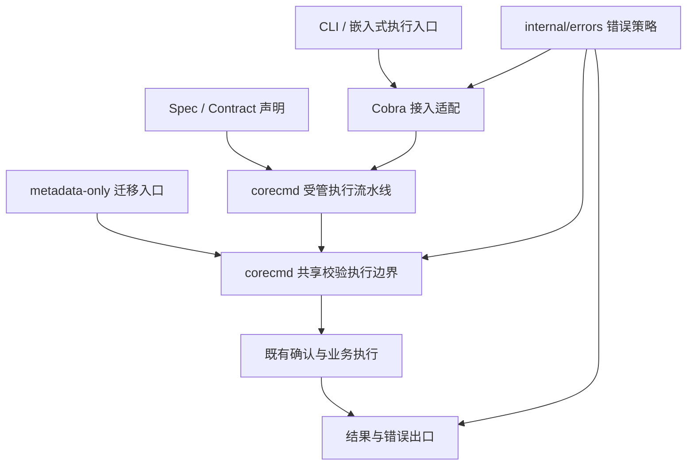

# 统一命令框架：参数校验与错误治理方案

状态：**Draft（草案）**。更新日期：2026-09-06。

复审发现的 `TraverseChildren` 父级解析缺口采用已确认的最小 Cobra 依赖补丁修复；wiki 手动解析已接回统一框架。本轮架构复审和实现验证已完成，本文与 PR 按要求保持 Draft；逐项证据及合并准入限制见[复审记录](unified-validation-errors-v2-review.md)。

基于 `fix/unified-validation-errors` 分支的两次提交及当前工作区补充改动。
本文补充 [命令框架 RFC](rfc-command-framework-convergence.md) 的 §5.0，沿用
[统一结果框架](unified-command-framework-2.0.md) 的输出契约。

## 1. 决策

采用 **统一命令框架拥有校验编排、错误模型独立、Cobra 作为接入适配层** 的方案。

设计中心是 `corecmd` 的受管执行流水线。参数约束来自现有 `Spec / Contract` 声明，
框架统一编排输入解析、声明式校验、自定义校验、确认和业务执行，并在明确的校验阶段调用
`internal/errors` 的归一化策略。`helpers`、shortcut 和 app 不再各自维护一套参数校验执行规则。

Cobra 的解析、位置参数及原生 required/group 通过框架适配层接入同一错误策略。
整树准备是统一框架的装配步骤，不是独立的校验系统。裸 Cobra 接入保留为迁移兼容层，
新增受管命令的业务约束应声明在框架中。

相较上一版，本次明确收回“以整树适配器为设计中心”的表述；不能仅把现有包装器移入
`corecmd` 或增加一个 `ExecuteC` 转发函数，就认定完成了统一框架收敛。

用户继续使用原来的命令、参数和 `--format json`。本方案不改变 legacy/unified
输出 rollout，不扩展 Schema 字段，不改变确认顺序。用户于 2026-09-06 确认采用最小 Cobra
依赖补丁，替代初稿“不修改 Cobra”的约束；补丁范围与维护方式见 §5.4。

### 本轮解决的问题

1. 参数校验失败稳定交付 validation / exit 3。
2. 已分类错误、自定义退出码、取消和超时穿过适配层时保持原始错误对象及错误链。
3. Tier1 与 Tier2 共用框架的自定义校验执行边界，消除 helpers 内的重复编排规则。
4. 框架自己的 Cobra 适配器只安装一层，独立命令与应用命令使用同一接入实现。
5. 门禁验证真实执行路径，同时明确哪些业务钩子不在自动分类范围内。

### 明确的取舍

使用 Cobra 公共 API 时，required/group 错误不能通过 `FlagErrorFunc` 拦截。
本方案仍在业务 `PreRunE` 成功后提前调用 Cobra 的约束检查并转换错误。成功路径上，
Cobra 随后会原生复查一次。消除的是 local/final 的额外重复，不承诺原生检查也只执行一次。

不删除 required/group annotations 来跳过原生复查；它们同时服务 Help、补全和 Schema。
`runDeclaredPreflight` 的声明式 required/enum/constraints 继续存在，以保护直接进入
受管 `RunE` 的调用路径，不能因为整树适配而移除。

## 2. 职责边界

| 层 | 负责 | 边界限制 |
| --- | --- | --- |
| `Spec / Contract` 声明 | required、enum、参数关系、输入语义、自定义 Validate 钩子 | 沿用现有各字段的权威归属，不再新增一份校验规则清单 |
| `internal/errors` | 错误构造、保留策略、validation 归一化、退出码 | 不依赖 Cobra，不扫描命令树 |
| `internal/corecmd` | 受管执行流水线、共享校验执行边界、确认顺序、Cobra 接入 | 不导入 `internal/cli`，不根据业务文案猜分类 |
| `internal/app` | 挂载顺序、参数纠错提示、调用状态清理、统一出口 | 提示不能覆盖已有分类，不新增输出端补分类逻辑 |
| `internal/helpers` / shortcut / plugin | 向框架提供声明、纯校验函数、业务执行函数 | 不重新实现校验编排；I/O、鉴权、远端错误在来源处分类 |
| `internal/output` | 将已有错误投影到所选输出契约 | 不重跑校验，不重新解释错误文案 |



## 3. 一个错误保留策略

`internal/errors` 提供以下错误策略接口：

```go
// nil 不属于需要保护的错误；对包装链使用 errors.As / errors.Is。
func PreserveClassification(err error) bool

// 只允许在明确的参数校验阶段调用。
func NormalizeValidation(err error, opts ...Option) error
```

`PreserveClassification` 的保护集合为 `*errors.Error`、`ExitCoder`、
`context.Canceled`、`context.DeadlineExceeded`。它不是“是否属于 validation”的查询，
也不负责给取消或超时重新分配退出码。

`NormalizeValidation` 对 nil 返回 nil，对保护集合返回原始输入；其余错误构造
validation 并保留 cause。`app` 的提示逻辑、`helpers.WrapErrorWithOperation` 和
Cobra 适配器全部复用这个集合，删除重复判断。

兼容处理：`CLIError` / `PATError` 现有对象与恢复信息不在本轮批量替换。
如果某种旧错误不属于上述保护集合，其显式兼容规则保留在所属适配层，不能靠文案扩充集合。

预解析错误只剥离直接位于外层的框架 handler 诊断外壳，随后保留底层权威错误对象。
其他包装（包括带分类的外层错误）完整保留，不用
`errors.As` 任意深入错误链并丢弃中间带分类的包装。测试同时断言原始对象、分类、退出码和 cause。

## 4. 统一框架的执行设计

### 4.1 一个声明源、一个校验执行责任方

继续使用现有 `Spec.Flags`、`Spec.Constraints`、`Spec.Validate` 及它们与 Contract 的
现有投影关系。框架从声明执行检查；Help / Schema 从同一声明交付事实。
不引入 `ValidationRegistry`、外部规则 JSON 或另一个可单独编辑的校验 Contract。

受管 preflight 保持在 `corecmd` 中，负责已有输入解析、required、enum、constraints 和
自定义 Validate 顺序。业务作者提供校验内容，框架负责何时调用、错误如何归一化，以及
失败后是否允许继续确认或执行。`Transform` 的转换错误同样在框架参数构造阶段归一化。

由框架构造“校验成功才进入后续步骤”的执行包装，供受管流水线和 Tier2 迁移入口共同使用。
不提供仅返回校验结果、仍要求 helpers 自己决定是否继续的 `RunValidation` 接口。
API 示意如下，实际命名按已有类型确定：

```go
// corecmd：构造时组合，执行时由返回的函数控制整个校验边界。
func WithValidation(
    validate func(*cobra.Command, []string) error,
    next func(*cobra.Command, []string) error,
) func(*cobra.Command, []string) error
```

包装器执行约定：非 nil 的 validate 调用一次；失败时归一化该错误并立即返回，next 调用
次数为零；成功时 next 调用一次，其错误原样返回。nil validate 直接进入 next，nil next
是构造错误。包装器不保存每次执行的结果，不将 next 的业务错误归为 validation。

Tier1 在 corecmd 内部将原有自定义 Validate 调用替换为该包装，接在输入解析及声明式
required/enum/constraints 成功之后，后续步骤仍是原有参数构造、确认和 dispatch。
`ConfirmFirst` 仍在原先的前置位置。必须删除旧的自定义 Validate 调用，不能在原有
preflight 完整执行之后再加一遍包装。

Tier2 在组装时将 helpers 提供的后续执行函数交给 corecmd 包装，再赋给命令 RunE。
helpers 不再执行 validate，也不再维护“校验失败是否继续”的分支；后续函数包含既有的
确认 / deferred caller / 原 RunE 逻辑。这样校验先于后续执行的顺序由框架生成的函数保证。

这不是开放给业务代码随意指定错误类别的通用 middleware。阶段与 reason 由框架固定：
位置参数 `invalid_positionals`、flag parser `invalid_flag`、required
`missing_required_flags`、flag group `invalid_flag_group`、自定义校验
`invalid_parameters`、值转换 `invalid_flag_value`。已分类错误的既有 reason 保留，
例如 app 明确的 `unknown_flag`；业务不需要重新传入上述框架标签。

### 4.2 三种命令的收敛路径

| 命令形态 | 本轮接入方式 | 获得的保证 |
| --- | --- | --- |
| Tier1：`corecmd.New` / `NewLeafCommand` / 已受管 shortcut | corecmd 将共享校验包装编入原有流水线，替换原自定义 Validate 调用 | 框架编排声明校验、确认和执行；直接受管 RunE 保留 preflight |
| Tier2：`DeclareLeafMetadata` | 将 Validate 和后续执行函数交给 `corecmd.WithValidation`，返回值作为 RunE | 框架保证 Validate 成功才进入确认和业务；直接 RunE / 代理委派同样受保护 |
| Tier3：裸 Cobra / 遗留扩展 | 框架装配时适配 parser、Args、required/group；业务钩子显式返回 typed error | 仅 CLI 校验边界保证；不宣称拥有完整声明式执行语义 |

Tier2 的 deferred confirmation 和 caller 管理暂留既有兼容接缝，不能为了归并文件位置
把依赖 helpers 的机制反向导入 corecmd。本轮统一的是校验执行责任；完整迁移到 Tier1
按具体命令推进。不要在 corecmd 再复制一份 helpers 的 deferred caller 流水线。

新增校验优先使用已有声明字段；无法表达的参数关系使用 Validate。已有业务钩子中的纯
参数检查逐步迁入上述边界，但鉴权、读文件、请求后端等操作不因迁移而被整体归为 validation。

### 4.3 执行入口与兼容契约

完整 CLI 执行统一使用已经完成框架装配的 Cobra `Execute` / `ExecuteC`。
`corecmd.New` 仍是构造 API，不承担整棵应用命令树的解析。独立运行先完成同一装配步骤，
再调用 Cobra 执行，不要求业务作者手工调用各个 validator。

已有 app 工厂返回 Cobra root 的用法可以保留，但必须由工厂完成框架准备。这个返回值是
兼容外观；调用者不能绕开已安装的框架流水线后仍声称获得完整 CLI 保证。

直接调用受管 RunE 继续经过声明式 preflight；直接调用裸 Cobra RunE 仍不会经过 parser / Args。
本轮不引入绕过 Cobra、独立解释 argv 的第二执行器，也不把 Schema 用作运行时规则加载源。
不新增 prepared execution handle；执行保护均安装在命令本体，不能只存在于某个可绕开的
`prepared.ExecuteC()` 转发函数中。

## 5. 框架内部的 Cobra 接入

### 5.1 统一准备入口

`corecmd.PrepareCommandTree(root *cobra.Command) error` 是框架的装配步骤：

1. 接收已经完成挂载的 Cobra 根命令；独立叶命令也是一棵合法树。
2. 第一遍检查整树是否包含已准备节点，并快照有继承语义的有效 flag handler。发现非法状态先返回构造错误，不修改部分节点。
3. 第二遍读取并包装各节点自己的 `Args`、`PreRunE` / `PreRun`；这些钩子不继承父节点，因此无需保存在整树快照中。闭包只捕获自身需要的函数；不在安装过程中继续读取已经包装过的父级 flag handler。
4. 成功返回 nil；不返回执行句柄，不使用进程级强引用 map 留住整棵命令树。
5. 对已准备树再次调用准备入口应明确报构造错误，禁止静默再包装。重复装配与重复执行
   是两件事，后者的状态约定见 §5.3。

独立命令的调用示意；app 工厂已准备的 root 不再重复调用准备函数：

```go
if err := corecmd.PrepareCommandTree(root); err != nil {
    return err
}
root.SetArgs(args)
executed, err := root.ExecuteC()
```

树上的私有标记仅用于拒绝重复准备及诊断，不是 Schema 声明，也不是另一套参数事实来源。
适配器及其捕获的原始钩子随着命令树回收，不额外缓存每次执行的校验结果。

### 5.2 应用与独立执行的接入

应用工厂完成内置、edition、plugin 挂载和提示策略安装后调用准备入口，再安装透明的
调用清理装饰器。现有 `NewRootCommand` 等对外工厂可继续返回已经准备的 Cobra root，
保持调用方 `SetArgs` / `ExecuteC` 的使用方式。

`corecmd.New` 不再安装 local 适配器。内部单元测试、独立命令执行和嵌入式调用需显式准备。
这是一个内部构造 API 的迁移成本，不能隐瞒为完全兼容的实现替换：移除 local 之前，必须
清点并迁移所有独立 `Execute` / `ExecuteC` 调用点。

目前先调用 `NewRootCommand` 再追加测试命令的用例，改为通过工厂的组装回调在准备前挂载。
已准备子树不再挂入另一棵未准备树；需要重组时从声明重新构造。

Go 调用方仍拿得到可变的 `*cobra.Command`，因此不能声称实现了语言层面的不可变性。
准备后禁止挂载命令、替换校验钩子或改变 flag handler 的规则，由内部入口约定、调用点迁移
和集成门禁约束。设置一次调用的参数值不等于重新声明命令。

### 5.3 重复执行与参数状态

本轮保证同一已准备树重复执行不会叠加适配器，每次进入校验边界都会重新运行校验；
**不保证同一 Cobra 对象的两次调用之间参数自动隔离**。

Cobra / pflag 会保留 flag 值和 `Changed`，`SetArgs` 只替换待解析参数。例如首次执行
传入必填 `--name Alice`，再次对同一对象执行且省略 `--name`，旧值和标记仍可能让
required 校验通过。这是本轮保留的 Cobra 有状态语义，不能描述为“不缓存 flag 值”。
app 已有凭证和 version 专项清理保持原行为，不推广为所有 flag 的通用重置机制。

需要相互独立调用的测试或嵌入式入口，每次通过已有命令工厂重新构造并准备命令树；
同时使用各入口已有的调用上下文初始化。新树隔离的是命令参数状态，不承诺自动隔离
helpers 全局依赖、认证缓存或其他进程级资源。本轮不增加全局状态隔离框架。

不采用将所有 flag 简单恢复 `DefValue` 并清空 `Changed` 的通用重置办法：自定义 Value、
slice flag、外部绑定变量和输入解析改写值需要各自的生命周期契约。若未来要提供廉价的
无状态重复调用，应另行设计并验证。重复执行也不意味着可并发使用同一命令树。

### 5.4 Flag handler 的选择

恢复 Cobra 的明确选择规则：使用最近的有效 handler，不隐式叠加所有祖先 handler。
第一遍快照得到的是装配结束时的有效处理器；执行时不再调用 `Parent().FlagErrorFunc()`。

参数保护和错误提示的优先级为：

1. 原始 parser error 已有权威分类或取消/超时信息：直接保留。
2. 命中明确评审的 blocked/ambiguous 参数规则：使用该规则的结构化错误。
3. 其余错误交给快照中的有效 handler；返回 nil 时退回原始 parser error。
4. handler 返回的权威错误保留；其余使用 `NormalizeValidation`。

app 的参数保护装饰器仍由 app 安装，corecmd 不读取参数别名目录。自定义子级 handler
如果还需要根提示，应通过显式装配组合实现；不由 corecmd 在执行阶段偷偷补链。
这与当前分支“local 再调用 parent”的行为不同，需要更新相应用例并检查实际用户提示。

调用状态清理装饰器包在最终 flag adapter 外层，保证原始权威错误的提前返回也执行清理。
其职责是清理状态并透传结果，不再寻找父级处理器。

手动调用 `ParseFlags` 的兼容代理必须把解析失败交给目标命令已安装的 `FlagErrorFunc`。
`ParseFlags` 本身不会调用该处理器；仅给错误增加一层 `fmt.Errorf` 会漏过统一边界。
该修复不把代理的直接 `RunE` 委派升级成完整的目标命令生命周期保证。

**已确认的依赖补丁：** Cobra v1.10.2 的 `TraverseChildren` 父级解析不调用 `FlagErrorFunc`，
且公共命令钩子无法在该失败点插入适配。保留完整遍历语义和原生执行入口，采用
`replace github.com/spf13/cobra => ./third_party/cobra`，仅在父级 `ParseFlags` 失败时
调用当前解析节点的有效 handler；handler 返回 nil 时保留原解析错误并停止执行。
成功遍历、父级局部 flag、命令选择及业务钩子顺序均保持原语义。

依赖内不导入 DWS 包、不承担错误分类；分类仍由 corecmd 安装的 handler 拥有。
保留上游 v1.10.2 源码、测试、许可证、原始文件校验和与可逆补丁，详见
[依赖补丁记录](../third_party/cobra/PATCHES.md)。专项门禁先验证补丁范围并运行 Cobra
全量测试，再验证真实 DWS 执行。升级依赖时需重验；上游满足相同语义后移除本地替换。

### 5.5 生命周期顺序

```text
flag parse → Args → PersistentPreRunE
→ 业务 PreRunE / PreRun
→ 适配层 Cobra required/group 检查
→ Cobra 原生 required/group 复查
→ 受管 RunE 的声明式 preflight
→ 既有确认与业务执行流水线
```

业务 `PreRunE` 非 nil 错误直接返回。required/group 检查必须留在业务 PreRun 之后，
以兼容别名向必填 canonical flag 的归一化。不要把检查前移到 root PersistentPreRun。
`ConfirmFirst`、输入解析顺序及输出文件原子发布沿用既有契约。

裸 Cobra 的直接 `RunE` 调用不经过 `Args` 和 Cobra 约束，不属于完整 CLI 执行保证。
受管 `RunE` 和 metadata-only `LeafSpec.Validate` 保留各自现有防护；代理入口需要完整
CLI 语义时必须走执行入口，不能借本方案宣称直接 `RunE` 已经等价于 `ExecuteC`。

## 6. 输入读取、转换与业务错误

本轮不再增加一套通用文件读取框架。复用现有输入解析能力，并明确以下契约：

| 阶段 | 允许的工作 | 错误约定 |
| --- | --- | --- |
| 输入读取 / resolve | 读取显式文件或 stdin | 系统 I/O 错误在来源处分类并保留 cause |
| Transform | 将已经取得的值转换为参数值 | 纯格式错误可交给框架归为 validation |
| Validate | 检查参数自身及参数间关系 | 纯校验错误可归一化；遗留 I/O 必须显式分类 |
| 业务 PreRunE / RunE / Invoke | 认证、远端调用、本地操作、流程编排 | 不自动整体转换为 validation |

当前招聘 `Transform: loadRecruitJobFile` 属于遗留例外。短期保留其已有文件路径语义，
读取失败使用 `NewInternal(..., WithCause(err))`，文件内容格式错误使用 validation，
并登记为具名迁移点。不能为追求阶段拆分，把普通路径擅自改成只接受 `@file`。

后续仅在证明路径、读取次数、dry-run 和确认行为不变后，将其迁入既有输入读取阶段。
纯 Transform 的长期约束是“不做 I/O”；本轮不承诺 Go 函数签名能够静态证明这一点。

业务 `RunE` 中仍有未分类的参数检查时，按产品命令逐个改为 `NewValidation` 并增加真实
执行回归。本轮框架门禁不等于仓库所有业务错误都已完成迁移。

## 7. 门禁与验收

门禁分为四类，避免用一个整树遍历测试代替执行语义证明。

| 层次 | 必须证明的行为 |
| --- | --- |
| 错误模型 | nil、普通错误、typed、ExitCoder、取消、超时及多层包装；保护集合保持对象身份和退出码 |
| 框架执行 | 独立叶 / 嵌套树、位置参数、非法 flag、required、group、别名归一化、业务 PreRun 错误、直接受管 RunE |
| 迁移同源 | 同一个校验 fixture 经 Tier1 / Tier2 执行，分类、退出码、原因和调用次数一致；框架失败阻止后续业务阶段 |
| 应用交付 | 内置 / 测试 edition / 临时本地 plugin 均在准备前挂载；真实 ExecuteC；二进制 JSON 与实际进程退出码 |

关键回归：

- 用 handler 调用计数证明只调用被选中的业务 handler 一次；父级不会被隐式追加。
- 自定义 handler 返回 nil、typed、ExitCoder、取消、超时都保留约定行为。
- required/group 失败不进入 RunE；业务 PreRun 归一化 flag 的成功路径仍可执行。
- 重复准备和挂入已准备子树在修改前失败；同一已准备树多次执行不叠加 adapter，校验重新运行。
- 同一树重复执行的回归明确记录 flag 值 / Changed 保留的兼容行为；独立调用的回归通过
  工厂构造新树，证明第一次传必填参数、第二次省略时，第二次返回 validation / exit 3。
- 参数错误不调用业务后端、不进入写操作；输出文件保持原子性。
- 声明式约束改变时，运行时与 Help / Schema 同步；禁止新建独立校验规则源。
- 直接测试框架生成的校验包装：失败时 next 为零次，成功或 nil Validate 时 next 恰好一次，
  next 的普通业务错误保持对象身份，不归为 validation；nil next 在构造时拒绝。
- helpers / shortcut 的迁移入口使用框架生成的执行包装，不自行调用 Validate 或重复处理
  其错误；Tier1 / Tier2 分别验证实际挂载后的 RunE，避免只证明一个未接入的工具函数。
- legacy 与 unified 各选择代表命令，分别校验现有错误字段及 exit 3，不强行统一 JSON 形状。
- 补全和 help 的可见性、required/group 标记、Schema 双向绑定保持不变。
- Cobra 自动生成的 help/completion 命令单独验证；整树准备的覆盖声明以实际准备时的树为准，
  不将后续自动生成节点误计入“已遍历”的证据。

全树结构扫描保留，用于发现漏接和覆盖范围变化；不对所有业务钩子盲目执行以避免真实副作用。
测试 edition 和 plugin 使用本地 fixture 与 fake transport，不需要真实鉴权和线上服务。

门禁脚本继续校验指定测试确实 run 且 pass；跨平台覆盖测试遵守
`TestCrossPlatformCoverage*` 命名约定。整树门禁还需报告静态节点数和扩展 fixture 覆盖数，
让新增扩展路径的漏接可见。

性能验收使用相同机器、Go 版本、构建配置、无并行测试负载的前后对照，记录
`BenchmarkNewRootCommand` 的 ns/op、B/op、allocs/op，以及小型树合法 / 非法参数执行。
不以截图中三次 10-iteration 数据断言退化或改善，也不为减少一次原生检查牺牲正确性。

## 8. 实施步骤

### A. 先集中错误策略

实现公共保留判断，替换四处重复逻辑，补齐预解析外壳与多层包装测试。
保留当前 adapter 安装路径；本阶段不改变处理器选择和业务执行顺序。

完成标准：错误模型与相关透传回归通过；对外分类和退出码没有非预期变化。

### B. 先收敛框架校验编排

实现 corecmd 生成的校验包装，使 Tier1 与 metadata-only Tier2 都由框架决定校验成功后
才进入后续步骤。Tier1 替换原自定义 Validate 调用；Tier2 将确认 / deferred caller /
原 RunE 组织成后续函数交给框架，移除 helpers 自行调用 Validate 及处理其错误的分支。
更新框架阶段注释和命令作者约定。

完成标准：Tier1 / Tier2 的同源回归通过；Validate 每次进入对应流水线只执行一次；
确认顺序和直接 RunE 防护不变；不存在新增的可编辑校验规则源。

### C. 原子切换命令准备路径

先清点独立执行、工厂后追加命令、动态替换钩子三类调用点，确定组装回调和准备函数接缝。
同时区分需要独立参数状态的调用与刻意复用 Cobra 状态的调用：前者每次从工厂构造新树，
后者保留原语义并增加兼容回归。
在同一个可验证变更中引入准备入口、迁移调用点、删除 local 安装及 local/final 状态，
并把原来的动态父级链改为装配时快照。不能先删除 local 再留下独立命令裸执行窗口。

完成标准：应用工厂、独立执行、测试扩展三条路径均使用相同准备逻辑；不存在 local/final
混合运行路径；重复准备和重组已准备子树有明确失败行为；仅保留 Cobra 执行入口，
不存在保护逻辑只装在独立执行句柄内的路径。

### D. 明确转换和业务校验边界

审计当前 Transform / Validate 中的 I/O，保证非校验错误在来源处分类。保留招聘路径兼容，
另行评估输入读取迁移。补齐已发现的业务参数错误，不扩大为全仓库文案替换。

完成标准：每个发现的混合 I/O 调用点有明确处理和回归；业务失败不会因所在钩子而变成 exit 3。

### E. 加固交付门禁并验证性能

补充扩展命令、真实 ExecuteC、二进制交付、help/completion 和 Schema 回归；运行生成漂移、
Schema 契约、构建及全量测试，再做无竞争的基准对照。验证命令分批执行，避免多个大型 app
测试和 Schema 构造任务并行竞争资源而让默认超时失去诊断意义。

完成标准：所有必需检查通过，失败和跳过均有明确解释；提交记录包含基准前后证据。

## 9. 回退与当前证据

A 可独立保留。B 的共享校验边界若回退，必须同时恢复 Tier1 / Tier2 调用点，防止漏校验或
重复校验。C 必须连同独立执行与工厂调用点整体回退，不能单独恢复一个安装函数而造成
双层适配。D 的正确错误分类修复可保留；不以回退方式恢复输出层文案猜测。
这些都是代码级变更，不增加运行时 feature flag 或用户可选错误协议。

截至本次讨论，当前旧实现的专项门禁、构建、三个二进制参数错误场景以及生成漂移检查已通过；
一次全量测试的 app 包触及默认 10 分钟超时。这些结果是背景证据，不是本提案的实现验收。
核心实现现已包含共享校验包装、一次装配、独立测试入口迁移及扩展门禁。
首次实现数据保留在[验证与性能记录](unified-validation-errors-v2-verification.md)，包括
跨时段根构建耗时增加约 20.5% 的信号。随后复审采用固定编译产物交替测量，并精简闭包
分配；当前结论以[复审记录](unified-validation-errors-v2-review.md)的逐项验证为准。
旧实现的通过结果不作为最终修订已经通过的证据。
